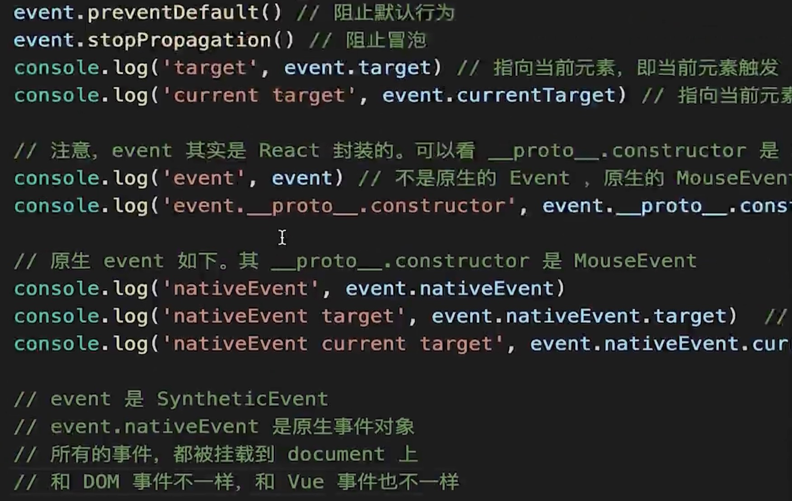

[← 返回笔记目录](/) 

---

# 事件

*   `event.target`: 事件最初发生的那个具体元素（事件源）
*   `event.currentTarget`: 当前正在处理事件的那个元素（绑定监听器的元素）



> **注意**：React 17 版本开始，事件就不再绑定到 `document` 上了

>
> *   React 16 绑定到 `document`
> *   React 17 事件绑定到 `root` 组件
> *   有利于多个 React 版本并存，例如微前端


# React 事件系统深度解析

React的事件系统是其核心机制之一，通过**合成事件（SyntheticEvent）**实现跨浏览器兼容和性能优化。下面从多个维度深入讲解。

---

## 一、什么是合成事件？

### 1.1 定义
合成事件是React封装的**跨浏览器一致的事件系统**，基于原生DOM事件构建，通过抽象层屏蔽不同浏览器对事件的实现差异。

```jsx
// JSX中绑定事件
<button onClick={handleClick}>点击</button>

// 实际处理的是合成事件对象
function handleClick(event) {
  // event是SyntheticEvent，不是原生Event
  console.log(event.target); // 触发事件的元素
  event.preventDefault();    // 阻止默认行为
  event.stopPropagation();   // 阻止冒泡
}
```

### 1.2 为什么需要合成事件？
- **跨浏览器兼容**：统一IE、Chrome、Firefox等浏览器的事件差异
- **性能优化**：通过事件委托减少事件监听器数量
- **API一致性**：提供统一的事件接口

---

## 二、事件系统的核心机制

### 2.1 事件委托（Event Delegation）

React不会给每个DOM元素单独绑定事件，而是采用**事件委托**方式：

```javascript
// ❌ 原生方式（性能差）
button1.addEventListener('click', handler1);
button2.addEventListener('click', handler2);
// ...

// ✅ React方式（性能优）
document.addEventListener('click', unifiedHandler); // React 16
rootContainer.addEventListener('click', unifiedHandler); // React 17+
```

**优势**：
- 减少内存占用
- 动态元素自动生效
- 统一管理事件

### 2.2 事件冒泡模拟

React的事件冒泡**不是真正的DOM冒泡**，而是通过遍历虚拟DOM树模拟：

```javascript
// 简化版流程
1. 原生事件触发 → 2. 捕获到根节点 → 3. 在虚拟DOM树中向上遍历
4. 依次调用各层级的事件处理器
```

---

## 三、React 16 vs React 17+ 的重大变化

### 3.1 事件委托位置的改变 ⭐

| 版本 | 事件委托位置 | 影响 |
|------|-------------|------|
| **React 16及之前** | `document` | 全局事件，多版本冲突 |
| **React 17+** | **根容器节点**（如`#root`） | 支持多版本共存 |

```javascript
// React 16
document.addEventListener('click', handler);

// React 17+
const root = document.getElementById('root');
root.addEventListener('click', handler);
```

**为什么改变？**
- 支持**微前端**场景下多个React版本共存
- 避免全局事件冲突
- 更符合预期的事件冒泡行为

### 3.2 事件池（Event Pool）的移除

#### React 16及之前：事件池机制
```javascript
function handleChange(e) {
  // ❌ 异步访问会失败！
  setTimeout(() => {
    console.log(e.target.value); // 可能为null
  }, 1000);
  
  // ✅ 必须调用persist()
  e.persist();
  setTimeout(() => {
    console.log(e.target.value); // 正常
  }, 1000);
}
```

**原理**：为提高性能，React复用事件对象，回调执行后清空属性。

#### React 17+：移除事件池
```javascript
function handleChange(e) {
  // ✅ 直接使用，无需persist()
  setTimeout(() => {
    console.log(e.target.value); // 正常
  }, 1000);
}
```

**原因**：现代浏览器性能已足够，事件池反而增加开发者困惑。

---

## 四、合成事件与原生事件的区别

| 特性 | 合成事件 | 原生事件 |
|------|---------|---------|
| **命名** | 驼峰命名（`onClick`） | 全小写（`onclick`） |
| **绑定位置** | 委托到根节点 | 直接绑定到元素 |
| **事件对象** | `SyntheticEvent` | 原生`Event`对象 |
| **阻止冒泡** | `e.stopPropagation()` | `e.stopPropagation()` |
| **异步访问** | React 17+可直接访问 | 始终可访问 |

### 4.1 获取原生事件对象
```javascript
function handleClick(e) {
  // e是SyntheticEvent
  console.log(e.nativeEvent); // 原生Event对象
  
  // 阻止原生事件冒泡
  e.nativeEvent.stopImmediatePropagation();
}
```

---

## 五、事件执行顺序

### 5.1 原生事件与React事件的执行顺序

```javascript
// 场景：同时绑定原生事件和React事件
const button = document.querySelector('button');
button.addEventListener('click', () => console.log('原生事件'));

function App() {
  return <button onClick={() => console.log('React事件')}>点击</button>;
}

// React 16输出：
// 原生事件 → React事件

// React 17+输出：
// 原生事件 → React事件（行为更一致）
```

### 5.2 事件捕获与冒泡

```javascript
// React支持捕获阶段（onCapture）
<div onClickCapture={() => console.log('捕获阶段')}>
  <button onClick={() => console.log('冒泡阶段')}>点击</button>
</div>

// 输出顺序：
// 捕获阶段 → 冒泡阶段
```

---

## 六、常见陷阱与最佳实践

### 6.1 阻止冒泡的坑

```javascript
// ❌ React事件中阻止冒泡，无法阻止原生事件
function handleClick(e) {
  e.stopPropagation(); // 只阻止React内部冒泡
}

// ✅ 需要阻止原生事件
function handleClick(e) {
  e.nativeEvent.stopImmediatePropagation();
}
```

### 6.2 异步访问事件对象

```javascript
// React 16（需要persist）
function handleChange(e) {
  e.persist();
  setData(prev => ({ ...prev, value: e.target.value }));
}

// React 17+（直接使用）
function handleChange(e) {
  setData(prev => ({ ...prev, value: e.target.value }));
}
```

### 6.3 动态事件处理器

```javascript
// ✅ 推荐：使用useCallback避免重复创建
const handleClick = useCallback((e) => {
  console.log('点击');
}, []);

// ❌ 避免：每次渲染都创建新函数
<button onClick={(e) => console.log('点击')}>按钮</button>
```

---

## 七、React 18的新特性

### 7.1 并发渲染与事件

React 18的**并发模式**影响事件处理：

```javascript
// useTransition：标记非紧急更新
const [isPending, startTransition] = useTransition();

function handleClick() {
  startTransition(() => {
    // 非紧急更新，可被中断
    setSearchQuery(input);
  });
}
```

### 7.2 事件优先级

React 18根据事件类型分配不同优先级：
- **离散事件**（click、input）：高优先级
- **用户阻塞事件**（drag）：中优先级  
- **连续事件**（scroll、mousemove）：低优先级

---

## 八、源码级理解（简化版）

```javascript
// 1. 事件注册
function registerEvent(rootContainer, eventType, handler) {
  rootContainer.addEventListener(eventType, dispatchEvent);
}

// 2. 统一派发
function dispatchEvent(nativeEvent) {
  const target = nativeEvent.target;
  const eventType = nativeEvent.type;
  
  // 3. 收集路径上的所有监听器
  const listeners = collectListeners(target, eventType);
  
  // 4. 创建合成事件
  const syntheticEvent = createSyntheticEvent(nativeEvent);
  
  // 5. 模拟冒泡
  for (let i = 0; i < listeners.length; i++) {
    listeners[i].handler(syntheticEvent);
    if (syntheticEvent._stopped) break;
  }
}
```

---

## 九、总结

| 核心概念 | 关键点 |
|---------|-------|
| **合成事件** | 跨浏览器封装，统一API |
| **事件委托** | 绑定到根节点，性能优化 |
| **React 17+** | 事件委托到根容器，移除事件池 |
| **执行顺序** | 原生事件先于React事件 |
| **阻止冒泡** | `stopPropagation()`只影响React内部 |

**最佳实践**：
1. 优先使用React事件系统
2. 需要原生事件时通过`nativeEvent`访问
3. React 17+无需担心事件池问题
4. 注意事件委托位置变化对微前端的影响

# React事件系统中listeners的收集机制详解

你问到了关键问题！`collectListeners` 是React事件系统的核心环节。让我详细拆解这个过程。

---

## 一、事件监听器存储在哪里？

### 1.1 Fiber节点中的事件存储

React在创建Fiber节点时，会将事件处理器存储在Fiber节点的`props`中：

```javascript
// JSX
<button onClick={handleClick}>点击</button>

// 编译后存储在Fiber节点中
{
  type: 'button',
  props: {
    onClick: handleClick,  // 事件处理器存储在这里
    children: '点击'
  },
  // ... 其他Fiber属性
}
```

### 1.2 实际存储结构

在React内部，事件监听器是这样组织的：

```javascript
// 简化版的Fiber节点结构
const fiber = {
  tag: HostComponent,        // 原生DOM组件
  type: 'button',            // DOM标签类型
  memoizedProps: {           // 当前的props
    onClick: handleClick,
    onMouseEnter: handleHover
  },
  stateNode: buttonElement,  // 对应的真实DOM节点
  return: parentFiber,       // 父节点
  child: null,               // 子节点
  sibling: null              // 兄弟节点
};
```

---

## 二、collectListeners的详细实现

### 2.1 从真实DOM节点找到对应的Fiber节点

```javascript
// 1. 从原生事件对象获取触发元素
function dispatchEvent(nativeEvent) {
  const target = nativeEvent.target; // 真实DOM节点
  const eventType = nativeEvent.type; // 事件类型，如'click'
  
  // 2. 从真实DOM节点找到对应的Fiber节点
  const fiber = getFiberFromNode(target);
  
  // 3. 收集监听器
  const listeners = collectListeners(fiber, eventType);
  
  // ...
}
```

### 2.2 如何从DOM节点找到Fiber节点？

React在创建DOM节点时，会将Fiber节点的引用存储在DOM节点上：

```javascript
// React创建DOM节点时
function createInstance(type, props) {
  const domNode = document.createElement(type);
  
  // 将Fiber节点引用存储在DOM节点上
  // 这个内部属性名会加随机值，以免冲突
  domNode._reactInternalFiber = fiber;
  
  return domNode;
}

// 获取Fiber节点
function getFiberFromNode(node) {
  return node._reactInternalFiber;
}
```

---

## 三、向上遍历收集监听器

### 3.1 核心收集逻辑

```javascript
function collectListeners(fiber, eventType) {
  const listeners = [];
  
  // 从触发事件的Fiber节点开始，向上遍历到根节点
  let current = fiber;
  
  while (current !== null) {
    // 检查当前Fiber节点是否有对应的事件处理器
    const listener = getListener(current, eventType);
    
    if (listener !== null) {
      listeners.push({
        instance: current.stateNode,  // 真实DOM节点
        listener: listener,            // 事件处理器
        current: current               // Fiber节点
      });
    }
    
    // 继续向上遍历父节点
    current = current.return;
  }
  
  // 反转，确保从根到目标的顺序（捕获阶段）
  // 或保持原顺序（冒泡阶段）
  return listeners;
}
```

### 3.2 getListener的实现

```javascript
function getListener(fiber, eventType) {
  const props = fiber.memoizedProps;
  
  if (props === null) {
    return null;
  }
  
  // 根据事件类型获取对应的事件处理器
  // 例如：eventType = 'click' -> propName = 'onClick'
  const propName = getEventPropName(eventType);
  
  return props[propName];
}

// 事件类型映射
function getEventPropName(eventType) {
  const eventMap = {
    'click': 'onClick',
    'mousedown': 'onMouseDown',
    'mouseup': 'onMouseUp',
    'mouseover': 'onMouseOver',
    'mouseout': 'onMouseOut',
    'mousemove': 'onMouseMove',
    'keydown': 'onKeyDown',
    'keyup': 'onKeyUp',
    // ... 更多事件映射
  };
  
  return eventMap[eventType] || null;
}
```

---

## 四、完整示例演示

### 4.1 虚拟DOM树结构

```javascript
// JSX结构
<div onClick={handleDivClick}>
  <span onMouseEnter={handleSpanEnter}>
    <button onClick={handleButtonClick}>点击</button>
  </span>
</div>
```

### 4.2 对应的Fiber树

```
FiberRoot
  └─ App
      └─ div (Fiber节点1)
          ├─ memoizedProps: { onClick: handleDivClick }
          ├─ stateNode: <div>
          └─ child: span
               ├─ memoizedProps: { onMouseEnter: handleSpanEnter }
               ├─ stateNode: <span>
               └─ child: button
                    ├─ memoizedProps: { onClick: handleButtonClick }
                    ├─ stateNode: <button>
                    └─ child: null
```

### 4.3 事件触发时的收集过程

```javascript
// 用户点击<button>，触发click事件

// 1. 原生事件触发
nativeEvent = { type: 'click', target: <button> }

// 2. 找到对应的Fiber节点
fiber = <button>对应的Fiber节点

// 3. 向上遍历收集监听器
collectListeners(fiber, 'click')

// 遍历过程：
current = buttonFiber
  → getListener(buttonFiber, 'click') = handleButtonClick ✅
  → listeners = [{ instance: <button>, listener: handleButtonClick }]

current = spanFiber
  → getListener(spanFiber, 'click') = null ❌
  → listeners 不变

current = divFiber
  → getListener(divFiber, 'click') = handleDivClick ✅
  → listeners = [
      { instance: <button>, listener: handleButtonClick },
      { instance: <div>, listener: handleDivClick }
    ]

current = AppFiber
  → getListener(AppFiber, 'click') = null ❌

current = FiberRoot
  → getListener(FiberRoot, 'click') = null ❌

current = null → 退出循环

// 4. 返回收集到的监听器
listeners = [
  { instance: <button>, listener: handleButtonClick },
  { instance: <div>, listener: handleDivClick }
]
```

---

## 五、冒泡阶段 vs 捕获阶段

### 5.1 冒泡阶段（默认）

```javascript
// 默认情况下，listeners顺序是从目标到根（冒泡）
listeners = [
  { instance: <button>, listener: handleButtonClick },  // 先执行
  { instance: <div>, listener: handleDivClick }          // 后执行
]

// 执行顺序
for (let i = 0; i < listeners.length; i++) {
  listeners[i].listener(syntheticEvent);
}
// 输出：handleButtonClick → handleDivClick
```

### 5.2 捕获阶段（onCapture）

**React 的捕获阶段（onClickCapture）和冒泡阶段一样，确实也是在 root 根节点上监听原生事件的冒泡来实现的**
```javascript
// 使用onCapture时，需要反转顺序
<div onClickCapture={handleDivCapture}>
  <button onClick={handleButtonClick}>点击</button>
</div>

// collectListeners收集到的顺序
listeners = [
  { instance: <button>, listener: handleButtonClick },
  { instance: <div>, listener: handleDivCapture }
]

// 捕获阶段需要反转
const captureListeners = listeners.reverse();
// captureListeners = [
//   { instance: <div>, listener: handleDivCapture },
//   { instance: <button>, listener: handleButtonClick }
// ]

// 执行顺序
for (let i = 0; i < captureListeners.length; i++) {
  captureListeners[i].listener(syntheticEvent);
}
// 输出：handleDivCapture → handleButtonClick
```

---

## 六、React源码中的实际实现

### 6.1 简化版源码流程

```javascript
// packages/react-dom/src/events/DOMPluginEventSystem.js

export function dispatchEventForPluginEventSystem(
  domEventName,
  eventSystemFlags,
  nativeEvent,
  targetInst,
  targetContainer
) {
  // 1. 创建合成事件
  const syntheticEvent = createAndAccumulateChangeEvent(
    domEventName,
    targetInst,
    nativeEvent,
    eventSystemFlags
  );
  
  // 2. 收集事件队列
  const dispatchQueue = [];
  accumulateEventDispatches(
    targetInst,
    null,
    syntheticEvent,
    dispatchQueue
  );
  
  // 3. 处理事件队列
  processDispatchQueue(dispatchQueue, eventSystemFlags);
}

// 核心：收集事件监听器
function accumulateEventDispatches(
  instance,
  ignoredDirection,
  syntheticEvent,
  dispatchQueue
) {
  if (instance === null) {
    return;
  }
  
  // 递归向上收集
  const { child, sibling, return: parent } = instance;
  
  // 先收集子节点（深度优先）
  if (child !== null) {
    accumulateEventDispatches(child, ignoredDirection, syntheticEvent, dispatchQueue);
  }
  
  // 收集当前节点
  if (instance !== ignoredDirection) {
    const listener = getListener(instance, syntheticEvent.type);
    if (listener != null) {
      dispatchQueue.push({
        instance,
        listener,
        currentTarget: instance.stateNode
      });
    }
  }
  
  // 收集兄弟节点
  if (sibling !== null) {
    accumulateEventDispatches(sibling, ignoredDirection, syntheticEvent, dispatchQueue);
  }
}
```

### 6.2 更真实的实现（考虑优先级和阶段）

```javascript
// React 18中的实际实现更复杂
function collectListeners(fiber, eventType, dispatchQueue) {
  let instance = fiber;
  
  // 向上遍历，收集捕获阶段的监听器
  while (instance !== null) {
    const captureListener = getListener(instance, eventType + 'Capture');
    if (captureListener !== null) {
      dispatchQueue.push({
        instance,
        listener: captureListener,
        phase: 'capture'
      });
    }
    instance = instance.return;
  }
  
  // 反转，确保从根到目标的顺序
  dispatchQueue.reverse();
  
  // 重新从目标节点开始，收集冒泡阶段的监听器
  instance = fiber;
  while (instance !== null) {
    const bubbleListener = getListener(instance, eventType);
    if (bubbleListener !== null) {
      dispatchQueue.push({
        instance,
        listener: bubbleListener,
        phase: 'bubble'
      });
    }
    instance = instance.return;
  }
}
```

---

## 七、关键要点总结

### 7.1 listeners收集的核心步骤

| 步骤 | 说明 |
|------|------|
| **1. 定位** | 从原生事件的target找到对应的Fiber节点 |
| **2. 遍历** | 从目标Fiber向上遍历到根节点 |
| **3. 提取** | 从每个Fiber的memoizedProps中提取事件处理器 |
| **4. 存储** | 将监听器和对应的DOM节点存储在数组中 |
| **5. 排序** | 根据捕获/冒泡阶段调整顺序 |

### 7.2 为什么需要向上遍历？

```javascript
// 因为React的事件委托机制
// 实际上所有事件都绑定在根容器上
rootContainer.addEventListener('click', dispatchEvent);

// 当事件触发时，需要模拟DOM的事件冒泡
// 这就是为什么需要从目标节点向上遍历收集监听器
```

### 7.3 性能优化

```javascript
// React不会每次都完整遍历整个树
// 而是利用Fiber树的结构，只遍历从目标到根的路径
// 时间复杂度：O(depth)，而不是O(n)
```

---

## 八、可视化理解

```
事件触发流程：
┌─────────────────────────────────────────────────┐
│  原生事件触发 (click)                           │
│  target = <button>                              │
└────────────────┬────────────────────────────────┘
                 │
                 v
┌─────────────────────────────────────────────────┐
│  1. 找到对应的Fiber节点                          │
│  fiber = buttonFiber                            │
└────────────────┬────────────────────────────────┘
                 │
                 v
┌─────────────────────────────────────────────────┐
│  2. 向上遍历收集监听器                           │
│  buttonFiber → spanFiber → divFiber → ...       │
└────────────────┬────────────────────────────────┘
                 │
                 v
┌─────────────────────────────────────────────────┐
│  3. 提取事件处理器                               │
│  onClick, onMouseEnter, ...                     │
└────────────────┬────────────────────────────────┘
                 │
                 v
┌─────────────────────────────────────────────────┐
│  4. 创建合成事件并执行                           │
│  syntheticEvent → listeners[0] → listeners[1]   │
└─────────────────────────────────────────────────┘
```

