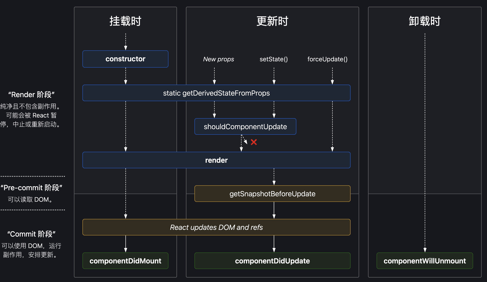
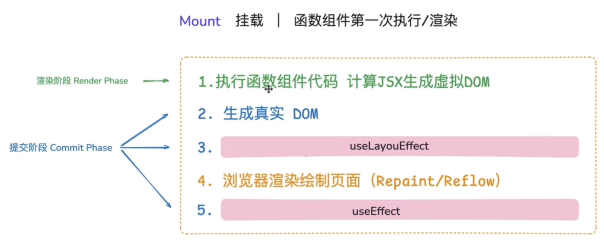
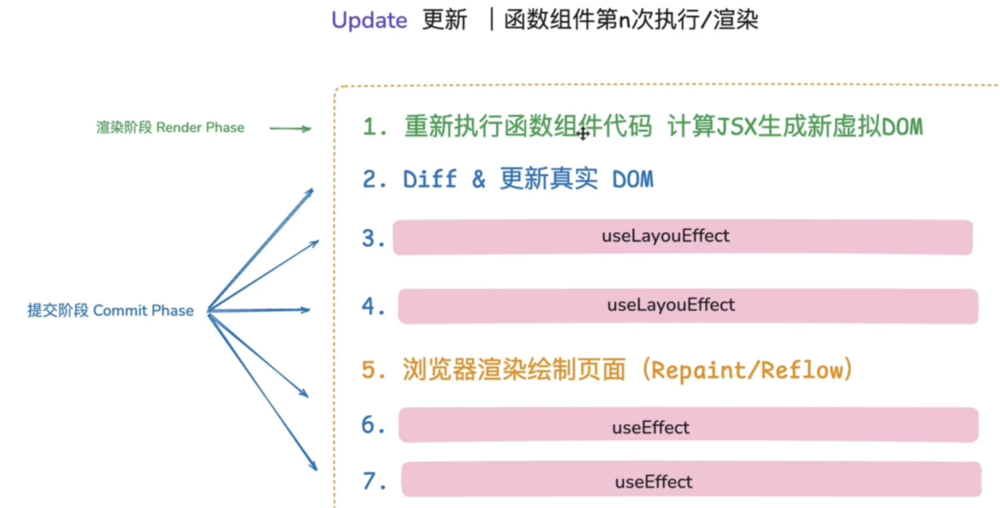
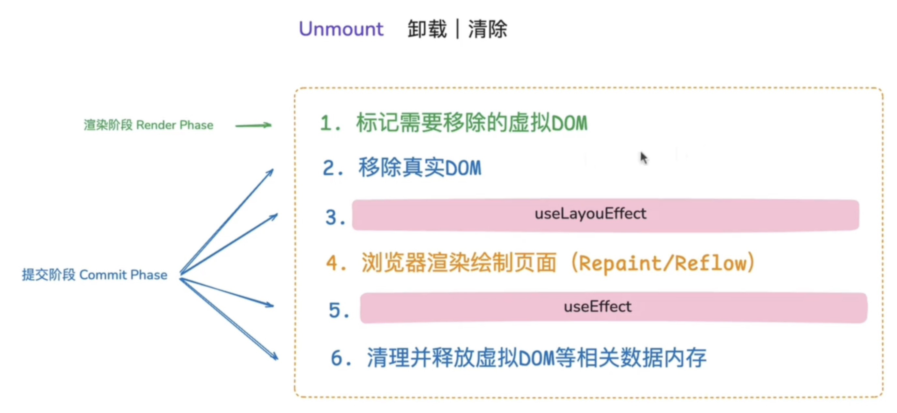

[← 返回笔记目录](/) 

---

# 类组件的生命周期

https://www.bilibili.com/video/BV1B5411h7W8/?spm_id_from=333.337.search-card.all.click&vd_source=d66a6fb5cb08fa8db4dd3bf2bd839f71

# 函数组件的生命周期

*   **纯函数**
*   **没有实例，没有声明周期，没有state**

https://www.bilibili.com/video/BV1FfJDzyEgT/?spm_id_from=333.337.search-card.all.click&vd_source=d66a6fb5cb08fa8db4dd3bf2bd839f71

