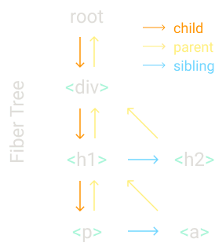

# Build Your Own React

> 原文：[pomb.us/build-your-own-react](https://pomb.us/build-your-own-react/)
>
> 完整实现代码：[01-full-version.js](./01-full-version.js)
>
> 本文档逐步带你从零实现一个迷你 React（名为 **Didact**），每个 Step 对应一个核心概念。

---

## 目录

| Step | 主题 | 核心问题 |
|------|------|----------|
| [I](#step-i-the-createelement-function) | `createElement` | JSX 编译后是什么？ |
| [II](#step-ii-the-render-function) | `render` | 如何把虚拟 DOM 变成真实 DOM？ |
| [III](#step-iii-concurrent-mode) | Concurrent Mode | 组件树太大卡住主线程怎么办？ |
| [IV](#step-iv-fibers) | Fibers | 如何组织"可中断"的工作单元？ |
| [V](#step-v-render-and-commit-phases) | Render & Commit | 用户看到半成品 UI 怎么办？ |
| [VI](#step-vi-reconciliation) | Reconciliation | 如何 diff 新旧节点并最小化 DOM 操作？ |
| [VII](#step-vii-function-components) | Function Components | 函数组件没有 DOM 节点怎么处理？ |
| [VIII](#step-viii-hooks) | Hooks | `useState` 到底是怎么工作的？ |

---

## 前置：JSX 到底是什么？

在开始之前，先搞清楚一件事：**JSX 只是语法糖，编译后就变成函数调用。**

```jsx
// 你写的 JSX
const element = <h1 title="foo">Hello</h1>
const container = document.getElementById("root")
ReactDOM.render(element, container)

// Babel 编译后（React 17 之前使用 React.createElement）
const element = React.createElement('h1', { title: 'foo'}, 'Hello')
const container = document.getElementById("root")
ReactDOM.render(element, container)
```

而 `React.createElement` 做的事情非常简单 — **返回一个普通 JS 对象**：

```jsx
// createElement 的实际产物
const element = {
  type: "h1",
  props: {
    title: "foo",
    children: "Hello",
  },
}
```

所以整个 React 渲染的本质就是：**对象 → 处理 → DOM**。下面用最原始的方式手动模拟一次：

```jsx
const element = {
  type: "h1",
  props: {
    title: "foo",
    children: "Hello",
  },
}

const container = document.getElementById("root")

// 1. 根据 type 创建真实 DOM 节点
const node = document.createElement(element.type)
// 2. 把 props（除了 children）赋给 DOM
node["title"] = element.props.title
// 3. 递归处理 children
const text = document.createTextNode("")
text["nodeValue"] = element.props.children

node.appendChild(text)
container.appendChild(node)
```

> 💡 **理解要点**：React 渲染 = 遍历虚拟 DOM 对象 → 创建/更新真实 DOM。后面所有 Step 都是在这个基础上逐步优化。

---

## Step I: The createElement Function

**对应代码**：[01-full-version.js](01-full-version.js) — `createElement()`、`createTextElement()`

**要解决的问题**：让 JSX 编译产物能正确生成虚拟 DOM 对象。

```jsx
// 输入（JSX）
const element = (
  <div id="foo">
    <a>bar</a>
    <b />
  </div>
);
const container = document.getElementById("root");
ReactDOM.render(element, container);
```

编译器会把上面的 JSX 转成嵌套的 `createElement` 调用：

```jsx
// 编译产物
const element = React.createElement(
  "div",
  { id: "foo" },
  React.createElement("a", null, "bar"),
  React.createElement("b"),
);
const container = document.getElementById("root");
ReactDOM.render(element, container);
```

所以 `createElement` 的实现非常简单 — 收参数、拼对象：

```jsx
function createElement(type, props, ...children) {
  return {
    type,                 // "div" | "h1" | 函数组件
    props: {
      ...props,           // { id: "foo" } 之类的属性
      children,           // 孩子是 createElement 的返回值或字符串
    },
  };
}
```

但有个问题：如果 child 是纯文本（如 `"bar"`），它不是对象，没有 `type`。所以需要把它包装一下：

```jsx
// 如果是原始值，则调用 createTextElement 包装成对象
function createElement(type, props, ...children) {
  return {
    type,
    props: {
      ...props,
      children: children.map((child) =>
        typeof child === "object" ? child : createTextElement(child),
      ),
    },
  };
}

// 文本节点的 type 用特殊标记 "TEXT_ELEMENT"
function createTextElement(text) {
  return {
    type: "TEXT_ELEMENT",
    props: {
      nodeValue: text,     // 文本内容
      children: [],        // 文本节点没有孩子
    },
  };
}
```

为了能让 JSX 用我们自己的函数编译，给库起个名字并告诉 Babel：

```jsx
const Didact = {
  createElement,
  createTextElement,
};

/** @jsx Didact.createElement */  // ← Babel 看到这个注释，就用 Didact.createElement 编译 JSX
const element = (
  <div id="foo">
    <a>bar</a>
    <b />
  </div>
);
```

> 💡 **理解要点**：`createElement` 不做任何 DOM 操作，只是把 JSX 信息转成纯数据对象。这就是"虚拟 DOM"。

---

## Step II: The render Function

**对应代码**：[01-full-version.js](01-full-version.js) — `render()` 的早期版本（已简化）

**要解决的问题**：把虚拟 DOM 对象转成页面上的真实 DOM。

```jsx
// 我们的库多了 render
const Didact = {
  createElement,
  render,
};

/** @jsx Didact.createElement */
const element = (
  <div id="foo">
    <a>bar</a>
    <b />
  </div>
);
const container = document.getElementById("root");
Didact.render(element, container);
```

最简单的 `render` 实现 — 创建 DOM 节点，递归处理孩子：

```jsx
function render(element, container) {
  // 1. 根据 type 创建 DOM 节点
  const dom = document.createElement(element.type);

  // 2. 递归处理所有孩子 ← 这是"递归不可中断"的根源
  element.props.children.forEach((child) => render(child, dom));

  // 3. 插入父容器
  container.appendChild(dom);
}
```

需要处理文本节点：

```jsx
function render(element, container) {
  const dom =
    element.type == "TEXT_ELEMENT"
      ? document.createTextNode("")       // 文本节点
      : document.createElement(element.type); // 普通元素

  element.props.children.forEach((child) => render(child, dom));

  container.appendChild(dom);
}
```

还需要把 props（如 `id`、`className`、事件等）挂到 DOM 上：

```jsx
function render(element, container) {
  const dom =
    element.type == "TEXT_ELEMENT"
      ? document.createTextNode("")
      : document.createElement(element.type);

  // 把除了 children 之外的 props 都赋给 DOM 节点
  const isProperty = (key) => key !== "children";
  Object.keys(element.props)
    .filter(isProperty)
    .forEach((name) => {
      dom[name] = element.props[name];  // dom["id"] = "foo"
    });

  element.props.children.forEach((child) => render(child, dom));

  container.appendChild(dom);
}
```

> 💡 **理解要点**：这个版本的 `render` 工作正常，但有一个致命问题 — **递归无法中断**。如果元素树上万个节点，主线程会被长时间阻塞（掉帧、卡顿）。这就是 Step III 要解决的。

---

## Step III: Concurrent Mode

**对应代码**：[01-full-version.js](01-full-version.js) — `workLoop()`

**要解决的问题**：渲染大组件树时不能阻塞主线程（用户点击、动画需要响应）。

核心思路：**把渲染工作拆成小单元，每个单元做完就让浏览器看看有没有别的事要做（用户交互、动画等）。如果有，就让出控制权。**

这个"让出控制权"的机制用的是浏览器的 `requestIdleCallback`：

```jsx
let nextUnitOfWork = null   // ← 下一个要处理的工作单元

function workLoop(deadline) {
    let shouldYield = false

    while (nextUnitOfWork && !shouldYield) {
        nextUnitOfWork = performUnitOfWork(nextUnitOfWork)
        // 检查本帧还剩多少时间，如果 < 1ms 就让出控制权
        shouldYield = deadline.timeRemaining() < 1
    }

    // 注册下一轮回调 → 形成"循环"
    requestIdleCallback(workLoop)
}

// 启动！
requestIdleCallback(workLoop)

function performUnitOfWork(nextUnitOfWork) {
    // TODO: 处理单个工作单元
}
```

**执行流程**：
```
requestIdleCallback
  → workLoop (浏览器空闲时)
    → 循环处理工作单元，直到没时间了或做完了
      → shouldYield = true (让出控制权)
        → 浏览器处理用户输入/渲染
          → requestIdleCallback
            → workLoop (再次空闲时继续)
              → ...
```

> 💡 **理解要点**：`requestIdleCallback` 是"并发模式"的基石。它让渲染工作分散在浏览器的空闲碎片中执行，用户永远感受不到卡顿。但拆成小单元需要一种新的数据结构来组织 — 这就是 Step IV 的 **Fiber**。

---

## Step IV: Fibers

**对应代码**：[01-full-version.js](01-full-version.js) — `performUnitOfWork()`、`reconcileChildren()` 中的 child/sibling/parent 关系

**要解决的问题**：如何组织"可中断、可恢复"的工作单元？

**Fiber** 就是 React 中代表"一个工作单元"的数据结构。每个 React 元素对应一个 fiber，整个应用就是一棵 fiber 树。

举例，渲染这棵树：

```jsx
Didact.render(
  <div>
    <h1>
      <p />
      <a />
    </h1>
    <h2 />
  </div>,
  container,
);
```

对应的 fiber 树结构：

```
              div (child → h1)
               ↓
              h1 (child → p, sibling → h2, parent → div)
               ↓
        p (sibling → a, parent → h1)
               ↓
        a (parent → h1)
               ↓
        h2 (parent → div)
```



### fiber 节点的属性

```jsx
{
  type: "div",           // 元素类型（"div" / 函数组件 / "TEXT_ELEMENT"）
  props: { ... },        // 属性
  dom: domNode,          // 对应的真实 DOM 节点
  parent: parentFiber,   // 父 fiber
  child: childFiber,     // 第一个子 fiber
  sibling: siblingFiber, // 下一个兄弟 fiber
  alternate: oldFiber,   // 上一次渲染的对应 fiber（用于 diff）
  effectTag: "UPDATE",   // 操作标记：PLACEMENT / UPDATE / DELETION
}
```

### 每个工作单元做 3 件事

1. **把 fiber 加到 DOM**（后来改为只打标记，见 Step V）
2. **为 children 创建 fiber 节点**（建立 child/sibling/parent 链）
3. **选下一个工作单元**按这个顺序找：`child → sibling → parent.sibling → ... → root → 完成`

### 代码逐步演进

首先提取一个 `createDom` 函数，负责创建真实 DOM：

```jsx
function createDom(fiber) {
  const dom =
    fiber.type == "TEXT_ELEMENT"
      ? document.createTextNode("")
      : document.createElement(fiber.type);

  // 把 props 赋到 DOM 上（除了 children）
  const isProperty = (key) => key !== "children";
  Object.keys(fiber.props)
    .filter(isProperty)
    .forEach((name) => {
      dom[name] = fiber.props[name];
    });

  return dom;
}
```

`render` 不再直接操作 DOM，而是创建 **root fiber** 作为起点：

```jsx
function render(element, container) {
  nextUnitOfWork = {
    dom: container,             // ← 容器本身
    props: {
      children: [element],      // ← 把传入的元素作为孩子
    },
  };
}
```

`workLoop` 和 `performUnitOfWork` 结合：

```jsx
function workLoop(deadline) {
  let shouldYield = false;
  while (nextUnitOfWork && !shouldYield) {
    nextUnitOfWork = performUnitOfWork(nextUnitOfWork);
    shouldYield = deadline.timeRemaining() < 1;
  }
  requestIdleCallback(workLoop);
}

requestIdleCallback(workLoop);

function performUnitOfWork(fiber) {
  // 1️⃣ 创建 DOM
  if (!fiber.dom) {
    fiber.dom = createDom(fiber);
  }

  // ❌ 问题在这里：每处理一个 fiber 就立刻挂到 DOM 上
  if (fiber.parent) {
    fiber.parent.dom.appendChild(fiber.dom);
  }

  // 2️⃣ 为孩子创建 fiber，建立 child/sibling 链
  const elements = fiber.props.children;
  let index = 0;
  let prevSibling = null;

  while (index < elements.length) {
    const element = elements[index];

    const newFiber = {
      type: element.type,
      props: element.props,
      parent: fiber,
      dom: null,
    };

    // 第一个孩子设为 child，后面的孩子设为前一个的 sibling
    if (index === 0) {
      fiber.child = newFiber;
    } else {
      prevSibling.sibling = newFiber;
    }

    prevSibling = newFiber;
    index++;
  }

  // 3️⃣ 返回下一个工作单元：child → sibling → uncle → ... → root
  if (fiber.child) {
    return fiber.child;
  }
  let nextFiber = fiber;
  while (nextFiber) {
    if (nextFiber.sibling) {
      return nextFiber.sibling;
    }
    nextFiber = nextFiber.parent;
  }
}
```

> 💡 **理解要点**：
>
> - **为什么用链表（child/sibling/parent）而不是数组？** 因为链表方便在任意节点"暂停"。数组需要额外记录遍历位置，链表直接 `return fiber.child` 就行。
> - 第 2 步中 `index === 0` → `child`，`index > 0` → `sibling` 的规则，就是把数组转成链表的惯用写法。
> - 第 3 步的 `nextFiber = nextFiber.parent` — 想象你从最深的后代一路往上回溯，找每个祖先的兄弟（叔叔），直到回到 root。

---

## Step V: Render and Commit Phases

**对应代码**：[01-full-version.js](01-full-version.js) — `wipRoot`、`commitRoot()`、`commitWork()`

**要解决的问题**：workLoop 可中断，如果每个 fiber 都立刻操作 DOM，用户会看到不完整的 UI。

### 核心改进：Render 阶段只打标记，Commit 阶段统一应用

```
旧方案（有问题）：
  performUnitOfWork → 立刻 appendChild → ❌ 可能被中断 → 用户看到半成品

新方案：
  performUnitOfWork → 只打 effectTag → 所有 fiber 都处理完 → commitRoot → 一次性更新 DOM
```

### 引入 wipRoot

`wipRoot` = "work in progress root" — 正在构建中的 fiber 树根节点。我们需要跟踪它，以便在工作全部完成后知道要提交哪棵树：

```jsx
function render(element, container) {
  wipRoot = {                      // ← 新增
    dom: container,
    props: {
      children: [element],
    },
  }
  nextUnitOfWork = wipRoot         // ← nextUnitOfWork 指向 wipRoot
}

let nextUnitOfWork = null
let wipRoot = null                 // ← 新增
```

当 `nextUnitOfWork` 为 null（所有工作完成）且 `wipRoot` 存在时，触发 commit：

```jsx
function commitRoot() {
  commitWork(wipRoot.child)        // 从 root 的孩子开始递归提交
  wipRoot = null                   // 提交完清空
}

function workLoop(deadline) {
  let shouldYield = false
  while (nextUnitOfWork && !shouldYield) {
    nextUnitOfWork = performUnitOfWork(nextUnitOfWork)
    shouldYield = deadline.timeRemaining() < 1
  }

  // 🔑 所有工作完成 → 提交！
  if (!nextUnitOfWork && wipRoot) {
    commitRoot()
  }

  requestIdleCallback(workLoop)
}
```

`commitWork` 递归地把 fiber 的 DOM 插入页面：

```jsx
function commitWork(fiber) {
  if (!fiber) {
    return
  }
  const domParent = fiber.parent.dom
  domParent.appendChild(fiber.dom)   // ← 真实 DOM 操作在这里
  commitWork(fiber.child)            // 递归孩子
  commitWork(fiber.sibling)          // 递归兄弟
}
```

> 💡 **理解要点**：
>
> - **Render Phase（渲染阶段）**：可中断，只做纯计算（创建 fiber、diff），不碰 DOM。
> - **Commit Phase（提交阶段）**：不可中断，统一操作 DOM，确保 UI 一致。
> - 把 `performUnitOfWork` 里那句 `fiber.parent.dom.appendChild(fiber.dom)` 去掉是关键 — 它把 DOM 操作从"分散的"变成了"集中的"。

---

## Step VI: Reconciliation

**对应代码**：[01-full-version.js](01-full-version.js) — `reconcileChildren()`、`updateDom()`、`currentRoot`、`alternate`

**要解决的问题**：第二次渲染时，如何 diff 新旧元素并只做最小化的 DOM 更新？

### 引入 currentRoot 和 alternate

每次 commit 后，把当前树保存为 `currentRoot`（旧树），下次 render 时通过 `alternate` 属性建立新旧 fiber 的关联：

```jsx
function commitRoot() {
  commitWork(wipRoot.child)
  currentRoot = wipRoot            // ← 保存旧树引用
  wipRoot = null
}

function render(element, container) {
  wipRoot = {
    dom: container,
    props: {
      children: [element],
    },
    alternate: currentRoot,        // ← 指向旧 fiber 树的根
  }
  nextUnitOfWork = wipRoot
}

let currentRoot = null             // ← 新增
```

### 把创建 fiber 的逻辑提取到 reconcileChildren

将 `performUnitOfWork` 里为孩子创建 fiber 的代码提取出来：

```jsx
function performUnitOfWork(fiber) {
  if (!fiber.dom) {
    fiber.dom = createDom(fiber);
  }

  const elements = fiber.props.children;
  reconcileChildren(fiber, elements);    // ← 提取到这里

  // ... 返回下一个工作单元的逻辑不变
}

function reconcileChildren(wipFiber, elements) {
  let index = 0;
  let prevSibling = null;

  while (index < elements.length) {
    const element = elements[index];

    const newFiber = {
      type: element.type,
      props: element.props,
      parent: wipFiber,
      dom: null,
    };

    if (index === 0) {
      wipFiber.child = newFiber;
    } else {
      prevSibling.sibling = newFiber;
    }

    prevSibling = newFiber;
    index++;
  }
}
```

### Diff 核心：同时遍历新旧 fiber 链表

通过 `wipFiber.alternate.child` 拿到旧子 fiber 链表，与新的 elements 数组逐一对比：

```jsx
function reconcileChildren(wipFiber, elements) {
  let index = 0;
  let oldFiber = wipFiber.alternate && wipFiber.alternate.child;  // 旧 fiber 链表头
  let prevSibling = null;

  // 同时遍历新数组和旧链表（两个都走完才结束）
  while (index < elements.length || oldFiber != null) {
    const element = elements[index];
    let newFiber = null;

    // 🔑 diff 核心：通过 type 判断
    const sameType = oldFiber && element && element.type == oldFiber.type;

    // 情况 1：类型相同 → 复用 DOM，标记 UPDATE
    if (sameType) {
      newFiber = {
        type: oldFiber.type,
        props: element.props,
        dom: oldFiber.dom,           // 复用旧 DOM！
        parent: wipFiber,
        alternate: oldFiber,
        effectTag: "UPDATE",         // ← 提交时 updateDom
      };
    }
    // 情况 2：有新元素，类型不同 → 新建 DOM，标记 PLACEMENT
    if (element && !sameType) {
      newFiber = {
        type: element.type,
        props: element.props,
        dom: null,                   // 新建，没有旧 DOM 可用
        parent: wipFiber,
        alternate: null,
        effectTag: "PLACEMENT",      // ← 提交时 appendChild
      };
    }
    // 情况 3：有旧 fiber，类型不同 → 删除旧 DOM
    if (oldFiber && !sameType) {
      oldFiber.effectTag = "DELETION";
      deletions.push(oldFiber);      // ← 收集到删除列表
    }

    // 移动旧 fiber 链表指针
    if (oldFiber) {
      oldFiber = oldFiber.sibling;
    }

    // 建立 child/sibling 关系（同 Step IV）
    if (index === 0) {
      wipFiber.child = newFiber;
    } else if (element) {
      prevSibling.sibling = newFiber;
    }
    prevSibling = newFiber;
    index++;
  }
}
```

### Diff 三种情况总结

| 场景 | 条件 | effectTag | DOM 操作 |
|------|------|-----------|----------|
| 复用 | `oldFiber.type === element.type` | `UPDATE` | 更新 props |
| 新建 | `element` 存在但类型不匹配 | `PLACEMENT` | `appendChild` |
| 删除 | `oldFiber` 存在但类型不匹配 | `DELETION` | `removeChild` |

### commitWork 根据 effectTag 分派操作

```jsx
function commitWork(fiber) {
  if (!fiber) return;

  const domParent = fiber.parent.dom;

  if (fiber.effectTag === "PLACEMENT" && fiber.dom != null) {
    domParent.appendChild(fiber.dom);                 // 🆕 新增
  } else if (fiber.effectTag === "DELETION") {
    domParent.removeChild(fiber.dom);                 // 🗑️ 删除
  } else if (fiber.effectTag === "UPDATE" && fiber.dom != null) {
    updateDom(fiber.dom, fiber.alternate.props, fiber.props);  // 🔄 更新
  }

  commitWork(fiber.child);
  commitWork(fiber.sibling);
}
```

### updateDom — 对比新旧 props

```jsx
const isEvent = (key) => key.startsWith("on");
const isProperty = (key) => key !== "children" && !isEvent(key);
const isNew = (prev, next) => (key) => prev[key] !== next[key];
const isGone = (prev, next) => (key) => !(key in next);

function updateDom(dom, prevProps, nextProps) {
  // 1. 移除旧的事件监听器（事件处理函数变了或被删了）
  Object.keys(prevProps)
    .filter(isEvent)
    .filter((key) => !(key in nextProps) || isNew(prevProps, nextProps)(key))
    .forEach((name) => {
      const eventType = name.toLowerCase().substring(2);  // "onClick" → "click"
      dom.removeEventListener(eventType, prevProps[name]);
    });

  // 2. 添加新的事件监听器
  Object.keys(nextProps)
    .filter(isEvent)
    .filter(isNew(prevProps, nextProps))
    .forEach((name) => {
      const eventType = name.toLowerCase().substring(2);
      dom.addEventListener(eventType, nextProps[name]);
    });

  // 3. 删除旧的不再存在的属性
  Object.keys(prevProps)
    .filter(isProperty)
    .filter(isGone(prevProps, nextProps))
    .forEach((name) => {
      dom[name] = "";
    });

  // 4. 设置新的/变化的属性
  Object.keys(nextProps)
    .filter(isProperty)
    .filter(isNew(prevProps, nextProps))
    .forEach((name) => {
      dom[name] = nextProps[name];
    });
}
```

> 🧠 **补充**：真实的 React 还会用 **key** 来做更精准的复用判断（比如列表重排时）。这里为了简化没有实现。

> 💡 **理解要点**：
>
> - `alternate` 是新旧 fiber 之间的桥梁 — 通过它，`reconcileChildren` 能拿到"上一次渲染的长相"来做 diff。
> - `effectTag` 是一个标记字段 — 它让 render 阶段只做"判断"（打标记），commit 阶段负责"执行"（操作 DOM）。
> - `type` 是 diff 的唯一依据（简化版） — 只要 type 不同，就直接删旧建新，不做更细的比较。

---

## Step VII: Function Components

**对应代码**：[01-full-version.js](01-full-version.js) — `updateFunctionComponent()`、`updateHostComponent()`、`commitDeletion()`

**要解决的问题**：函数组件（`<App />`）和原生标签（`<div />`）的处理方式不同。

### 函数组件用法的变化

```jsx
// 函数组件
function App(props) {
  return <h1>Hi {props.name}</h1>;
}
const element = <App name="foo" />;   // ← type 是函数 App，不是字符串 "app"

// 编译后
function App(props) {
  return Didact.createElement("h1", null, "Hi ", props.name);
}
const element = Didact.createElement(App, { name: "foo" });
```

### 函数组件的两个特殊之处

1. **没有 DOM 节点** — fiber 的 `dom` 字段为 null（不像 `<div>` 能 `document.createElement`）
2. **children 不是直接从 props 取的** — 必须**执行这个函数**，拿返回值当 children

### performUnitOfWork 分流

```jsx
function performUnitOfWork(fiber) {
  const isFunctionComponent = fiber.type instanceof Function;
  // fiber.type 是字符串 "div"  → Function → false → updateHostComponent
  // fiber.type 是函数 App    → Function → true  → updateFunctionComponent

  if (isFunctionComponent) {
    updateFunctionComponent(fiber);
  } else {
    updateHostComponent(fiber);
  }

  // ... 返回下一个工作单元
}

function updateFunctionComponent(fiber) {
  // 🔑 执行函数，拿到返回的 element（如 <h1>Hi foo</h1>）
  const children = [fiber.type(fiber.props)];
  reconcileChildren(fiber, children);
}

function updateHostComponent(fiber) {
  if (!fiber.dom) {
    fiber.dom = createDom(fiber);       // 创建真实 DOM
  }
  reconcileChildren(fiber, fiber.props.children);  // children 直接从 props 取
}
```

### commitWork 需要适配没有 DOM 的 fiber

找父 DOM 时，函数组件的 `fiber.parent.dom` 为 null，需要往上找：

```jsx
function commitWork(fiber) {
  if (!fiber) return;

  // 🔑 不能直接用 fiber.parent.dom — 父 fiber 可能是函数组件（没有 dom）
  let domParentFiber = fiber.parent;
  while (!domParentFiber.dom) {
    domParentFiber = domParentFiber.parent;   // 一直往上找
  }
  const domParent = domParentFiber.dom;

  // ... effectTag 处理不变

  commitWork(fiber.child);
  commitWork(fiber.sibling);
}
```

删除时也要递归找到有 DOM 的后代：

```jsx
function commitDeletion(fiber, domParent) {
  if (fiber.dom) {
    domParent.removeChild(fiber.dom);      // 有 DOM 直接删
  } else {
    commitDeletion(fiber.child, domParent); // 函数组件没有 DOM，继续往下找
  }
}
```

> 💡 **理解要点**：函数组件的 fiber 只是"中间人" — 它自身不产生 DOM，但它的孩子（函数返回值渲染的元素）会产生 DOM。所以找父节点和删除节点时都要"跳过去"。

---

## Step VIII: Hooks

**对应代码**：[01-full-version.js](01-full-version.js) — `useState()`、`wipFiber`、`hookIndex`

**要解决的问题**：函数组件是纯函数，每次调用都重新执行，怎么在多次调用之间保持状态？

### 示例：计数器

```jsx
const Didact = {
  createElement,
  render,
  useState,                     // ← 新增
}

/** @jsx Didact.createElement */
function Counter() {
  const [state, setState] = Didact.useState(1)  // 初始值 1
  return (
    <h1 onClick={() => setState(c => c + 1)}>
      Count: {state}
    </h1>
  )
}
const element = <Counter />
const container = document.getElementById("root")
Didact.render(element, container)
```

### useState 依赖的全局变量

`useState` 是一个普通函数，它怎么知道"当前是哪个组件的第几个 hook"？答案是 **全局变量**：

```jsx
let wipFiber = null      // 当前正在处理的函数组件的 fiber
let hookIndex = null     // 当前 hook 是组件中的第几个

function updateFunctionComponent(fiber) {
  wipFiber = fiber       // ← 设置上下文：useState 通过这个知道"是谁在调我"
  hookIndex = 0          // ← 每次渲染从第 0 个 hook 开始
  wipFiber.hooks = []    // ← 初始化 hooks 数组
  const children = [fiber.type(fiber.props)]  // 执行组件 → 内部可能调用 useState
  reconcileChildren(fiber, children)
}
```

### useState 完整实现

```jsx
function useState(initial) {
  // 1️⃣ 通过 wipFiber.alternate（旧 fiber）和 hookIndex 找到旧的 hook
  const oldHook =
    wipFiber.alternate &&
    wipFiber.alternate.hooks &&
    wipFiber.alternate.hooks[hookIndex];

  // 2️⃣ 创建新 hook：有旧的复用旧 state，没有用 initial
  const hook = {
    state: oldHook ? oldHook.state : initial,
    queue: [],                      // action 队列
  };

  // 3️⃣ 执行所有排队中的 action（来自上次 setState 调用）
  const actions = oldHook ? oldHook.queue : [];
  actions.forEach((action) => {
    hook.state = action(hook.state);  // action 是函数: oldState → newState
  });

  // 4️⃣ setState — 不立刻改 state，而是触发重新渲染
  const setState = (action) => {
    hook.queue.push(action);

    // 以 currentRoot 为基础创建新的 wipRoot，触发新一轮渲染
    wipRoot = {
      dom: currentRoot.dom,
      props: currentRoot.props,
      alternate: currentRoot,       // ← 指向旧树，reconcileChildren 用来 diff
    };
    nextUnitOfWork = wipRoot;       // ← 启动 workLoop
    deletions = [];
  };

  // 5️⃣ 把新 hook 存到 fiber.hooks，hookIndex 自增
  wipFiber.hooks.push(hook);
  hookIndex++;
  return [hook.state, setState];
}
```

### 一次 setState 的完整数据流

```
用户点击 <h1>
  → setState(c => c + 1)
    → action 被 push 到 hook.queue
    → 创建新的 wipRoot（alternate 指向 currentRoot）
    → nextUnitOfWork = wipRoot
      → workLoop 再次运行
        → performUnitOfWork 处理 Counter fiber
          → updateFunctionComponent
            → 执行 Counter()
              → 调用 useState(1)
                → 发现 oldHook.queue 里有 action
                → 执行 action(1) → state = 2
                → 返回 [2, setState]
            → reconcileChildren 对比新旧 fiber
              → 发现 children "Count: 2" ≠ "Count: 1"
              → effectTag = "UPDATE"
          → 所有工作完成
            → commitRoot
              → commitWork (UPDATE) → updateDom → DOM 文本更新
                → 用户看到 Count: 2 ✅
```

> 💡 **理解要点**：
>
> - **为什么 hooks 必须按顺序调用？** 因为 hook 是通过 `hookIndex` 来定位的，不是通过名字。如果某次渲染跳过一个 hook，所有后续 hook 的 index 都会错位。
> - **setState 为什么不立刻更新 state？** 因为 state 的更新需要重新执行整个组件函数（重新走渲染管线），才能拿到新的 children 去 diff。
> - **action 队列**：支持连续多次调用 `setState(c => c + 1)` — 它们都会排队，下次渲染时依次执行。

---

## 尾声

### 调用栈对照（和真实 React 一致）

如果你在真实 React 的某个函数组件里打断点，调用栈通常长这样：

```
workLoop
performUnitOfWork
updateFunctionComponent
```

这正是我们实现的名字 — 教程刻意使用了和 React 源码相同的变量名和函数名，方便你之后去读真正的 React 源码。

### 和真实 React 的主要区别

| 特性 | Didact | React |
|------|--------|-------|
| 渲染阶段遍历 | 遍历整棵树 | 利用启发式规则跳过无变化子树 |
| 提交阶段遍历 | 遍历整棵树 | 只遍历有 effect 的 fiber 链表 |
| Fiber 对象 | 每次新建 | 复用上一次的 fiber 对象 |
| 更新优先级 | 丢弃 wip，从根重来 | 每个更新有过期时间戳，按优先级处理 |
| key 协调 | 未实现 | 支持 |

### 你可以自己加的扩展

- 支持 `style` 设为对象（如 `style={{ color: "red" }}`）
- 扁平化子元素数组
- 实现 `useEffect` Hook
- 基于 key 的协调（reconciliation）

---

> 📖 **完整实现代码参考**：[01-full-version.js](./01-full-version.js) — 所有 Step 的代码整合在一个文件中，配有详细中文注释。
