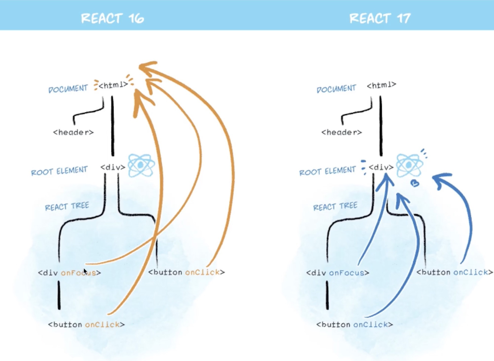

[← 返回笔记目录](/) 

---

# 事件

*   `event.target`: 事件最初发生的那个具体元素（事件源）
*   `event.currentTarget`: 当前正在处理事件的那个元素（绑定监听器的元素）

> **注意**：React 17 版本开始，事件就不再绑定到 `document` 上了

>
> *   React 16 绑定到 `document`
> *   React 17 事件绑定到 `root` 组件
> *   有利于多个 React 版本并存，例如微前端

待更新，我先分类完吧