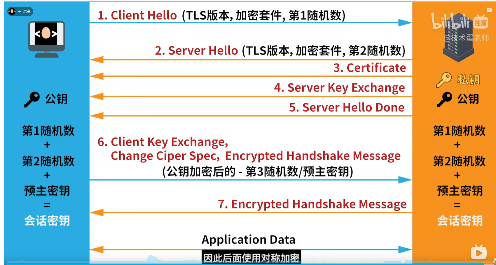

# 滚动驱动动画性能优化面试题

> 对应考察维度：**专业能力 → 前端工程化与性能优化 → 复杂动画性能调优**
> 核心场景：TaroJS（React 语法）+ 微信小程序，十几个全屏 section 的滚动驱动动画优化
>
> ⚠️ **简历一致性**：以下内容与你简历中「保时捷经销商系统（TaroJS + 微信小程序）」完全对应。优化聚焦在 **React 层面**和 **CSS/浏览器渲染层面**——这些是跨平台通用的核心能力，不依赖小程序特有 API。

---

## 一、项目背景（30 秒电梯演讲）

为保时捷经销商系统的**小程序端**开发了一个品牌展示页面（基于 TaroJS，使用 React 语法），核心挑战：

- 页面分为 **十几个 section**，每个 section 高度至少 `100vh`，**部分 section 初始高度远超 100vh**（内容丰富的需要 `200vh` 甚至更多）
- 动画 **非一次性播放**，而是**跟随滚动条位置实时变化**——滚动多少，动画就播放到对应帧
- **双向支持**：向下滚动 = 播放进场动画，向上滚动 = 倒播退场动画
- **多端适配**：小程序跑在微信 WebView 中，不同机型的 WebView 内核版本差异大（iOS WKWebView / Android Chromium / 鸿蒙 ArkWeb）

> 面试中讲这段时，建议主动说出 **技术难点**："核心难点是——十几个 section 同时存在大量 DOM 节点 + 高频滚动事件 + 每个 section 都要实时计算动画进度，三者叠加产生了严重的性能瓶颈。而且 section 高度不固定，部分远超 100vh，这让很多常规优化方案（如虚拟列表）直接失效。"
>
> **关于 TaroJS**：面试时不用强调 Taro 框架本身，重点讲 React 层面的优化思路和浏览器渲染原理——这些是你简历中 'React + TypeScript' 能力的直接体现，也是面试官最看重的深度。

---

## 二、核心追问链路

---

### Q1: 你怎么发现页面性能差的？

> 🚨 **这是你之前踩过的坑。** "我感觉卡"是最差的回答。面试官想知道的是你的**量化能力和排查方法论**。

#### 标准回答框架（从数据到定位）

**第一步：肉眼感知 → 量化指标**

"首先我注意到滑动页面时有明显的 **视觉卡顿** 和 **动画不同步**——手指已经滑过去了，动画还在后面追。但仅有感觉不够，我需要拿到**客观数据**。"

**第二步：使用工具收集数据**

| 工具 | 用途 | 关键指标 |
|------|------|----------|
| **微信开发者工具 → 性能面板** | 实时查看 FPS、CPU 占用、内存 | FPS 低于 30 即为明显卡顿，CPU 持续高占用说明 JS 执行过重 |
| **微信开发者工具 → 调试器 → Performance 面板** | 录制滚动操作，分析每帧耗时分布 | 单帧超过 16.67ms（60fps 预算）即为掉帧；定位耗时最长的函数调用 |
| **真机调试** | 在真实手机上运行，观察实际性能（开发者工具有代理层开销，性能比真机差） | FPS、动画跟手度、是否闪退（GPU 内存溢出） |
| **代码注入 FPS 监控** | `requestAnimationFrame` 驱动的帧率计数器，通过 console 或 toast 输出 | 持续低于 45fps 需要优化 |

**第三步：定位瓶颈**

```
录了一段滚动过程的 Performance 面板 → 分析发现：
├── scroll 事件回调高频触发 → 每次触发 React setState({ scrollTop })
│   → 页面级 state 更新导致 10+ 个 Section 组件全部 re-render
│   → React Virtual DOM diff 耗时 ~5ms
│   → Taro setData 序列化 + 跨线程传输 ~8ms
├── 动画属性通过 JS 动态设置 inline style → 每帧触发 Style 重算 + Paint
│   → Paint 耗时 ~6ms
├── 合计单帧远超 16.67ms 预算 → 实际 FPS 约 20-25
└── 瓶颈确认：scroll 中的 setState 是整个性能问题的根源
```

**追问：为什么 scroll 中 setState 是问题根源？**

```
scroll 事件（每 ~16ms 触发一次）
  → setState({ scrollTop })
  → React Reconciler 遍历 10+ 个 Section 的 Virtual DOM 进行 diff
  → Taro 把 diff 结果通过 setData 序列化传到渲染层（跨线程 IPC）
  → 渲染层更新 WebView DOM
  → 浏览器重新 Layout → Paint → Composite

每次 scroll 事件 → 完整走一遍上述链路
JS 线程被占满 → 渲染层拿不到帧时间 → 掉帧 → 卡顿
```

#### 你可以直接说的量化话术

> "我用微信开发者工具的 Performance 面板录制了一段滚动操作，FPS 在 20-30 之间波动——流畅体验需要 50+。帧耗时分析定位到了核心瓶颈：scroll 事件中的 setState 触发 React diff 约 5ms，setData 跨线程传输约 8ms，合计单帧突破 16.67ms 预算。根因是**scroll 事件中高频调用 setState 阻塞了渲染**。"

---

### Q2: 你做了哪些具体优化？

#### 优化一（最核心）：小程序 animate() + Observer → 动画脱离 setState

**问题**：scroll 事件中 `setState({ scrollTop })` 是性能瓶颈的根源。每次滚动都触发 React 全量 re-render + Taro setData 跨线程传输。

**核心思路**：**动画用小程序 `animate()` API 在渲染层直接执行，JS 逻辑层只做"开关"控制，scroll 中不再调用 setState。**

> `animate()` 是小程序提供的 JS API，用法类似 Web Animations API 的 `element.animate(keyframes, options)`。虽然是 JS 调用，但**动画执行发生在渲染层**，不经过逻辑层的 setState → setData 链路。

```
优化前（问题链路）：
scroll 事件（高频）
  → setState({ scrollTop })
  → React diff（主线程阻塞）
  → setData 序列化 + 跨线程（小程序双线程开销）
  → 渲染层更新
  → 单帧超预算 → 掉帧

优化后：
Observer 检测 section 进入视口（异步，不阻塞）
  → 调用 element.animate(keyframes, options)（一次性调用）
  → 动画在渲染层独立执行
  → JS 线程空闲 → 帧预算完全留给渲染
```

**实现步骤**：

**第一步：定义 keyframes 为 JS 对象（不是 小程序 animate() 传入 keyframes）**

```tsx
// 进场动画的关键帧
const enterKeyframes = [
  { opacity: 0, transform: 'translateY(40px)' },
  { opacity: 1, transform: 'translateY(0)' },
];

// 退场动画的关键帧（倒播效果）
const leaveKeyframes = [
  { opacity: 1, transform: 'translateY(0)' },
  { opacity: 0, transform: 'translateY(-40px)' },
];

const animOptions = {
  duration: 600,
  easing: 'ease-out',
  fill: 'both' as const, // 动画结束后保持最终状态
};
```

**第二步：用 Observer 检测 section 可见性，调用 animate()**

```tsx
function Page() {
  const lastScrollY = useRef(0);

  useEffect(() => {
    const observer = new IntersectionObserver(
      (entries) => {
        const currentY = window.scrollY;
        const direction = currentY > lastScrollY.current ? 'down' : 'up';
        lastScrollY.current = currentY;

        entries.forEach(entry => {
          const el = entry.target as HTMLElement;

          if (entry.isIntersecting && direction === 'down') {
            // 向下滚 + 进入视口 → 播放进场动画
            el.animate(enterKeyframes, animOptions);
          } else if (!entry.isIntersecting && direction === 'up') {
            // 向上滚 + 离开视口 → 播放退场动画
            el.animate(leaveKeyframes, animOptions);
          }
        });
      },
      { threshold: [0, 0.1, 0.5, 1] }
    );

    document.querySelectorAll('.section').forEach(el => observer.observe(el));
    return () => observer.disconnect();
  }, []);

  return (
    <>
      <Section1 />
      <Section2 />
      {/* ... 十几 section，只渲染一次，之后不再 setState */}
    </>
  );
}
```

**为什么从根本上解决了问题？**

```
对比：

❌ 旧方案（React state 驱动，每帧 setState）：
scroll → setState → React diff → setData → 渲染
JS 线程每帧都在排队 → 渲染拿不到帧时间 → 持续掉帧

✅ 新方案（animate() 渲染层执行，Observer 做开关）：
Observer（异步触发）→ 调用 element.animate(keyframes, options)
→ 动画在渲染层独立执行，不需要 JS 逐帧参与
→ JS 只做了"告诉渲染层开始播动画"这一件事，然后就没事了
→ 动画全程不经过 React 渲染管线
```

**追问：animate() 和 小程序 animate() 传入 keyframes 有什么区别？为什么选它？**

| | 小程序 animate() 传入 keyframes | `element.animate()` |
|---|---|---|
| **定义方式** | 声明式，写在 WXSS 文件里 | 程序式，JS 传入 keyframes 对象 |
| **控制方式** | 通过切换 className 或 style 控制 | 调用即播，返回 Animation 对象可控 |
| **执行位置** | 都在渲染层 | 都在渲染层 |
| **灵活性** | 静态，keyframes 写死了 | **动态**，可以根据滚动方向/速度动态选择不同 keyframes |
| **适用场景** | 固定的、预定义的动画 | **随滚动方向动态切换进场/退场动画** |

> 我们的场景需要根据滚动方向动态切换进场 vs 退场动画，`animate()` 更灵活——Observer 检测到方向后直接传入不同的 keyframes 数组即可。

---

#### 优化二：will-change + transform 3D → 创建独立合成层

先澄清一个容易误解的点——

**transform 本身确实只触发 Composite，但有一个前提：这个元素必须已经在自己的独立合成层（GraphicsLayer）里。** 如果元素没有独立合成层，它和其他内容共享一个图层，那 transform 变化时浏览器仍然需要重新绘制那个共享图层。

**will-change 和 translate3d 的作用就是：保证元素拥有独立合成层。**

```
没有独立合成层时（默认情况）：
┌─────────────────────────┐
│ 共享的 Paint Layer       │
│  ┌──────┐               │
│  │ 文字  │               │  ← 文字、图片、动画元素都在同一个图层
│  ├──────┤               │
│  │ 图片  │               │     transform 变化
│  ├──────┤               │  → 整个图层重新 Paint → 慢
│  │ 动画  │ ← 动了一下    │
│  └──────┘               │
└─────────────────────────┘

有独立合成层时（will-change / translate3d 之后）：
┌─────────────────────────┐
│ 共享的 Paint Layer       │
│  ┌──────┐ ┌──────┐      │
│  │ 文字  │ │ 图片  │      │  ← 静态元素不动
│  └──────┘ └──────┘      │
├─────────────────────────┤
│ 独立的 GraphicsLayer     │  ← will-change 创建的独立图层
│  ┌──────────────────┐   │
│  │  动画元素（GPU 纹理）│   │  ← 存在 GPU 显存里
│  └──────────────────┘   │     transform 变化 → 只移动这一层 → 快
└─────────────────────────┘
```

**三者分别做什么**：

| 手段 | 作用 | 类比 |
|------|------|------|
| `will-change: transform` | **提前通知**浏览器"这个元素马上要有 transform 变化"，浏览器**在空闲时**为它创建独立合成层 | 提前预约——"我下周要用会议室"，系统提前安排好 |
| `translate3d(0, y, 0)` | **强制**浏览器创建合成层（3D 变换必须走 GPU，浏览器没有选择余地） | 直接进去占位——不管系统怎么想，我现在就要 |
| 只改变 `transform` / `opacity` | 在**已有**独立合成层的前提下，变化发生在 Composite 阶段，不碰 Layout/Paint | 会议已经预约好了，你直接进去开就行 |

**所以完整的故事线是**：

```
1. will-change: transform    → 提前创建独立合成层（规范做法）
2. translate3d()             → 低端机型/老浏览器兜底（Hack 做法）
3. keyframes 中只用 transform + opacity → 在已有合成层上动画（零开销变化）
```

**代码**：

```css
.section {
  /* 第 1 层保险：规范方式请求独立合成层 */
  will-change: transform, opacity;

  /* 第 2 层保险：万一浏览器不认 will-change，3D 写法强制提升 */
  /* keyframes 中用 translate3d 而非 translateY */
}

/* 动画结束 → 释放 GPU 内存 */
.section.animation-done {
  will-change: auto;
}
```

```tsx
// keyframes 中始终用 3D 写法
const enterKeyframes = [
  { opacity: 0, transform: 'translate3d(0, 40px, 0)' },
  { opacity: 1, transform: 'translate3d(0, 0, 0)' },
];
el.animate(enterKeyframes, { duration: 600, easing: 'ease-out', fill: 'both' });
```

> **⚠️ 不要滥用**：每个独立合成层在 GPU 显存里存一份纹理。10 个 section 各有 5 个动画元素 = 50 个图层 = 可能几百 MB 显存。**用完移除**（`will-change: auto`），低端机控制图层数量。

**追问：浏览器怎么决定一个元素要不要给独立合成层？**

```
浏览器的启发式规则（Chromium 为例）：

自动提升的情况：
├── 3D transform（translate3d、rotate3d 等）
├── <video>、<canvas>、<iframe>
├── opacity 动画 + 同时有 transform 动画
├── will-change 显式声明
├── 元素在主动画元素的上方（z-index 重叠）
└── filter（blur、drop-shadow 等）

不自动提升的情况：
├── 2D transform 单独使用（translateY、rotate 等）← 浏览器可能偷懒
├── 元素太小（不值得单独建图层）
└── 低端 GPU（避免显存压力）
```

**性能对比总结**：

| 属性变更方式 | 触发 Layout | 触发 Paint | 触发 Composite | 前提条件 |
|------------|------------|------------|---------------|---------|
| `left: 0 → 100px` | ✅ | ✅ | ✅ | — |
| `background: red → blue` | ❌ | ✅ | ✅ | — |
| `transform: translateX(100px)` | ❌ | ❌ | ✅ | **元素已有独立合成层** |
| `opacity: 0 → 1` | ❌ | ❌ | ✅ | **元素已有独立合成层** |

> **一句话总结**："transform 让变化跳过 Layout/Paint，will-change 保证 transform 有跳过的前提条件。"

---

---

#### 优化三：Observer 多阈值 + 方向判断 → 精准控制动画时机

**问题**：需要准确判断滚动方向 + section 与视口的相对位置，才能正确决定播放进场还是退场动画。

**方案**：

```tsx
const observer = new IntersectionObserver(
  (entries) => {
    const direction = getScrollDirection(); // 比较当前和上一次 scrollY

    entries.forEach(entry => {
      const el = entry.target as HTMLElement;

      if (entry.isIntersecting && direction === 'down') {
        // 向下滚 + section 进入视口 → 进场动画
        el.animate(enterKeyframes, animOptions);
        
      } else if (!entry.isIntersecting && direction === 'up') {
        // 向上滚 + section 退出视口 → 退场动画
        el.animate(leaveKeyframes, animOptions);
        
      }
    });
  },
  {
    // 多阈值：在不同交叉比例时都触发，动画切换更精准
    threshold: [0, 0.1, 0.25, 0.5, 0.75, 1],
  }
);
```

**Observer 的优势**：
- **异步回调**，不阻塞主线程，浏览器在空闲时执行
- **自动管理**：元素离开视口或被移除时自动停止观察
- **多阈值**：一次注册，在多种交叉状态下都能触发，不需要轮询
- 对比 scroll 事件：scroll 是同步的、每帧都触发的高频事件；Observer 是异步的、只在交叉状态变化时才触发

---

#### 优化四：React 层面优化 → 减少非动画场景的 re-render

**问题**：虽然核心的滚动动画已经通过 animate() 脱离了 React 渲染循环，但页面还有其他会触发 setState 的场景——数据加载、用户点击、表单交互等。这些 setState 仍然会触发所有子组件的默认 re-render。

```
即使和动画无关的 state 变了（比如某个弹窗的显示状态），
如果不用 React.memo → 所有 10+ 个 Section 仍然全量 re-render → diff 白做
```

**不是替代 animate() 方案，而是补充**：animate() 解决了"滚动驱动动画"这个最高频的瓶颈，React.memo 解决剩余的"零散 setState 引发的连带 re-render"。

**方案**：

```tsx
// 1. Section 组件用 React.memo —— 阻止无关 state 变化引发的 re-render
const Section = React.memo(function Section({
  data, onAction
}: SectionProps) {
  // 2. 复杂计算用 useMemo 缓存
  const processedData = useMemo(() =>
    heavyTransform(data), [data]
  );

  // 3. 回调用 useCallback 稳定引用，否则 React.memo 失效
  const handleClick = useCallback(() => {
    onAction(data.id);
  }, [onAction, data.id]);

  return (
    <div className="section">
      {/* 静态内容不会被无关 state 变化影响 */}
      <StaticContent data={processedData} />
      <button onClick={handleClick}>操作</button>
    </div>
  );
});

// 4. 静态组件单独提取 + memo
const Header = React.memo(() => <header>...</header>);
const Footer = React.memo(() => <footer>...</footer>);
```

**追问：React.memo 和 shouldComponentUpdate 什么关系？**

```
React.memo 是函数组件的浅比较方案，等价于 class 组件的：

shouldComponentUpdate(nextProps) {
  // 浅比较：遍历每个 prop，用 === 比较
  return nextProps.data !== this.props.data
      || nextProps.onAction !== this.props.onAction;
}

浅比较（===）：
- number、string、boolean → 直接比值的相等 → ✅ 可靠
- object、array、function  → 比的是引用 → ⚠️ 如果引用变了，即使内容相同也算"变了"

这就是为什么需要 useMemo / useCallback：
保持引用稳定，让浅比较能够正确地判断"没变化"。
```

**追问：React.memo 有开销吗？为什么不是所有组件都包一层？**

每一项优化都有代价：

```
React.memo 的开销：
1. 每次父组件渲染时，React.memo 需要遍历 props 做浅比较 → 有少量 CPU 开销
2. 如果 props 几乎每次都变（比如直接传对象字面量），浅比较永远返回 false
   → 白花比较开销 + 仍然 re-render → 负优化

适用场景（收益 > 开销）：
├── 组件 props 少且多为基本类型
├── 父组件频繁渲染，但子组件 props 很少变化
└── 组件渲染开销大（DOM 深、有复杂子组件）

不适用场景：
├── props 每次都变 → memo 没用
├── 组件本身渲染极轻（一个 <span>）→ 比较开销 ≈ 渲染开销，没意义
└── props 很多且深层嵌套 → 浅比较不够用，需要用自定义比较函数
```

---

#### 优化五：图片资源优化 → WebP 替代 PNG/JPG

**问题**：页面有大量高清图片作为 section 背景和内容展示，PNG/JPG 格式文件体积大，影响首屏加载和滚动时的解码性能。

**方案**：将全部图片统一转换为 WebP 格式。

```
优化前：
├── hero-bg.png      → 1.2 MB
├── product-1.jpg    → 480 KB
├── product-2.jpg    → 520 KB
├── ...
└── 合计约 8 MB

优化后：
├── hero-bg.webp     → 320 KB（减少 ~73%）
├── product-1.webp   → 140 KB（减少 ~71%）
├── product-2.webp   → 155 KB（减少 ~70%）
├── ...
└── 合计约 2.5 MB（减少 ~69%）
```

**WebP 为什么更小？**

| 对比维度 | JPEG | PNG | WebP |
|---------|------|-----|------|
| **有损压缩** | DCT 算法，块状压缩 | 不支持 | VP8 帧内压缩，预测编码，更高效 |
| **无损压缩** | 不支持 | DEFLATE | 比 PNG 小 26% 左右 |
| **透明通道** | 不支持 | 支持（RGBA） | 支持（有损+无损均可） |
| **动画** | 不支持 | 不支持（APNG 除外） | 支持 |
| **解码速度** | 快 | 中等 | 与 JPEG 接近 |

核心原理：WebP 的预测编码比 JPEG 的 DCT（离散余弦变换）更善于利用相邻像素的相似性，在同等画质下能用更少的比特数。

**追问：怎么处理不兼容 WebP 的浏览器？**

```html
<!-- <picture> 标签自动降级 -->
<picture>
  <source srcset="hero-bg.webp" type="image/webp">
  
</picture>
```

或者服务端根据 `Accept` 请求头动态返回：

```
请求头：Accept: image/webp,image/avif,image/jpeg,*/*
→ 服务端返回 .webp

请求头：Accept: image/jpeg,*/*（老浏览器）
→ 服务端降级返回 .jpg
```

**追问：WebP 也有局限吗？**

1. **解码仍走 CPU**：WebP 解码在 CPU 上执行，大量大图同时解码仍然吃 CPU。Chrome 99+ 开始支持 WebP 硬件解码，但老设备不支持。
2. **不支持渐进式显示**：JPEG 可以逐行显示（progressive JPEG），低网速时用户至少能看到模糊版。WebP 只能完整下载后显示。
3. **AVIF 是下一代选择**：比 WebP 再小 20-30%，且支持 HDR 和更宽的色域。但解码速度比 WebP 慢，目前适合对画质要求高、允许首帧慢一点的场景。

> **面试话术**："图片优化是投入产出比最高的一步——把全部图片从 PNG/JPG 换成 WebP，体积减少约 70%，首屏加载快了近两秒。如果现在做，我会再加上 AVIF 的渐进增强和懒加载。"

---

### Q3: 为什么这些优化有效？（原理深挖）

面试官常追问的点：

#### 追问 1："will-change 底层到底做了什么？"

```
will-change 触发浏览器的三个行为：

1. 创建 GraphicsLayer（合成层）
   - 将该元素的渲染结果作为独立纹理存入 GPU 显存
   - 该层的 transform/opacity 变化只影响纹理的合成位置
   - 不触发重排（Layout）和重绘（Paint）

2. 提前准备 GPU 资源
   - 浏览器通常会延迟创建合成层（按需）
   - will-change 让浏览器提前创建，避免动画首帧的创建开销

3. 建立独立的渲染上下文
   - 该元素的内容（包括子元素）渲染为单独的位图
   - 位图变化时只需重新合成，不影响其他元素
```

#### 追问 2："为什么 transform 不触发重排？"

```
浏览器的渲染流水线（Chromium 渲染引擎）：

DOM Tree ──→ Style ──→ Layout Tree ──→ Paint Layer ──→ GraphicsLayer ──→ Display

  │              │            │               │                │
  │              │            │               │                └── transform 只影响这里
  │              │            │               └── color 等属性影响这里
  │              │            └── width/left 等属性影响这里
  │              └── 计算每个元素的具体样式
  └── 解析 HTML

关键：transform 作用于 GraphicsLayer 的合成阶段，
元素在文档流中的位置（Layout 阶段计算）没有改变。
所以不需要重新 Layout，也不需要重新 Paint。
```

#### 追问 3："为什么不用 setState 直接操作 DOM 是合理的？"

```
这个优化的本质是搞清楚"谁该管什么事"：

React 的职责：管理组件状态和 UI = f(state) 的映射关系
             适合"数据变了 → UI 需要跟着变"的场景

渲染层的职责：执行动画（animate() 传入 keyframes 后由渲染层独立完成）
             动画是渲染层的原生能力，不依赖 JS 状态

我们的 section 动画：
- 动画定义（keyframes）→ 纯 CSS，属渲染层
- 触发时机判断（Observer）→ JS 做一次判断
- 执行 → 渲染层独立完成

换句话说：React 不应该管"动画怎么播"，它只需要管"什么时候让渲染层开始播"。
Observer 回调里调用 element.animate()，就是做了这个"通知"的职责。
不经过 setState 是刻意的——这个信息不需要进入 React 的状态管理体系。
```

---

### Q4: 为什么不用虚拟列表？

> 🚨 **这是你之前被追问的问题。** 需要清楚地解释"不是我不知道虚拟列表，而是这个场景有三个条件让虚拟列表不可行。"

#### 核心原因（按重要性排序）

**原因一（最致命）：Section 高度不固定，远超 100vh**

虚拟列表的核心前提是**能提前知道每个 item 的高度**（定高）或**能测量到真实高度**（动态高度）。但我的场景中：

```
Section 1: 100vh  — 标准
Section 2: 250vh  — 内容丰富，有大量图文和子动画
Section 3: 100vh  — 标准
Section 4: 180vh  — 包含可展开的详情区域
...
```

- 定高虚拟列表直接不可用（高度差异巨大）
- 动态高度虚拟列表需要一个"测量阶段"——先渲染每个 item 拿到真实高度
- 但渲染本身就包含了大量 DOM 节点和动画元素——测量的代价等于把性能问题先经历一遍

**原因二：动画进度与滚动位置的强绑定**

```
虚拟列表的运作方式：
┌──────────────┐
│  Item N      │ ← 可视区，渲染真实 DOM
│  Item N+1    │ ← 可视区，渲染真实 DOM
├──────────────┤ 可视区边界
│  (空白占位)   │ ← Item 0~N-1   用 padding-top 撑高
│  (空白占位)   │ ← Item N+2~End 用 padding-bottom 撑高
└──────────────┘

但动画需要：
- section 的 offsetTop 反映真实位置
- section 在 DOM 中持续存在以保持动画状态

冲突：
- 虚拟列表的空白区域（padding/translateY）让 scrollTop 与 section 的视觉效果脱钩
- section 被卸载后 `getBoundingClientRect()` 直接返回 0
- 无法计算动画进度
```

**原因三：动画的连续性要求**

- Section 滚到可视区边缘时，动画处于中间状态
- 虚拟列表在 section 滚出可视区后会**卸载**该 section → 所有动画状态丢失
- 重新滚回来时 section 重新 mount → 动画从 0 开始而非从上次位置继续
- 这个闪烁对用户体验是灾难性的

#### 总结话术

> "虚拟列表解决的是'列表项太多导致 DOM 数量爆炸'的问题。我的场景中真正的瓶颈不是 DOM 数量（十几 section vs 成千上万列表项），而是 **scroll 事件中高频 setState 阻塞了渲染**。虚拟列表的 mount/unmount 机制会打破动画的连续性。再加上 section 高度远超 100vh 且不固定，动态高度虚拟列表的测量成本本身就不低。"

---

### Q5: 有没有更好的方案？

> 面试官想看你是否**持续关注新技术**，以及对不同方案的认知广度。

#### 方案一：CSS Scroll-driven Animations（原生方案，理想解法）

```css
/* 直接用 CSS 声明动画跟随滚动条 */
/* 完全在 Compositor 线程执行，不占用主线程 */

.section {
  view-timeline-name: --section-timeline;
  view-timeline-axis: block;
  animation: fade-in 1s linear;
  animation-timeline: --section-timeline;
  animation-range: entry 0% entry 100%;
}

@keyframes fade-in {
  0%   { opacity: 0; transform: translateY(40px); }
  100% { opacity: 1; transform: translateY(0); }
}
```

| 维度 | 我们的方案（Observer + keyframes） | Scroll-driven Animations |
|------|----------------------------------|--------------------------|
| **执行线程** | 渲染层（keyframes） | Compositor 线程 |
| **需要 JS？** | Observer 做开关 | 完全不需要 |
| **反向播放** | JS 判断方向后切换动画名 | 原生支持，滚动回去自动倒播 |
| **浏览器支持** | 全兼容 | Chrome/Edge 115+; Safari/Firefox 暂不支持（2025） |

**现状**：适合做渐进增强——支持的浏览器可以获得零 JS 开销的完美体验，不支持的降级到当前方案。

#### 方案二：Web Animations API（WAAPI）

```tsx
// 比 CSS @keyframes 更灵活：currentTime 可以精确控制任意进度
const animation = element.animate(
  [
    { opacity: 0, transform: 'translateY(40px)' },
    { opacity: 1, transform: 'translateY(0)' },
  ],
  { duration: 1000, fill: 'both' }
);
animation.pause();

// 在 Observer 回调中控制进度
animation.playbackRate = direction === 'down' ? 1 : -1;
animation.play();
```

**优势**：`currentTime` 精确控制任意帧，可以动态改变速率和方向，且仍然在 Compositor 线程执行。

#### 方案三：Canvas / WebGL 统一渲染

将整个页面放在一个 `<canvas>` 中渲染，自建动画引擎。

**优势**：只有一个 DOM 节点，性能天花板最高。

**劣势**：开发成本极高（等于开发迷你游戏引擎）；无法使用 React 生态；无障碍和 SEO 不支持；对此场景过度设计。

#### 方案四：CSS containment（辅助优化）

```css
.section {
  contain: layout style paint;
  /* 告诉浏览器：这个元素内部的渲染变化不会影响外部 */
  /* 浏览器可以跳过子树外的重新计算 */
}
```

几乎零成本的优化，适合独立 section 场景，作为辅助手段。

---

### Q6: 跨平台差异怎么调试和解决？

> 小程序虽然跑在微信里，但渲染层本质上是系统 WebView，浏览器兼容性问题同样适用。

#### 常见差异

| 平台 / 内核 | 典型问题 | 原因 |
|-----------|---------|------|
| **iPhone (WKWebView)** | `animation-delay` 负值精度有偏差；滚动惯性手感不同 | WKWebView 的 Animation 实现与 Chromium 有细微差异 |
| **小米/华为高端机 (Chromium)** | 合成层数量过多时性能退化 | 系统 WebView 的 Chromium 版本较老，合成策略保守 |
| **鸿蒙 (ArkWeb)** | `animation-delay` 负值行为不一致；部分 CSS 属性不支持 | ArkWeb 是华为自研内核，CSS Animation 规范实现有差异 |
| **低端 Android (Chromium 旧版)** | 合成层过多导致 GPU 内存溢出/闪退 | GPU 显存不足，大量纹理占用超出硬件承受范围 |

#### 调试方法

```
1. 微信开发者工具 → 性能面板（初步定位）
   实时查看 FPS、CPU、内存曲线。
   注意：开发者工具有代理层开销，性能比真机差，只看相对趋势，
   最终结论以真机实测为准。

2. 微信开发者工具 → 调试器 → Performance 面板
   录制滚动操作，逐帧分析耗时分布。

3. 真机调试（最终验证）
   在 iPhone、华为、小米等真机上实测，观察真实 FPS 和动画跟手度。

4. 代码注入 FPS 计数器
   用 requestAnimationFrame 实现帧率监控，console 输出。
```

#### 降级策略

```tsx
function getAnimationConfig(): AnimationConfig {
  const isLowEnd = navigator.hardwareConcurrency <= 4;

  if (isLowEnd) {
    return {
      fps: 30,                   // 降低帧率
      reducedKeyframes: true,    // 减少关键帧，简化动画
      willChange: false,         // 低端机不用 will-change，避免 GPU 内存压力
    };
  }

  return {
    fps: 60,
    willChange: true,
  };
}
```

---

## 三、面试话术模板

### 完整故事线（2-3 分钟版本）

```
"我印象最深的一次性能优化，是保时捷小程序里品牌展示页的滚动驱动动画调优。
项目基于 TaroJS（React 语法）。

【背景】页面有十几个全屏 Section，动画跟随滚动条实时变化——滚到哪播到哪。
向下滚是进场动画，向上滚是退场倒播。section 高度不固定，有的远超 100vh。
十几组动画同时挂在页面上，性能压力很大。

【测量】我用微信开发者工具的 Performance 面板录了一段滚动操作，
FPS 只有 20 多。帧分析定位到核心瓶颈：scroll 事件中每次 setState
触发 React diff（~5ms）+ setData 跨线程传输（~8ms），
单帧突破 16.67ms 预算。根因是 scroll 中高频 setState 阻塞了渲染。

【方案】核心思路——让动画脱离 React 渲染循环，放到渲染层独立执行。

第一步：把所有动画声明为 小程序 animate() 传入 keyframes，默认 paused。
第二步：用 IntersectionObserver 检测每个 section 是否进入视口。
第三步：进入视口→设 调用 el.animate(keyframes, options)，动画在渲染层独立执行。
第四步：scroll 事件中完全不调用 setState。

关键理念：React 不应该管"动画怎么播"，它只需要管"什么时候让渲染层开始播"。

辅助优化一：will-change + translate3d 创建独立合成层，让 transform 动画
只触发 Composite、跳过 Layout 和 Paint。

辅助优化二：全部图片换成 WebP 格式，体积减少约 70%，首屏加载快近两秒。

【结果】优化后 FPS 稳定在 55+，JS 线程基本空闲，滚动跟手，
首屏加载时间也明显缩短。这个经历让我理解了"性能优化是组合拳"——
渲染层优化解决卡顿，资源优化解决加载，两者配合才是完整的体验提升。

【反思】如果现在重新做，CSS Scroll-driven Animations 是更理想的方案——
动画完全在 Compositor 线程执行，连 Observer 都不需要。
但目前兼容性不够，可以用 @supports 做渐进增强。"
```

---

## 四、扩展知识：相关原理速查

### 浏览器渲染流水线（完整版）

> 面试中讲渲染流水线，最容易漏的是 **Layer Tree、Raster（栅格化）、Tiles（瓦片化）** 三步。下面按正确顺序逐层拆解。

---

#### 总览：七个阶段一张表

| 阶段 | 做什么 | 产出物 | 在哪条线程 |
|------|--------|--------|-----------|
| ① Parse | HTML → DOM Tree，CSS → CSSOM Tree | DOM + CSSOM | 主线程 |
| ② Style | 计算每个节点的最终样式（合并默认值、继承、选择器优先级） | ComputedStyle | 主线程 |
| ③ Layout | 计算每个节点的**几何位置和尺寸**（x, y, w, h） | Layout Tree | 主线程 |
| ④ Layer | 构建图层树，决定哪些元素提升为独立 GraphicsLayer | Layer Tree | 主线程 |
| ⑤ Paint | 为每层生成**绘制指令**（Display List：画矩形、文字、阴影…） | Display List | 主线程 |
| ⑥ Raster | 将绘制指令转为**像素位图**（GPU Texture），按 Tile 分块执行 | GPU 纹理 | Raster Worker 线程 |
| ⑦ Composite | GPU 将各层纹理按 z-order + transform 矩阵**合成**输出到屏幕 | 屏幕画面 | 合成线程 |

---

#### 一、逐阶段拆解

**① Parse（解析）—— 字节流 → 结构化数据**

```
HTML 字节 → 字符 → Token（标签/属性/文本）→ Node → DOM Tree
CSS 字节 → 字符 → Token → CSSOM Tree

注意：解析是增量进行的，不需要等整个 HTML 下载完。
CSS 解析不阻塞 HTML → DOM，但会阻塞后续的 Render。
```

**② Style（样式计算）—— 确定每个节点的最终样式**

```
浏览器做的事：
1. 把 user-agent 默认样式 + 开发者 CSS + 用户自定义样式合并
2. 按选择器优先级（specificity）解决冲突
3. 把所有相对单位（em, rem, %, vh）算成绝对 px 值
4. 对每个 DOM 节点输出一份 ComputedStyle

例如 div { width: 50% } → 视口 375px → ComputedStyle: width: 187.5px
```

**③ Layout（重排）—— 几何位置和尺寸**

```
输入：带 ComputedStyle 的 DOM Tree
输出：每个节点的盒子模型（x, y, width, height, margin, padding, border）

举例：
<div style="width: 50%; padding: 20px;">
  <span>hello</span>
</div>

Layout 计算过程：
1. 视口 375px × 50% → div 内容宽度 187.5px
2. + padding 20×2 → div 总宽度 227.5px
3. "hello" 5 字符 × 14px 字体 → 70px → 不换行
4. div height = 14px 行高 + 20×2 padding = 54px
5. 输出的 Layout Tree：div(0, 0, 227, 54), span(20, 20, 70, 14)
```

**④ Layer（图层树构建）—— 面试最容易漏掉的一步**

Layout 之后不是直接 Paint。浏览器会先把 Layout Tree 转成 **Layer Tree**，核心动作是决定哪些元素需要**单独提升**为 GraphicsLayer：

```
Layer Tree 的决策逻辑：
├── 拥有自己的层叠上下文（z-index 非 auto + 定位元素）→ 创建 Paint Layer
├── 3D transform、will-change、<video>、<canvas> → 提升为 GraphicsLayer
├── 元素在主动画元素上方（z-index 重叠）→ 可能被连带提升
└── 其余元素 → 共享父级 Paint Layer

Paint Layer（绘制层）：按层叠顺序组织，同一层的元素一起 Paint
GraphicsLayer（合成层）：独立 GPU 纹理，transform 变化不影响其他层
```

**⑤ Paint（绘制指令生成）—— 注意：不产出像素！**

```
Paint 产出的是 "Display List"（Skia 中是 SkPicture）：

对一个按钮元素，Paint 生成：
1. drawRect(#fff, x=0, y=0, w=187, h=59)      ← 白色背景
2. drawRect(border=#ccc, x=0, y=0, w=187, h=59) ← 边框
3. drawText("hello", x=20, y=20, 14px, #333)    ← 文字
4. drawShadow(offset=2, blur=4, rgba(0,0,0,0.1)) ← 阴影

这些是"命令"，不是像素。实际的像素产出在下一步 Raster。
```

**⑥ Raster（栅格化）—— 像素产出的阶段**

```
Raster 做的事：执行 Paint 阶段产出的绘制指令，把它变成真正的像素位图。

"在 (20,20) 处画 14px 的 'hello'" 这条指令
  → GPU Shader 对目标区域每个像素点计算颜色
  → 输出一张 RGBA 位图（GPU Texture）
  → 存到 GPU 显存（VRAM）中

GPU 为什么比 CPU 快：
├── CPU：逐像素串行处理，40000 个像素逐个排队 → 慢
├── GPU：几百个 Shader 核心同时并行处理 → 40000 个像素同时算完 → 快
└── 例子：background: linear-gradient(to bottom, #000, transparent)
         CPU 要逐行算渐变，GPU 所有像素瞬间完成
```

**⑦ Composite（合成）—— 最终画面输出**

```
每个 GraphicsLayer 在 GPU 显存里对应一张纹理：

Layer 0: 背景层     [~3 MB]
Layer 1: Header     [~90 KB]
Layer 2: Section 1  [~1.2 MB]  ← 动画元素
Layer 3: Section 2  [~1.2 MB]

合成线程做的事：
1. 对每一层按 transform 矩阵做几何变换（位移/缩放/旋转）
2. 按 opacity 混合半透明像素
3. 按 z-order 叠放
4. 输出一帧画面

关键结论：
transform 变化 → GPU 只修改第 1 步的"变换矩阵"，纹理本身不需要重新生成。
这就是为什么 transform 动画只需要 Composite ——
位图（栅格化结果）已经在 GPU 显存里了，动它只需改一个矩阵参数。
```

---

#### 二、Tiles（瓦片化）—— 为什么长页面不会占满 GPU 显存

**问题**：一个 `375×20000px` 的图层，如果完整栅格化成一张位图 = 30MB。10 个图层 = 300MB，低端手机显存总共 512MB，直接崩溃。

**解决**：浏览器把每层切成 256×256px 的 **Tile（瓦片）**，只栅格化视口附近的：

```
页面切分示意（每个 □ = 256×256 Tile）：

┌──┬──┬──┐
│ □│ □│ □│  ← 视口上方，未栅格化
├──┼──┼──┤
│ □│ ■│ □│  ← ■ 视口内的 Tile，已栅格化，纹理在 GPU 缓存
├──┼──┼──┤
│ □│ □│ □│  ← 视口下方，未栅格化
├──┼──┼──┤
│..│..│..│  ← 更远的区域完全不处理
└──┴──┴──┘
```

**Tile 生命周期**：分配 → Raster Worker 线程栅格化 → 存入 GPU Texture Atlas → 合成 → 滚出视口后回收

| Tile 大小 | 优点 | 缺点 |
|----------|------|------|
| 小（128px） | 增量栅格化快，滚动丝滑 | Tile 数量多，管理开销大 |
| 大（512px） | 管理效率高 | 滚动时突然需要栅格化大块，单帧压力大 |
| **Chromium 默认 256px** | 折中 | — |

> 面试一句话："浏览器把页面切成 256px 的小块，只把屏幕附近的变成像素存 GPU 里，远的一律不动。"

---

#### 三、两条线程的分工——为什么 animate() 不会被 JS 卡顿影响

| | 主线程（Main Thread） | 合成线程（Impl Thread） |
|---|---|---|
| **负责** | JS 执行、Style、Layout、Paint | Raster 调度、Composite、VSync 响应 |
| **触发条件** | JS 操作 DOM/样式、resize、scroll 等 | 每次 VSync 自动运行 |
| **能不能被 JS 阻塞？** | ✅ 就是被它阻塞的 | ❌ 独立运行，主线程卡死也不影响 |

```
这意味着什么？

场景：页面上有一个 JS 长任务跑了 200ms

主线程：被阻塞 200ms，React setState 全卡住，Layout/Paint 全停
合成线程：照常跑！每 16.67ms 照常 Composite，往屏幕输出画面

→ 如果动画用的是 CSS Animation / animate()，且只改了 transform/opacity
→ 这 200ms 里动画仍然 60fps 流畅运行
→ 但如果动画走的是 JS setState → 这 200ms 里完全卡死

这就是我们优化方案选 animate() 而不继续用 setState 的底层原因。
```

---

#### 四、一个完整帧的生命周期（VSync → 屏幕）

```
VSync 信号（硬件每 16.67ms 发一次）
    │
    ▼
合成线程收到信号 ──→ 开始准备新帧
    │
    ├── 1. 处理 Input（触摸、滚轮），确定有没有待处理事件
    │
    ├── 2. 执行 requestAnimationFrame 回调（主线程）
    │
    ├── 3. 如果需要：Style → Layout → Paint（主线程）
    │     如果不需要（transform/opacity only + 有合成层）：跳过！
    │
    ├── 4. Raster（栅格化新出现的 Tile，Raster Worker 线程池并行）
    │
    ├── 5. Composite（合成所有图层纹理 → 一帧画面）
    │
    ▼
SwapBuffers：GPU 把画面推到屏幕

┌──────┬──────┬──────┬──────────┐
│ 帧 A │ 帧 B │ 帧 C │ (丢弃)    │
│16.7ms│16.7ms│16.7ms│          │
├──────┴──────┴──────┴──────────┤
│ 如果主线程卡 40ms → 丢两帧 → 用户感知为"画面跳了"  │
└────────────────────────────────┘
```

---

#### 五、两个额外优化机制

```
content-visibility: auto
├── 屏幕外元素：跳过 Layout + Paint + Raster（全部跳过，不是延迟）
├── 浏览器只计算一个近似高度（contain-intrinsic-size）用于滚动条
├── 元素接近视口时自动触发完整渲染
├── 适合：页面下方不常被看到的 section
└── 一句话：让浏览器不渲染看不见的东西

Occlusion Culling（遮挡剔除）
├── 被不透明元素完全挡住的 Tile → 不栅格化
├── 在 Composite 阶段自动判断
├── 半透明元素后面的内容 → 仍然要渲染（因为会露出来）
└── 这是浏览器自动做的，不需要开发者介入
```

---

#### 六、完整示例：滚动动画的两种渲染路径

```
用户滚动 → Section 动画元素 transform: translateY(20px → 0px)

━━━ 路径 A：无独立合成层（没加 will-change）━━━

JavaScript   Style     Layout    Paint      Raster    Composite
(处理滚动)   (重算)    (重排)    (指令)     (像素)     (合成)
  ~2ms       ~1ms      ~3ms      ~5ms       ~4ms       ~1ms
                                            ↑
                                    纹理要重新生成！
总耗时 ≈ 16ms → 撞到帧预算边界 → 随时掉帧

━━━ 路径 B：有独立合成层（will-change 已生效）━━━

JavaScript   Style     Layout    Paint      Raster    Composite
(处理滚动)   (跳过)    (跳过)    (跳过)     (跳过)     (合成)
  ~2ms                                              ~1ms
                                                     ↑
                                          纹理已在 GPU 缓存中
                                          只改变换矩阵！
总耗时 ≈ 3ms → 帧预算绰绰有余 → 稳定 60fps

will-change 的价值：
不是让 transform 本身更快，
而是让 transform 变化时"需要做的事"从 6 步缩减为 2 步。
```

### 会触发 Layout 的操作（能避免就避免）

```
读取（强制同步布局——最隐蔽的性能杀手）：
offsetTop/Left/Width/Height、scrollTop/Left/Width/Height、
clientTop/Left/Width/Height、getComputedStyle()、
getBoundingClientRect()、getClientRects()

写入：
width/height/padding/margin/border/top/left/right/bottom
display、position、float、overflow
添加/删除 DOM 节点、修改文本内容

→ 原则：批量读 → 批量写。读写在同一个帧内交替 = 强制同步布局
→ 更佳：用 transform 替代 left/top，用 opacity 替代 visibility
```

### 这个场景的优化核心：谁该管什么事

```
目标：把帧时间控制在 16.67ms 以内

核心原则：
├── 渲染层能做的事，不要绕回逻辑层
│   └── 小程序 animate() 传入 keyframes 动画 → 渲染层独立执行
├── JS 的职责是"开关"，不是"驱动每一帧"
│   └── Observer 判断时机 → Observer 触发时调用 element.animate()
├── scroll 事件中不要 setState
│   └── 把高频的 scroll → setState → diff → setData 链路砍掉
├── 动画属性只用 composite-only（transform + opacity）
│   └── will-change / translate3d 创建合成层
└── 资源体积优化
    └── 图片统一 WebP 格式，体积减少约 70%
```

---

## 五、浏览器输入 URL 到页面显示（完整流程）

> 前端面试**必考题**。考察你是否理解从网络到渲染的完整链路。回答的关键是 **分阶段、有层次**，不要把所有东西混在一起讲。

### 总览：七大阶段

```
① URL 解析 → ② DNS 解析 → ③ TCP 连接 → ④ TLS 握手
→ ⑤ HTTP 请求/响应 → ⑥ 浏览器解析 → ⑦ 渲染流水线
```

---

### 阶段一：URL 解析

**做什么**：浏览器判断你输入的是"搜索关键词"还是"合法 URL"。

```
输入 "baidu.com"
  → 浏览器补全协议：https://baidu.com
  → 解析出：
    protocol: "https"
    host:     "baidu.com"
    path:     "/"
    port:     443（https 默认）
```

**追问：浏览器怎么处理 HSTS（HTTP Strict Transport Security）？**

如果网站配置了 HSTS 且在你浏览器的 HSTS 预加载列表中（如 baidu.com），浏览器会**强制使用 HTTPS**，即使你输入的是 `http://`，浏览器也会在本地直接 307 重定向到 `https://`，不会先发 HTTP 请求。

---

### 阶段二：DNS 解析 —— 域名 → IP

**做什么**：把域名 `baidu.com` 翻译成服务器 IP 地址。

**查询链路（逐级缓存）**：

```
浏览器 DNS 缓存
  → OS hosts 文件
  → 路由器缓存
  → ISP DNS 服务器（运营商）
  → 根域名服务器（.）
  → 顶级域名服务器（.com）
  → 权威 DNS 服务器（baidu.com）
```

**追问：DNS 查询用的是什么协议？**

传统用 UDP（端口 53），单个包 512 字节以内。现在也有 DNS over HTTPS (DoH) 和 DNS over TLS (DoT)，用加密信道防止 DNS 劫持。

**追问：CDN 是怎么工作的？**

权威 DNS 服务器不直接返回源站 IP，而是根据请求来源 IP 判断地理位置，返回最近的 CDN 边缘节点 IP。这就是为什么同一域名在不同地区解析到不同 IP。

---

### 阶段三：TCP 连接 —— 三次握手

**做什么**：在客户端和服务器之间建立可靠的传输通道。

```
客户端                          服务器
  │                               │
  │── SYN (seq=x) ──────────────→│  ① 客户端：我要连接，初始序号 x
  │                               │
  │←─ SYN+ACK (seq=y, ack=x+1) ──│  ② 服务器：收到，我的序号 y，确认 x+1
  │                               │
  │── ACK (ack=y+1) ────────────→│  ③ 客户端：确认 y+1，连接建立
  │                               │
  │◄═══════ 连接建立 ═══════════►│
```

**追问：为什么是三次，不是两次或四次？**

- **两次不够**：客户端发了 SYN，服务器回了 SYN+ACK——但如果服务器回的包丢了，客户端认为连接失败，服务器却以为连接已建立，浪费服务器资源
- **三次刚好**：客户端最后再确认一次，双方都确认了"自己能发也能收"
- **四次挥手**是断开连接时用的，因为 TCP 是全双工的，双方要各自关闭

---

### 阶段四：TLS 握手（HTTPS 专属）

#### 为什么要加密？先理解明文传输的风险

HTTP 是**明文传输**——你发的所有数据，中间任何一个路由器、交换机、Wi-Fi 热点都能看到：

```
你 ──→ 路由器A ──→ 运营商 ──→ 路由器B ──→ 服务器
         ↑            ↑           ↑
      都能看到！     都能看到！    都能看到！

你发的请求：
GET /login HTTP/1.1
username=admin&password=123456   ← 明文！中间任何节点都能偷看
```

HTTPS 加了一层 **TLS 加密信道**，数据在传输前加密，只有目标服务器能解密。中间节点只能看到一堆乱码。

#### SSL 和 TLS 是什么关系？

```
SSL 1.0  ──→ 从未公开发布（1994，网景公司）
SSL 2.0  ──→ 1995 发布，有严重安全漏洞
SSL 3.0  ──→ 1996 发布，也被攻破了
TLS 1.0  ──→ 1999，本质是 SSL 3.1（改名了）
TLS 1.1  ──→ 2006
TLS 1.2  ──→ 2008，目前最广泛使用的版本
TLS 1.3  ──→ 2018，最新版本，更快更安全
```

> **面试时说**："现在说 SSL 其实是指 TLS。SSL 是旧名字，技术上 SSL 3.0 及之前都已被废弃。TLS 1.2 和 1.3 是目前的标准。"

#### 两种加密方式的角色

HTTPS 用到了**两种加密**，各司其职：

| | 对称加密 | 非对称加密 |
|---|---|---|
| **密钥** | 加解密用**同一把**密钥 | 一把**公钥**加密，一把**私钥**解密 |
| **速度** | **快**（毫秒级） | **慢**（是前者的 100-1000 倍） |
| **问题** | 双方怎么安全交换密钥？密钥在传输中被偷了怎么办？ | 公钥可以公开，私钥只有服务器持有，天然安全 |
| **作用** | 加密**实际传输的数据** | 加密**对称密钥的交换过程** |

**核心思路：用非对称加密来安全地传输对称密钥，然后用对称加密来高效传输实际数据。**

打个比方：
- 对称加密 = 双方用同一把钥匙锁箱子。快，但"怎么安全地把钥匙交给对方"是难题。
- 非对称加密 = 服务器公开一个"开口信箱"（公钥），任何人都能往里塞信，但只有服务器有钥匙打开（私钥）。慢，但安全。
- HTTPS 的做法 = 先用信箱（非对称）传一把临时钥匙（对称密钥），之后都用这把临时钥匙通信。

#### TLS 1.2 握手详解（4 步，2-RTT）
https://www.bilibili.com/video/BV1KY411x7Jp/?spm_id_from=333.337.search-card.all.click&vd_source=d66a6fb5cb08fa8db4dd3bf2bd839f71

```
第 1 次往返（RTT 1）：

客户端                                              服务器
  │                                                    │
  │──① ClientHello ──────────────────────────────────→│
  │   内容：                                           │
  │   · 客户端支持的 TLS 版本（1.2, 1.1...）             │
  │   · 客户端支持的加密套件列表（密码本组合）             │
  │     "我会用 AES-256-GCM, ChaCha20..."              │
  │   · 客户端随机数（Client Random）                   │
  │                                                    │
  │←─② ServerHello ──────────────────────────────────│
  │   内容：                                           │
  │   · 选定的 TLS 版本 + 加密套件                       │
  │     "就用 AES-256-GCM"                             │
  │   · 服务器随机数（Server Random）                   │
  │                                                    │
  │←─② Certificate ─────────────────────────────────│
  │   · 服务器的 SSL 证书（含公钥 + 域名 + CA 签名）      │
  │                                                    │
  │←─② ServerHelloDone ──────────────────────────────│
  │   · "我说完了"                                      │
  │                                                    │
  │── 客户端验证证书（本地进行，不发网络请求）：           │
  │   1. 用内置 CA 公钥 验证证书上的 CA 签名              │
  │   2. 检查证书是否过期                                │
  │   3. 检查证书域名是否匹配访问的域名                    │
  │   → 验证通过，证明"这个公钥确实是 baidu.com 的"       │
  │                                                    │
  │                                                    │
第 2 次往返（RTT 2）：                                   │
  │                                                    │
  │──③ ClientKeyExchange ────────────────────────────→│
  │   客户端生成 Premaster Secret（预主密钥）：           │
  │   · 用证书里的服务器公钥加密 Premaster Secret        │
  │   · 只有持有私钥的服务器能解开                       │
  │                                                    │
  │──③ ChangeCipherSpec ─────────────────────────────→│
  │   · "接下来我用对称密钥加密了"                        │
  │                                                    │
  │──③ Finished ─────────────────────────────────────→│
  │   · 第一条加密消息（验证对称密钥是否有效）             │
  │                                                    │
  │←─④ ChangeCipherSpec + Finished ──────────────────│
  │   服务器也切换到对称加密，握手完成                     │
  │                                                    │
  │◄══════ 加密信道建立 ═══════════════════════════►│
```

**会话密钥是怎么生成的？**（面试最爱问这一步）

```
三方各自贡献一部分随机数，用 PRF（伪随机函数）混合：

Client Random   —— 客户端在 ClientHello 中提供（明文）
Server Random   —— 服务器在 ServerHello 中提供（明文）
Premaster Secret —— 客户端生成，用服务器公钥加密传输

    ↓  三方混合，通过 PRF 函数

Master Secret（主密钥）
    ↓  再通过 PRF 分成

Session Keys（会话密钥）：
├── 客户端 → 服务器 的对称密钥
├── 服务器 → 客户端 的对称密钥（通常是不同的！）
└── HMAC 密钥（用于消息完整性校验）
```

> **关键理解**：即使攻击者监听到了 Client Random 和 Server Random（它们是明文的），但没有 Premaster Secret（被公钥加密了，只有服务器私钥能解开），就推不出会话密钥。

#### TLS 1.3 的改进

```diff
握手从 2-RTT 降到 1-RTT：

- 删掉了 RSA 密钥交换 → 只用 DH 密钥交换（前向安全性）
- 删掉了 CBC 模式、SHA-1、RC4 等不安全算法
- ClientHello 中直接包含了 DH 密钥协商参数
  → 第 1 次往返就完成了密钥交换 + 服务器认证
  → 不再需要 Premaster Secret → Master Secret → Session Keys 这个长链条
- 支持 0-RTT：之前连过的网站可以直接发加密数据

TLS 1.3 握手（1-RTT）：
客户端                          服务器
  │── ClientHello ──────────────→│ ① 客户端：我支持的套件 + DH 参数
  │←─ ServerHello + 证书 ────────│ ② 服务器：选定套件 + DH 参数 + 证书
  │   此时双方已经算出会话密钥      │
  │── 加密数据 ──────────────────→│ ③ 第一条加密消息就是业务数据
```

#### 追问热点

**1. 证书里有什么？证书链是怎么验证的？**

```
服务器证书包含：
├── 域名（baidu.com）        ← 浏览器会比对
├── 公钥                     ← 用来加密 Premaster Secret
├── 有效期                   ← 过期了浏览器会报错
├── 颁发者（CA）信息          ← "DigiCert 签发"
└── CA 的数字签名             ← CA 用自己的私钥加密的摘要

验证链（信任链）：
操作系统/浏览器内置的根 CA 证书（无条件信任）
  └── 中间 CA 证书（根 CA 签发）
      └── baidu.com 证书（中间 CA 签发）
          → 逐级验证签名 → 最终信任

如果中间任何一级验证失败 → 浏览器显示"不安全"警告
```

**2. 什么是前向安全性（Forward Secrecy）？**

> "即使服务器的私钥某天被泄露了，**过去的通信内容也无法被解密**。"

因为会话密钥不是直接用服务器公钥加密的，而是双方临时协商出来的（DH 密钥交换）。每次连接生成不同的会话密钥。服务器私钥只用于验证身份，不参与会话密钥的生成。

TLS 1.3 **强制要求**前向安全性（只保留 DH 密钥交换），TLS 1.2 可选。

**3. 中间人攻击（MITM）是什么？TLS 怎么防？**

```
攻击者截获了你和目标服务器的通信：

你 ──→ 攻击者（假装是服务器）──→ 真实服务器
        │
        攻击者可以偷看甚至修改所有数据

TLS 怎么防：
1. 攻击者可以伪造一个证书，但没有合法 CA 的签名
2. 浏览器验证证书时发现签名不合法 → 显示警告
3. 攻击者无法伪造 CA 签名（除非攻破了 CA，那就不是 TLS 的问题了）
```

---

### 阶段五：HTTP 请求与响应

**做什么**：浏览器向服务器要资源。

**请求**：

```
GET / HTTP/1.1
Host: baidu.com
Connection: keep-alive
Accept: text/html,application/xhtml+xml
Accept-Encoding: gzip, br
User-Agent: Chrome/xxx
Cookie: BAIDUID=xxxxx
```

**响应**：

```
HTTP/1.1 200 OK
Content-Type: text/html; charset=utf-8
Content-Encoding: br          ← Brotli 压缩
Cache-Control: max-age=3600   ← 缓存策略
Set-Cookie: sessionid=xxxxx
Transfer-Encoding: chunked    ← 分块传输

<!DOCTYPE html>               ← 响应体
<html>...
```

**追问：HTTP/1.1 vs HTTP/2 vs HTTP/3？**

| | HTTP/1.1 | HTTP/2 | HTTP/3 |
|---|---------|--------|--------|
| **传输层** | TCP | TCP | QUIC (UDP) |
| **连接数** | 同一域名 6 个连接 | 1 个连接多路复用 | 1 个连接，无队头阻塞 |
| **头部压缩** | 无 | HPACK | QPACK |
| **队头阻塞** | 有（TCP 层） | 有（TCP 层） | **无** |
| **推出时间** | 1997 | 2015 | 2022 |

---

#### HTTP 缓存（面试高频！）

浏览器缓存分为**强缓存**和**协商缓存**两种策略。

**决策流程**：

```
浏览器请求资源
      │
      ▼
┌─ 强缓存命中？ ────────────────────────────┐
│ (Cache-Control / Expires 未过期)            │
│                                            │
│ YES → 直接从本地缓存取（状态码 200，        │
│       但实际不发网络请求，显示为             │
│       "200 (from disk cache)" 或            │
│       "200 (from memory cache)"）           │
│                                            │
│ NO（过期了 / 没配）                          │
│   │                                        │
│   ▼                                        │
│ 浏览器发起请求，带上验证头                   │
│   │                                        │
│   ▼                                        │
│ 服务器判断资源是否变了                       │
│   │                                        │
│   ├─ 没变 → 304 Not Modified（协商缓存命中）  │
│   │         浏览器更新缓存过期时间，继续用缓存  │
│   │                                        │
│   └─ 变了 → 200 OK + 新资源                  │
│             浏览器替换缓存，渲染新内容         │
└────────────────────────────────────────────┘
```

**强缓存（不发请求）**：

| 响应头 | 含义 | 示例 |
|--------|------|------|
| `Cache-Control: max-age=3600` | 缓存 3600 秒（1小时）内直接用缓存，不发请求 | 静态 JS/CSS/图片 |
| `Cache-Control: no-cache` | **可以用缓存，但每次用之前必须问服务器**（走协商缓存） | HTML 主文档 |
| `Cache-Control: no-store` | **完全不缓存**，每次重新请求 | 敏感数据接口 |
| `Cache-Control: immutable` | 资源永远不变，**即使点了刷新也不重新验证** | 带 hash 的文件名 `app.a1b2c3.js` |
| `Expires: Wed, 01 Jul 2026 08:00:00 GMT` | 老式写法，优先级低于 Cache-Control | 兼容老浏览器 |

```
强缓存命中 → 开发者工具中看到：
Status: 200 (from disk cache)    ← 从硬盘缓存加载
Status: 200 (from memory cache)  ← 从内存缓存加载（更快，但重启浏览器就没了）
```

**协商缓存（发请求，但可能不传 body）**：

| 请求头 / 响应头 | 机制 | 特点 |
|----------------|------|------|
| `Last-Modified` / `If-Modified-Since` | 服务器告诉浏览器"上次修改时间"；浏览器下次请求时带上这个时间，服务器比较是否变了 | **时间精度只有秒**，1 秒内多次修改检测不到 |
| `ETag` / `If-None-Match` | 服务器返回资源内容的**哈希指纹**；浏览器下次请求时带上这个哈希，服务器比对 | **内容变化一定检测到**，比 Last-Modified 更精确 |

```
协商缓存完整流程（以 ETag 为例）：

① 浏览器第一次请求 style.css
② 服务器返回：
   HTTP/1.1 200 OK
   ETag: "abc123def"              ← 这个资源的哈希指纹
   Cache-Control: no-cache        ← 允许缓存但必须每次验证
   响应体: /* 完整的 CSS 内容 */
③ 浏览器缓存 style.css + 记录 ETag = "abc123def"
④ 用户刷新页面，浏览器发请求：
   GET /style.css HTTP/1.1
   If-None-Match: "abc123def"     ← "我上次存的版本是这个哈希"
⑤ 服务器比较：
   ├─ 文件没变 → 304 Not Modified（不传 body，省流量）
   └─ 文件变了 → 200 OK + 新 ETag + 新内容
```

**实际工程中怎么配？**

```
HTML 文件（index.html）：
  Cache-Control: no-cache            ← 每次都验证，因为入口文件变了
                                        用户才能看到新版本

带 hash 的静态资源（app.a1b2c3.js）：
  Cache-Control: max-age=31536000, immutable
  ← 缓存 1 年！因为文件名里带了 hash，
    内容变了 hash 就变 → 新文件名 → 不算缓存 → 新请求
    内容没变 → 文件名不变 → 永远用缓存

图片（logo.png，不带 hash）：
  Cache-Control: max-age=86400      ← 缓存 1 天
  ETag: "xyz789"                    ← 1 天后走协商缓存验证
```

**追问：memory cache 和 disk cache 的区别？**

```
memory cache（内存缓存）：
├── 存在 RAM 中，速度极快
├── 浏览器关闭就清空
├── 通常缓存体积小的、当前页面正在用的资源
└── 状态码显示：200 (from memory cache)

disk cache（硬盘缓存）：
├── 存在硬盘中，速度比内存慢但比网络快
├── 浏览器关闭后仍然存在
├── 通常缓存体积大的、不常用的资源
└── 状态码显示：200 (from disk cache)

一般规律：
├── 当前页面首次加载的 JS/CSS → 内存缓存（马上还要用）
├── 图片、字体 → 硬盘缓存（体积大，不常变）
└── 前一个页面留下的缓存 → 硬盘缓存
```

---

### 阶段六：浏览器解析 —— 字节 → DOM / CSSOM

**做什么**：把服务器返回的 HTML 字节流，一步步转成浏览器能理解的结构。

```
字节流（Bytes）
  → 字符流（Characters）—— 根据 Content-Type 的 charset 解码
  → Token（标签、属性、文本）
  → Node（DOM 节点）
  → DOM Tree（DOM 树）

同时：CSS 也一样
  → CSSOM Tree（CSS 对象模型树）
```

**关键：遇到 `<script>` 怎么办？**

```
<脚本解析阶段>
├── <script src="...">      → 暂停 HTML 解析，下载 + 执行 JS
├── <script async>          → **并行下载**，下载完立即执行（暂停 HTML 解析）
├── <script defer>          → **并行下载**，等 HTML 解析完再执行
└── <link rel="stylesheet"> → 并行下载 CSS，不阻塞 HTML 解析；但阻塞 JS 执行
                               （JS 可能操作 CSSOM，所以必须等 CSS 就绪）
```

**追问：为什么浏览器不边下载边渲染？**

浏览器**确实可以边下载边渲染**——这就是"渐进式渲染"。浏览器在收到足够的数据后会先构建部分 DOM 并开始渲染，不需要等整个 HTML 下载完。但在以下情况会阻塞：

- CSS 还没下载完（避免"无样式内容的闪烁" FOUC）
- 遇到同步 `<script>`（脚本可能修改 DOM）

---

### 阶段七：渲染流水线 —— DOM/CSSOM → 屏幕像素

```
DOM Tree + CSSOM Tree
        │
        ▼
   Render Tree（渲染树：合并 DOM + CSS，但只包含可见节点）
        │         display:none 的节点不参与；伪元素会参与
        ▼
   Layout（重排：计算每个节点的几何位置和大小）
        │
        ▼
   Paint（重绘：将每个节点绘制成位图，生成 Paint Layer）
        │
        ▼
   Composite（合成：将多个 Layer 按 z-index 顺序合并为最终画面）
        │
        ▼
   屏幕显示
```

**追问：重排（Layout）和重绘（Paint）有什么区别？**

| | 重排（Reflow） | 重绘（Repaint） |
|---|---|---|
| **触发条件** | 几何属性变化（width、height、left、字体大小、display 等） | 外观属性变化（color、background、box-shadow 等） |
| **影响范围** | 修改当前元素后，可能需要重新计算子、父甚至整个文档的布局 | 只需要重新画当前元素 |
| **性能开销** | **高**（几何计算 + 后续重绘） | **中**（只重绘位图） |
| **典型触发** | 添加/删除 DOM、改变 size、读取 offsetWidth | 改颜色、改背景图 |

**Composite（合成）优化目标**：如果只用 `transform` 和 `opacity` 做动画，浏览器可以跳过 Layout 和 Paint，直接合成——这就是 will-change 和 translate3d 的优化原理，也是本文档动画优化的底层依据。

---

### 面试回答模板（30 秒精简版）

> "从输入 URL 到页面显示，我分成七个阶段来理解：
>
> ① URL 解析——浏览器判断是搜索词还是合法地址，补全协议和端口。
> ② DNS 解析——逐级缓存把域名翻译成 IP 地址。
> ③ TCP 三次握手——建立可靠的端到端连接。
> ④ TLS 握手——如果是 HTTPS，在 TCP 之上建立加密信道。
> ⑤ HTTP 请求响应——浏览器发送 GET 请求，服务器返回 HTML + 资源。
> ⑥ 浏览器解析——HTML 字节流 → Token → Node → DOM Tree；CSS → CSSOM Tree。
> ⑦ 渲染流水线——Render Tree → Layout → Paint → Composite → 屏幕显示。
>
> 如果你想听某个阶段的细节，我可以展开讲。"

---

## 六、TaroJS 是怎么做到一套代码多端运行的？

> 分三个问题讲清楚：**编译时改了啥、运行时模拟了啥、适配层啥时候介入。**

---

### 问题一：编译时做了什么？

**你的理解是对的**——Taro 编译时做的事可以拆成两条线：

**线 1：React 代码本身的编译（Babel）**

```
你的 React 代码（JSX/TSX）
  → Babel 编译 JSX → React.createElement() 调用
  → TypeScript 编译 TS → JS
  → 打包（Webpack / Vite）
  → 产出：标准的 JS bundle

这条线跟普通 React 项目一样，Taro 没做什么特殊处理。
```

**线 2：Taro 做的额外工作——名字翻译 + 模板生成**

```
同时，Taro 的编译器做了一份额外的工作：

① 标签名翻译
  <View>   → <view>
  <Text>   → <text>
  <Image>  → <image>

② 属性名翻译
  className → class
  onClick   → bindtap（在模板层面，不是 JS 层面）

③ 生成小程序模板文件（WXML）
  Taro 从 JSX 中提取出"静态结构部分"，生成对应的 WXML 模板。
  动态部分（数据绑定、事件处理）通过 setData 桥接。

④ 生成小程序配置文件（app.json / page.json）
```

**总结：编译时做了什么（一句话版）**

> React 代码走 Babel 正常编译；Taro 额外把组件的标签名/属性名翻译成小程序能识别的名字，顺便生成 WXML 模板和配置文件。编译时不改变 React 的运行逻辑。

---

### 问题二：运行时做了什么？

**你的理解也是对的**——React 需要几个底层能力才能运行，而小程序不提供这些。Taro 运行时自己模拟了它们。

**React 运行需要什么？**

```
React 的两个核心阶段：

Reconciler（协调 / Render 阶段）：
  需要的能力：遍历 Virtual DOM、比较新旧节点差异
  → 这是纯 JS 计算，不需要浏览器 API
  → 在小程序逻辑层可以直接跑，Taro 不需要模拟

Commit（提交阶段）：
  需要的能力：
  ├── document.createElement()  —— 创建 DOM 节点
  ├── element.appendChild()     —— 插入子节点
  ├── element.setAttribute()    —— 设置属性
  ├── element.removeChild()     —— 删除节点
  └── element.addEventListener()—— 绑定事件
  → 这些在浏览器里由浏览器提供
  → 小程序没有这些东西！
```

**Taro 运行时的模拟方案**：

```
React 调用                              Taro 提供
─────────                              ────────
document.createElement('view')    →    new TaroElement('view')
element.appendChild(child)       →    TaroElement.appendChild()
element.setAttribute('class')   →    TaroElement.setAttribute()
element.removeChild(child)       →    TaroElement.removeChild()
element.addEventListener(...)    →    注册到 Taro 事件系统
window / document / location     →    全都模拟了一份
```

**所以对 React 来说，跟在浏览器里运行没什么区别**——它调 `document.createElement`，Taro 返回一个 TaroElement 对象，React 不知道这个对象是假的，它只关心对象有没有实现需要的接口。

**模拟完之后怎么更新到小程序页面？**

```
React 完成一次更新 → Taro 知道"哪些节点变了"
  → Taro 把变更数据序列化 → 调用小程序 setData()
  → 小程序渲染层收到数据 → 更新真实界面

关键优化：
├── 批量合并：16ms 内的多次 setState → 合并为一次 setData
├── 数据裁剪：只传变化的字段，不传整个 state
└── 增量更新：只传变化的节点数据，不传整棵 Virtual DOM 树
```

**事件系统怎么模拟？**

```
小程序只有 bindtap 这样的原生事件，
React 组件需要 onClick 这样的 Web 标准事件。

Taro 的做法：代理模式

1. 在小程序根节点上绑定所有事件（bindtap、bindinput ……）
2. 用户点击某处 → 小程序触发 bindtap
3. Taro 根据点击坐标 / _wxNodeId 找到对应的虚拟 DOM 节点
4. 包装成 Web 标准 Event 对象（包含 target、preventDefault 等）
5. 交给 React 的事件处理函数

用户代码：      <Button onClick={handleClick} />
实际执行链路：  bindtap → TaroEvent → React 事件系统 → handleClick(e)
```

---

### 问题三：适配层是什么？什么时候介入？

这是你不太清楚的部分。其实很简单——**适配层就是一堆 `if/else` 或 `switch/case`，在打包时根据目标平台选中正确的代码**。

**具体例子：当你写 `Taro.request()` 时发生了什么**

你写的代码：
```tsx
Taro.request({ url: '/api/data' })
```

Taro 的 API 适配器代码（简化版）：
```ts
// packages/taro-runtime/src/adapter/request.ts

function request(options) {
  // 编译时，TARO_ENV 是常量，不满足条件的代码会被 Tree Shaking 删除

  if (process.env.TARO_ENV === 'weapp') {
    // 微信小程序：调用 wx.request
    return wx.request(options);
  }

  if (process.env.TARO_ENV === 'alipay') {
    // 支付宝小程序：调用 my.request
    return my.request(options);
  }

  if (process.env.TARO_ENV === 'h5') {
    // H5：调用浏览器的 fetch
    return fetch(options.url, options);
  }

  // ... 其他平台
}
```

**你编译微信小程序时**：
- Webpack 的 DefinePlugin 把 `process.env.TARO_ENV` 替换为字符串 `'weapp'`
- `if ('weapp' === 'weapp')` → 永远为 true → 保留
- `if ('weapp' === 'alipay')` → 永远为 false → **Tree Shaking 删除**
- `if ('weapp' === 'h5')` → 永远为 false → **Tree Shaking 删除**
- 最终打包产物只剩 `wx.request(options)` 这一行

**所以适配层的本质**：

```
适配层 = 统一接口 + 平台分支 + 编译时 Tree Shaking

你的代码            Taro 适配层             最终产物（微信）
─────────          ──────────             ──────────
Taro.request()  →  if (weapp) wx.request   →  wx.request()
                   if (alipay) my.request  →  (被 Tree Shaking 删除)
                   if (h5) fetch()         →  (被 Tree Shaking 删除)

组件适配也是同理：
<Button>         →  if (weapp) <button>    →  微信原生 button 组件
                   if (h5) <button>        →  HTML button 元素
```

**三层适配器各管什么**：

| 适配器 | 管什么事 | 例子 |
|--------|---------|------|
| **API 适配器** | 小程序能力调用 | `Taro.request`、`Taro.getSystemInfo`、`Taro.navigateTo` |
| **组件适配器** | UI 组件渲染 | `<Button>`、`<ScrollView>`、`<Swiper>` |
| **生命周期适配器** | 小程序生命周期 → React 生命周期 | 小程序 `onShow` → React `componentDidShow` |

**三个问题串起来，一个完整的请求周期**：

```
你的 React 代码：
function Page() {
  const [data, setData] = useState(null);
  useEffect(() => {
    Taro.request({ url: '/api' }).then(setData);  // ← 编译时确定调用 wx.request
  }, []);
  return <View>{data?.name}</View>;  // ← 编译时翻译为 <view>
}

编译时：
├── Babel 正常编译 JSX/TS → JS
├── <View> → <view>（标签名翻译）
├── Taro.request → wx.request（适配层 Tree Shaking）
└── 生成 WXML 模板

运行时：
├── useEffect 执行 → 调用 wx.request（适配层在编译时已经选好了）
├── setData 触发 → React Reconciler 跑 Virtual DOM Diff
├── Commit 阶段 → 调用 TaroElement 模拟的 DOM API
├── Taro 算出变更 → setData({ root: { cn: [{ v: 'hello' }] } })
├── 渲染层收到 → 更新 <view>hello</view>

全程 React 不知道自己跑在"非浏览器"环境里。
```

---

### Taro 2.x → 3.x 的变化（选讲）

| | Taro 2.x | Taro 3.x |
|---|---------|---------|
| **核心理念** | 重编译时 | 重运行时 |
| **JSX 处理** | 直接把 JSX 翻译成 WXML 模板 | JSX 正常编译为 React 代码，运行时接管 |
| **DOM 模拟** | 无 | 有（TaroElement 等） |
| **跨框架支持** | 仅 React | React / Vue / Preact 等 |
| **调试** | 源码和产物结构差异大 | 结构和源码一致，可读性好 |

> 面试时说："Taro 3 最大的变化是引入了运行时 DOM 模拟层。之前 2.x 是纯编译时——JSX 直接翻译成 WXML，React 本身不参与小程序运行。3.x 让 React 完整跑在逻辑层，编译时只做名字翻译和适配层代码选择。"

---

### 面试追问：Taro 方案的局限性？

1. **setData 通信瓶颈不可消除**：逻辑层和渲染层分离是物理架构，Taro 只能优化不能消除。

2. **运行时体积**：模拟 DOM/BOM 的代码有几十 KB，对小程序的 2MB 包限制不友好。

3. **复杂交互不如原生**：高频手势、实时动画多了一层 Taro 运行时中转。我们动画选 `animate()` API 而不是 React state 驱动，就是有意识地绕过了这层中转。

4. **调试链路长**：源码 → Taro 编译 → 小程序运行 → 报错行号是编译产物，需要 source map。

5. **平台差异无法 100% 抹平**：总有需要写 `if (process.env.TARO_ENV === 'weapp')` 的时候。

---

## 七、面试官可能的反问汇总

| 面试官反问 | 你的策略 |
|-----------|---------|
| "你怎么测量性能的？" | 讲微信开发者工具 Performance + 真机验证 + 代码注入 FPS（Q1） |
| "核心优化思路是什么？" | 讲 animate() + Observer 替代 scroll 中的 setState，动画脱离 React 渲染循环（Q2 优化一） |
| "React 层面还做了什么优化？" | 讲 React.memo + useMemo + useCallback 减少非动画场景的连带 re-render（Q2 优化四） |
| "will-change 的原理？" | 讲合成层 + 渲染流水线 + 控制数量释放 GPU 内存（Q2/Q3） |
| "Observer 回调里直接操作 DOM，不走 React？" | 讲职责分离——渲染层的事还给渲染层，React 不需要管动画执行（Q3 追问 3） |
| "不用虚拟列表吗？" | 讲变高 section + 动画连续性 + mount/unmount 状态丢失（Q4） |
| "还有其他方案吗？" | 讲 Scroll-driven Animations / WAAPI / Canvas / CSS containment（Q5） |
| "不同机型表现不一样怎么办？" | 讲 iOS/Android/鸿蒙 WebView 差异 + 降级策略（Q6） |
| "IntersectionObserver 和 scroll 事件的区别？" | 讲异步 vs 同步、主线程阻塞、自动管理（Q2 优化四） |
| "图片优化方面你做了什么？" | 讲 WebP vs PNG/JPG 的体积对比 + picture 降级 + AVIF 展望（Q2 优化五） |
| "如果重新做会怎么做？" | Scroll-driven Animations 渐进增强 + CSS containment |
| "Taro 是怎么做到一套代码多端运行的？" | 讲编译时 AST 转换 + 运行时 DOM 模拟 + 适配器模式（六） |
| "你从中学到了什么？" | "性能优化不是玄学，是数据驱动的工程决策。核心是把渲染层该做的事还给渲染层。" |
