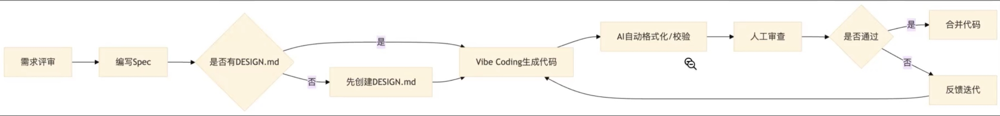
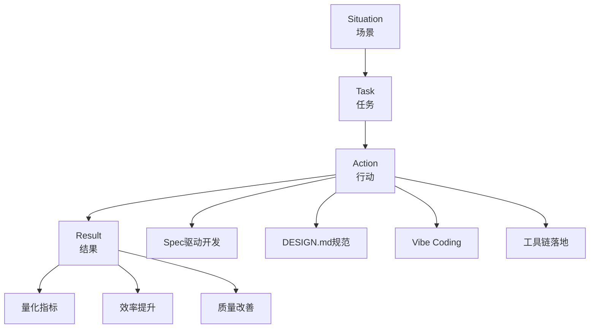
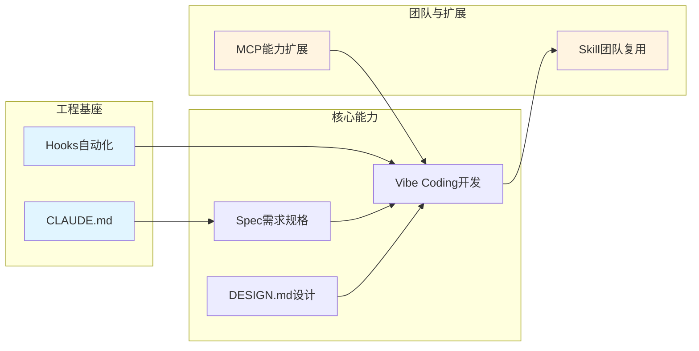
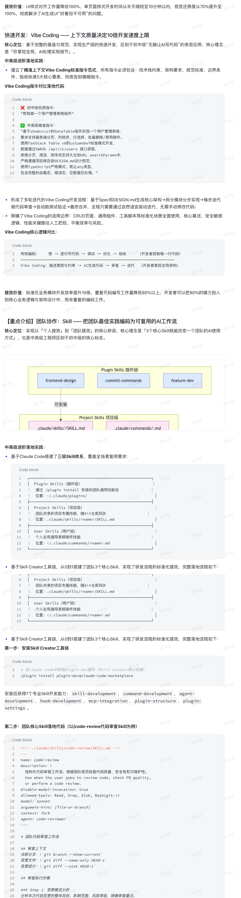
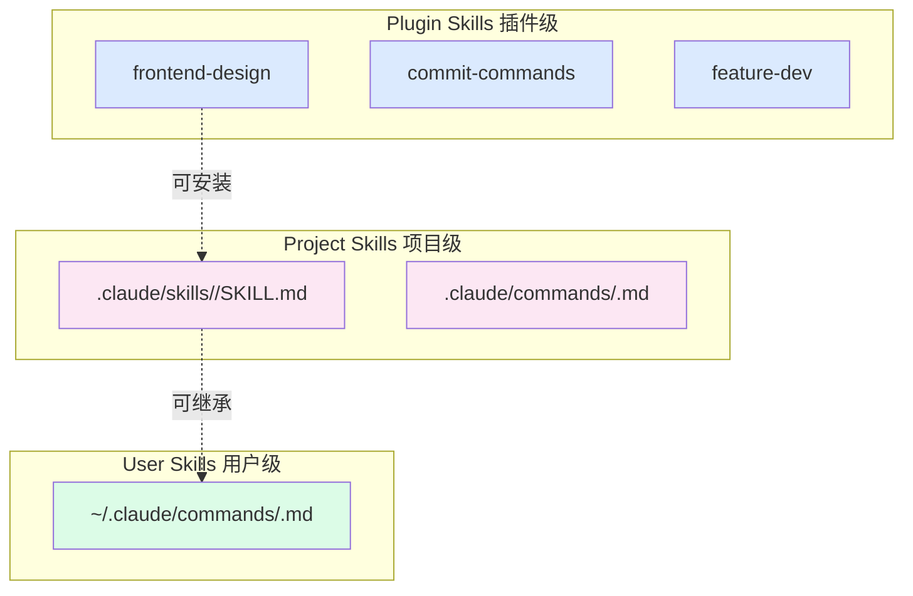

课程

https://www.bilibili.com/video/BV1V7djB3EP1/?spm_id_from=333.337.search-card.all.click&vd_source=d66a6fb5cb08fa8db4dd3bf2bd839f71

# 面试能力分级要求

- **【初中级】**  
  之前有做过 AI 工具在前端/全栈编码场景的提效吗？请举例说明你的具体提效方案。

- **【中高级】**  
  有做过 AI 编程提效、AI Agent 应用开发吗？请分别详细说明 AI 提效具体实践以及你对于前端 AI Agent 开发思路。

- **【专家级】**  
  假如你是 Leader，对于前端 AI 提效以及 AI Agent 全栈开发有哪些规划？在团队能带来哪些沉淀落地与最佳实践？

# 课程内容提要

- **对标初中级前端 AI 面试高频考点**：  
  掌握 AI 工具在前端/全栈编码中的落地提效方案，学会用真实案例清晰阐述实践过程。课程拆解面试官考察逻辑，规避空泛回答，掌握可量化、可复现的提效思路，夯实 AI 提效基础认知，从容应对岗位 AI 相关面试提问，提升基础岗面试通过率。

- **攻克中高级前端 AI 面试核心难点**：  
  构建 AI 编程深度提效与前端 AI Agent 开发体系。课程详解 Agent 架构、Skills 封装、MCP 应用等关键技术，梳理完整开发思路与工程化路径，将零散 AI 经验转化为体系化竞争力，具备独立开发 AI Agent 能力，形成面试技术优势。

- **站在技术 Leader 视角**：  
  搭建团队级 AI 提效与全栈 Agent 开发规划能力。课程讲解团队 AI 技术落地、能力梯队建设、项目推进与资产沉淀方法，输出可落地的团队 AI 转型方案与最佳实践，能应对专家岗高阶面试，具备带领团队实现 AI 技术规模化落地的管理与架构能力。

---

# 初中级：之前有做过 AI 工具在前端/全栈编码场景的提效吗？请举例说明你的具体提效方案。

## 前端/全栈编码场景AI提效核心体系

### 软件开发的周期



```
软件开发周期
├─ 需求
├─ 方案
├─ UI 设计
├─ 测试用例
│   ├─ unit test
│   └─ e2e test
├─ 研发
│   ├─ 前端
│   └─ 服务端
├─ 测试
└─ 发布
```

产品经理拆需求 → 技术负责人方案设计 → UI 画图 → 测试负责人测试用例编写 → 前端开发后端开发联调
→ 测试（单元测试、集成测试） → 代码审查 → 发布

### 在这些环节 AI 能做什么？

目前我的认知就是 `前端开发后端开发联调 [AI 写代码]`

AI 更好理解需求，并且拆解需求，符合做完的方案设计、代码规范等去开发，必须设置限制 --- Spec 驱动，只有这样才能让 AI 24小时给我们写代码，而不是你说一句，它写一下。

目前基于 Spec 驱动或者 Vibe Coding 形式，可能就是一天定好需求方案后，AI 跑一两天写完，然后我们人工干预review，最后发布。

---

### 1. 需求前置：Spec驱动的需求规格化提效

核心理念：AI 不怕需求长，怕需求不清晰。Spec 是你和 AI 之间的“开发合同”，从源头解决 AI 产出不符合预期、反复返工的核心痛点。

**● 极简落地模板（初中级直接套用）：**

```md
# 需求Spec：XXX功能/页面开发

## 目标描述

一句话讲清功能核心用途、适用场景

## 技术约束

明确技术栈、框架版本、组件库、状态管理方案、编码规范等硬性要求

## 功能需求

分点列出核心功能、交互逻辑、边界场景处理

## 验收标准

可量化的完成指标，比如交互效果、性能要求、兼容范围、错误处理要求
```

**提效价值**：避免“帮我写个登录页”这类模糊指令带来的反复修改，单次需求沟通返工率降低30%，AI产出符合度从30%提升至90%以上。

### 2. 编码落地：精准上下文的 Vibe Coding 编码提效

**核心理念**：区别于“无脑让 AI 写代码”，通过精准的上下文约束，让 AI 处理重复、标准化的编码工作，你只负责把控核心逻辑与最终效果。

- **标准指令模板**：

```md
基于【技术栈】，实现【具体功能】，要求：

1. 遵循【项目编码规范/设计模式】
2. 包含【错误处理/边界场景/类型定义】
3. 参考【已有文件/项目结构】的实现方式
4. 不使用【禁止的语法/第三方包】
```

- **适用 & 不适用场景：**

| **高适配场景**（推荐使用 AI 编码辅助） | **不建议使用场景**（慎用或避免 AI 生成） |
| -------------------------------------- | ---------------------------------------- |
| CRUD 页面 / 表单 / 表格开发            | 核心业务算法 / 加密逻辑                  |
| 通用 UI 组件封装                       | 安全敏感的鉴权 / 支付逻辑                |
| 项目脚手架 / 工具脚本开发              | 性能关键路径代码                         |
| 重复的接口对接 / 数据处理逻辑          | 底层架构设计代码                         |

### 3. 视觉一致性：DESIGN.md 驱动的 UI 开发提效

**前端专属提效方案**：  
解决 AI 生成 UI 样式混乱、不符合项目设计规范、反复调样式的核心痛点，是前端工程师区别于其他开发的 AI 提效核心竞争力。

- **极简落地方法**：  
  在项目根目录创建 `DESIGN.md` 文件，定义项目核心设计规范；AI 可直接读取并生成完全符合规范的 UI 代码，**无需 Figma 导出、无需复杂配置**。

- **核心必填章节（初中级精简版）**：
  - **a. 颜色系统**：品牌色、语义色、中性色的色值与使用场景
  - **b. 字体规则**：字体族、字号层级、字重规范
  - **c. 组件样式**：按钮、卡片、输入框、表单的基础样式、圆角、交互态
  - **d. 布局规则**：间距系统、网格规范、页面通用布局结构
  - **e. 设计护栏**：明确禁止的设计反模式（如禁用某些样式组合/滥用阴影等）

- **提效价值**：
  - UI 样式对齐工作量降低 100%（无需反复调整像素）
  - 页面视觉一致性达 100% 符合项目规范
  - 单页面样式开发时间从半天缩短至 **10 分钟以内**

### 4. 全流程辅助：Claude Code / Cursor 工程化提效

**核心理念**： 覆盖前端开发全生命周期的提效，不止于写代码，解决日常开发中繁琐、重复的工程化工作。

#### 核心落地场景：

- **a. 项目初始化**：一键生成符合规范的项目结构、配置文件、目录分层
- **b. 调试排错**：自动分析报错信息、定位 bug 根因、给出可直接复用的修复方案
- **c. 代码规范**：自动修复 ESLint/TypeScript 类型错误、格式化代码、补充缺失的类型定义
- **d. Git 操作**：自动生成符合 Conventional Commits 规范的提交信息、解决合并冲突、创建分支与 PR
- **e. 文档生成**：自动为组件/函数生成 JSDoc 注释、README 使用文档、接口对接文档

#### 提效价值：

- 工程化繁琐工作耗时降低 **90%**
- 日常开发中非核心编码工作量减少 **70%**

### 5. 质量兜底：AI 辅助的测试与优化提效

**核心理念**： 解决初中级工程师容易忽略的 AI 代码质量问题，同时通过 AI 降低测试、优化的门槛。

#### 核心落地场景：

- **a. 测试用例生成**：自动为组件/工具函数生成单元测试用例，覆盖核心逻辑与边界场景
- **b. 代码审查**：自动检查代码中的潜在 bug、性能问题、安全隐患、规范问题
- **c. 性能优化**：自动分析页面/组件的性能瓶颈，给出优化方案并实现，比如重渲染优化、包体积优化
- **d. 兼容适配**：自动处理多端兼容、浏览器兼容问题，给出适配方案

#### 提效价值：

- 测试用例编写时间缩短 **90%**
- 代码 bug 率降低 **60%**
- 性能优化工作量降低 **70%**

### 6. 本质

本质上就是写提示词【spec + vibe coding + DESIGN.md】+ 通用化逻辑要写成skills 方便2次调用 + 工具类的东西要封装成mcp

1. 并且 Spec 文件也不是你全部编写，主要是AI辅助编写。通常一个spec对应一个功能，或者一个页面，或者一个组件，甚至是一个函数。总之就是一个明确的功能点，或者说一个明确的开发目标。如：`spec/login.spec.md`。
2. AI coding，Codex, Claude Code, Trae, Cursor
3. skills 化—— 将开发流程中的关键环节转化为可复用、可评估、AI 友好的 **技能模块（skills）**
   - **需求拆解 → skill 化**
   - **方案设计 → skill 化**
   - **测试用例生成 → skill 化**
     - 单测（Unit Test）
     - 集测（Integration Test）
   - **代码审查 → skill 化**

4. MCP（Model Context Protocol） —— 远程工具协议，用于向智能体（AI Agent）提供上下文与能力调用
   - **Figma UI**：Figma 提供设计图的 `schema.json` → 传输至 **Figma MCP Server**（实现设计资产结构化接入 AI 工作流）

   - **GitHub**：通过 `github release MCP` 接入 GitHub 发布信息（支持 AI 获取版本变更、Changelog、Release Notes 等上下文）

项目中呈现形态：

- Agent.md + Design.md, 可以去看看[这个](https://github.com/VoltAgent/awesome-design-md)

  **设计图更精准化方案**

- 提供 `DESIGN.md` —— 贴近团队设计语言
- Figma MCP —— 设计图生成代码
- 开发自己团队组件库 MCP

## 面试可直接复用的2个经典实战案例

### 案例1：中后台SaaS系统CRUD模块批量开发提效（最通用、最贴合初中级工作场景）

#### 项目背景

我在上一家公司负责企业内部SaaS管理系统的前端开发，技术栈为Next.js 14 + Tailwind CSS + shadcn/ui + TypeScript，日常高频处理用户管理、订单管理、商品管理等CRUD业务模块开发。

#### 传统开发痛点

每个业务模块都需要重复编写表格、表单、增删改查逻辑、权限控制、错误处理代码，样式需要反复对齐项目设计规范，单个模块平均开发周期1.5人天，3个模块累计需要4.5人天，大量重复工作占用了核心业务优化的时间。

#### 我的完整提效方案

1. 前置规范定义：先编写统一的CRUD模块Spec文件，明确3个模块的通用技术约束、功能规范、交互逻辑、验收标准，避免每个模块重复沟通；同时编写项目级 DESIGN.md 文件，统一定义设计规范、组件样式、布局规则，确保UI一致性。
2. 批量编码提效：基于Claude Code，结合Spec和DESIGN.md，通过精准的Vibe Coding指令，批量生成3个模块的核心代码，包括表格组件、表单组件、增删改查接口对接、权限控制、错误处理全流程逻辑。
3. 质量与效率兜底：用AI自动为每个模块生成单元测试用例，自动修复TypeScript类型错误和ESLint规范问题，一键完成代码格式化和提交，同时通过AI自动分析潜在的重渲染问题，完成基础性性能优化。
4. 可复用沉淀：沉淀出通用的CRUD模块Spec模板、AI提示词模板、DESIGN.md规范，团队其他同学可直接复用。

#### 量化提效结果

- 3个业务模块的总开发周期从4.5人天缩短至0.5人天，整体提效900%；
- 代码完全符合项目编码规范，UI视觉一致性100%达标，无需反复调整样式；
- 单个模块单元测试覆盖率达到80%以上，线上bug率较之前降低65%；
- 后续新增同类型业务模块，开发周期从1.5人天缩短至2小时以内，沉淀的模板被团队12名前端同学全员复用，统一了团队开发效率与代码风格。

### 案例2：前端工程化工具脚本开发提效

#### 项目背景

项目需要开发一套前端工程化工具脚本，包括国际化自动翻译、打包资源压缩、无用代码检测、项目构建产物分析4个核心脚本，技术栈为Node.js + TypeScript。

#### 传统开发痛点

手动开发需要查阅大量第三方库API、处理各种边界场景、调试兼容性问题，预估开发周期1人天，且后续需要持续维护迭代。

#### 我的提效方案

1. 为每个脚本编写独立的Spec文件，明确脚本的核心功能、入参出参、执行逻辑、错误处理、兼容要求；
2. 用Cursor + Claude Code，基于Spec生成脚本核心代码，同时自动引入适配的第三方库，处理边界场景与异常捕获；
3. 用AI自动生成脚本的测试用例，验证执行效果，修复潜在问题，同时自动生成脚本的使用文档。

#### 量化提效结果

- 脚本开发总耗时从1人天缩短至1小时，提效800%；
- 脚本功能完整，覆盖所有预设场景，异常处理完善，线上运行零故障；
- 自动生成的使用文档清晰完整，团队同学可直接上手使用，无需额外沟通。

## 面试回答黄金模版



> - Situation（场景）：我在上一家公司的中后台SaaS项目中，负责前端业务模块开发，日常高频处理CRUD页面、通用组件开发、工程化脚本编写等工作，传统开发模式下重复代码多、样式对齐耗时长，基础功能开发占用了大量工作时间。​
> - Task（任务）：我需要在保证代码质量和项目规范的前提下，通过AI工具搭建一套可复用的前端编码提效方案，缩短业务模块开发周期，减少重复工作，同时把更多时间投入到项目性能优化、核心业务逻辑开发中。​
> - Action（行动，核心提效方案）：我主要落地了4件事：
>   - 1. 搭建了Spec驱动的需求规格化流程，每个需求开发前先编写结构化Spec文件，明确技术约束、功能需求和验收标准，给AI清晰的执行指令，从源头减少返工；
>   - 2.  编写了项目级DESIGN.md设计规范文件，定义了项目的颜色、字体、组件样式、布局规则，让AI生成的UI直接符合设计规范，无需反复调整样式；
>   - 3.  基于Claude Code + Cursor搭建了全流程编码提效体系，覆盖从代码编写、调试修复、Git操作到文档生成的完整开发流程；
>   - 4.  沉淀了通用CRUD模块、组件开发的Spec模板和AI提示词模板，确保AI产出的代码始终符合团队规范，同时可被团队同学复用。​
> - Result（量化结果）：这套方案落地后，单个CRUD业务模块的开发周期从1.5人天缩短至2小时以内，整体提效80%以上；代码规范符合度和UI视觉一致性从之前的60%提升至100%，线上bug率降低65%；沉淀的模板被团队10+前端同学全员复用，统一了团队的开发效率和代码风格，我也有了更多时间负责项目的架构优化和核心业务攻坚。

## 面试避坑

1. 避坑：不要只说“我会用Copilot补全代码”​这句话完全体现不出你的核心能力，面试官要的是你的提效方案设计能力，而非工具使用能力，必须讲清楚你是如何通过AI解决业务痛点、落地完整提效流程的。

2. 避坑：不要只讲功能，不讲量化结果​面试回答必须有可量化的数字，比如“提效80%”“开发周期从1.5天缩短到2小时”“bug率降低65%”，空泛的“提升了开发效率”没有任何说服力。​

3. 避坑：回避AI带来的风险与问题​不要只说AI的好处，要主动提及你是如何做质量兜底的，比如代码审查、类型校验、测试覆盖、安全漏洞检查，体现你的严谨性，这也是面试官非常关注的点。​

4. 避坑：照搬通用案例，不贴合自身业务​一定要结合你自己的真实工作场景，比如你做的是H5、小程序、PC端官网、中后台系统，不同场景的提效方案有明显差异，针对性的案例才会让面试官相信是你的真实实践。

---

# 【中高级】有做过 AI 编程提效、AI Agent 应用开发吗？请分别详细说明 AI 提效具体实践以及你对于前端 AI Agent 开发思路

1. **体系化落地能力**：能否从个人提效升级为团队级提效，搭建可复用、可标准化的AI编程提效体系，而非零散的碎片化使用；

2. **技术深度理解**：对AI编程的核心逻辑、工程化落地、风险管控有完整认知，而非停留在“一句话写代码”的表层应用；

3. **AI Agent架构能力**：能否从前端业务视角出发，设计贴合前端场景的AI Agent，具备从0到1的业务落地能力，而非只会套开源Demo；

4. **业务价值转化能力**：能否将AI技术转化为可量化的业务成果，给团队、项目带来实际的效率提升与技术沉淀，而非炫技式的技术堆砌。

## AI 编程提效体系化深度实践

我搭建了一套覆盖前端研发全生命周期的6大模块闭环提效体系，从工程基座、需求定义、视觉规范、开发落地、团队复用、能力扩展全链路打通，实现了从个人提效到团队规模化提效的升级，完整体系与落地代码如下：



## CLAUDE.md + Hooks —— AI 研发体系

**核心定位**：作为整个AI提效体系的底层基座，给AI明确项目的“游戏规则”，同时通过自动化Hooks实现全流程质量兜底，解决AI产出不符合项目规范、风险操作不可控的核心痛点。

### 中高级进阶落地实践：

- 搭建了三级CLAUDE.md体系，实现AI上下文的全场景覆盖：
  - **a. 全局级** `~/.CLAUDE/CLAUDE.md`：定义个人/团队通用编码规范、AI交互规则、语言偏好、安全红线；
  - **b. 项目级** `项目根目录/CLAUDE.md`：明确项目技术栈、架构分层、目录结构、编码规范、常用命令、权限规则，是AI理解项目的核心入口；
  - **c. 模块级** `src/xxx/CLAUDE.md`：针对特定模块（如组件库、权限系统）的特殊规则、实现约定、复用规范，实现精细化的AI上下文控制。

### 项目级CLAUDE.md完整落地代码：

```codeblock
# 企业SaaS管理系统 — AI开发说明书

## 技术栈
- 框架：Next.js 14（App Router）
- 语言：TypeScript 5.3（strict mode）
- 样式：Tailwind CSS 3.4 + shadcn/ui
- 状态管理：Zustand
- 数据获取：SWR
- 测试：Vitest + React Testing Library

## 项目结构
src/
├── app/ # Next.js App Router 路由页面
├── components/ # 可复用公共组件（按业务模块拆分）
├── hooks/ # 自定义React Hooks
├── lib/ # 工具函数、常量定义、类型统一定义
├── services/ # API调用层、请求封装
└── types/ # 全局TypeScript类型声明


## 编码规范
- 组件：函数式组件 + React Hooks，禁止class组件
- 命名：组件PascalCase，工具函数camelCase，常量UPPER_SNAKE_CASE
- 类型：禁止使用any/unknown，必须定义完整Props Interface
- 导入：统一使用@/ 路径别名，禁止相对路径跨多层级导入
- 错误处理：所有异步操作必须有完整try/catch，前端友好错误提示

## 常用命令
- 开发启动：pnpm dev
- 生产构建：pnpm build
- 单元测试：pnpm test
- 代码规范检查：pnpm lint
- 代码格式化：pnpm format

```

- **配套Hooks自动化触发器**，实现AI操作的全流程质量管控与风险拦截，在`.claude/settings.json`中完成完整配置：

Hooks 配置完整代码：

```json
{
  "hooks": {
    "PostToolUse": [
      {
        "matcher": "Edit|Write",
        "hooks": [
          {
            "type": "command",
            "command": "npx prettier --write $CLAUDE_FILE_PATH"
          },
          {
            "type": "command",
            "command": "npx eslint --fix $CLAUDE_FILE_PATH"
          },
          {
            "type": "command",
            "command": "npx tsc --noEmit $CLAUDE_FILE_PATH"
          }
        ]
      }
    ],
    "PreToolUse": [
      {
        "matcher": "Edit|Write",
        "hooks": [
          {
            "type": "command",
            "command": "bash -c '[[ \"$CLAUDE_FILE_PATH\" == *.env* ]] && echo BLOCK || echo PASS'"
          }
        ]
      }
    ],
    "Notification": [
      {
        "matcher": "idle_prompt",
        "hooks": [
          {
            "type": "command",
            "command": "afplay /System/Library/Sounds/Ping.aiff"
          }
        ]
      }
    ]
  }
}
```
- **核心能力**：`PostToolUse` Hook 在 AI 编辑代码后自动执行格式化、规范修复、类型校验，确保代码 100% 符合规范；`PreToolUse` Hook 拦截 `.env` 等敏感文件修改，避免安全风险；`Notification` Hook 实现任务完成自动通知。

**提效价值**：项目规范对齐成本降低 100%，AI 产出的代码规范符合度从 60% 提升至 100%，高危操作拦截率 100%，从源头解决了 AI 代码的质量与安全问题。

## 需求定义：Spec —— 让 AI 准确理解需求

**核心定位**：解决 AI 需求传递损耗、反复返工、产出不符合预期的核心痛点，核心理念是「AI 不怕需求长，怕需求不清晰」，是 AI 提效的第一个核心杠杆点。

### 中高级进阶落地实践：
- 搭建了团队标准化的 Spec 模板体系，覆盖功能开发、组件封装、工具脚本、Bug 修复等全研发场景，每个 Spec 严格包含：目标描述、技术约束、功能需求、边界条件、验收标准 5 大核心模块，无歧义、可执行、可验收；
- 将 Spec 与团队研发流程深度结合，需求评审后直接输出标准化 Spec，作为 AI 开发的唯一输入，同时和后续的 Skill 能力联动，通过 `/feat` Skill 直接读取 Spec 自动执行全流程开发。

### 团队通用 Spec 完整落地模板（以用户登录模块为例）：

```md
# DESIGN.md — Admin Dashboard 管理系统设计规范

## ## 1. Visual Theme & Atmosphere
**设计哲学**：** 专业、高效、信息密集  
**氛围关键词**：** 极简、克制、功能优先  
**设计参考**：** Linear + Vercel 混合风格  
**模式**：** 深色优先，支持浅色模式一键切换  

---

## ## 2. Color Palette & Roles

### ### 品牌色
| 名称         | 色值       | 核心用途                     |
|--------------|------------|------------------------------|
| Primary      | `#6366F1`  | 主操作按钮、链接、选中态、高亮标识 |
| Primary Hover| `#4F46E5`  | 主按钮悬停态、点击态         |

### ### 语义化功能色
| 名称     | 色值       | 核心用途                             |
|----------|------------|--------------------------------------|
| Success  | `#10B981`  | 成功状态、正向趋势、完成标识         |
| Warning  | `#F59E0B`  | 警告状态、需关注提示、待办标识       |
| Error    | `#EF4444`  | 错误状态、危险操作、失败标识         |
| Info     | `#3B82F6`  | 信息提示、中性状态、帮助标识         |

### ### 表面色（深色模式）
| 名称            | 色值        | 核心用途                         |
|-----------------|-------------|----------------------------------|
| Background      | `#09090B`   | 页面全局底色                     |
| Surface         | `#18181B`   | 卡片、面板、容器底色             |
| Surface Elevated| `#27272A`   | 弹窗、下拉菜单、悬浮面板         |
| Border          | `#27272A`   | 分割线、组件边框                 |
| Text Primary    | `#FAFAFA`   | 标题、核心正文                   |
| Text Secondary  | `#A1A1AA`   | 次要文字、标签、辅助说明         |
| Text Muted      | `#52525B`   | 占位符、禁用文字、非核心备注     |

---

## ## 3. Typography Rules
**字体族规范**：**  
- 标题/正文：`Inter, -apple-system, BlinkMacSystemFont, sans-serif`  
- 代码/数字：`JetBrains Mono, Menlo, Monaco, monospace`

### **字体层级表**：**  
| 层级   | 字号  | 字重 | 行高 | 核心用途               |
|--------|-------|------|------|------------------------|
| H1     | 30px  | 700  | 1.2  | 页面主标题             |
| H2     | 24px  | 600  | 1.3  | 区块标题、卡片主标题   |
| H3     | 18px  | 600  | 1.4  | 子模块标题、栏目标题   |
| Body   | 14px  | 400  | 1.6  | 正文内容、表格文字     |
| Small  | 12px  | 400  | 1.5  | 辅助信息、标签、备注   |
| Code   | 13px  | 400  | 1.5  | 代码片段、数字展示     |

---

## ## 4. Component Stylings

### ### 按钮规范
| 类型       | 背景色       | 文字色       | 圆角 | 标准高度 |
|------------|--------------|--------------|------|----------|
| Primary    | `#6366F1`    | `#FFFFFF`    | 6px  | 36px     |
| Secondary  | `transparent`| `#FAFAFA`    | 6px  | 36px     |
| Ghost      | `transparent`| `#A1A1AA`    | 6px  | 36px     |
| Danger     | `#EF4444`    | `#FFFFFF`    | 6px  | 36px     |

### **交互态规范**：**  
- Hover：亮度+10%，缩放 1.01 倍  
- Active：亮度-5%  
- Disabled：opacity 0.5，cursor: not-allowed  
- Focus：2px solid `#6366F1` 外发光，offset 2px  

### ### 卡片规范
- 背景：Surface `#18181B`  
- 边框：1px solid `#27272A`  
- 圆角：8px  
- 内边距：16px（紧凑）/ 24px（标准）  
- Hover 态：border-color 切换为 `#3F3F46`  

### ### 输入框规范
- 背景：`#09090B`  
- 边框：1px solid `#27272A`  
- 圆角：6px  
- 标准高度：36px  
- Focus 态：border-color 切换为 `#6366F1`  
- 占位符颜色：`#52525B`  

---

## ## 5. Layout Principles
**间距系统（4px 基础单位）**：**  
`4 / 8 / 12 / 16 / 24 / 32 / 48 / 64`

### **页面布局规范**：**  
- 侧边栏宽度：240px（可折叠至 64px）  
- 内容区最大宽度：1200px  
- 内容区内边距：24px  
- 卡片间距：16px  
- 网格系统：12 列网格，列间距 16px  

---

## ## 6. Depth & Elevation
| 层级     | 阴影规范                          | 核心用途               |
|----------|-----------------------------------|------------------------|
| Level 0  | `0 1px 2px rgba(0,0,0,0.3)`       | 页面底色               |
| Level 1  | `0 4px 12px rgba(0,0,0,0.4)`      | 基础卡片、输入框       |
| Level 2  | `0 8px 24px rgba(0,0,0,0.5)`      | 下拉菜单、悬浮面板     |

---

## ## 7. Do's and Don'ts

### **Do's**：**  
- 必须使用语义化颜色，禁止硬编码色值  
- 保持信息密度，减少无意义的留白  
- 所有可交互元素必须有完整 hover/focus/active 态  
- 表格数字统一右对齐，提升可读性  

### **Don'ts**：**  
- 禁止使用超过 2 种字体族  
- 禁止使用纯黑 `#000000` 作为背景色  
- 深色模式禁止使用纯白 `#FFFFFF` 作为正文色（使用 `#FAFAFA`）  
- 禁止使用超过 12px 的圆角，保持设计克制感  

---

## ## 8. Responsive Behavior
| 断点    | 屏幕宽度       | 布局适配规则                         |
|---------|----------------|--------------------------------------|
| Mobile  | < 768px        | 侧边栏隐藏，切换为底部导航栏         |
| Tablet  | 768px–1024px   | 侧边栏折叠为图标模式                 |
| Desktop | > 1024px       | 完整侧边栏+内容区布局                |

### **触摸目标规范**：** 移动端可交互元素最小尺寸 44×44px  

---

## ## 9. Agent Prompt Guide

### **快速参考**：**  
- 品牌主色：`#6366F1`（Indigo）  
- 页面底色：`#09090B`（近黑）  
- 卡片底色：`#18181B`  
- 字体：Inter + JetBrains Mono  
- 圆角标准：按钮/输入框 6px、卡片 8px  

### **即用提示模板**：**
> "生成一个深色主题的SaaS管理系统页面，使用Indigo作为主色调，Inter字体，8px圆角卡片，信息密集型布局，严格遵循项目根目录DESIGN.md设计规范，禁止超出规范的自定义样式。"
```
# 中级和高级部分



### 补全流程图
