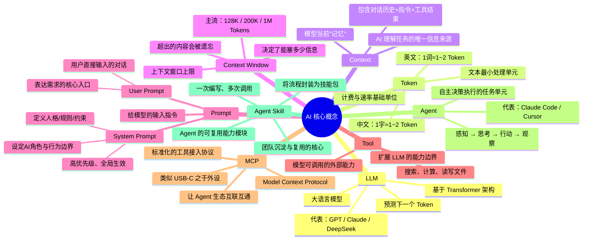
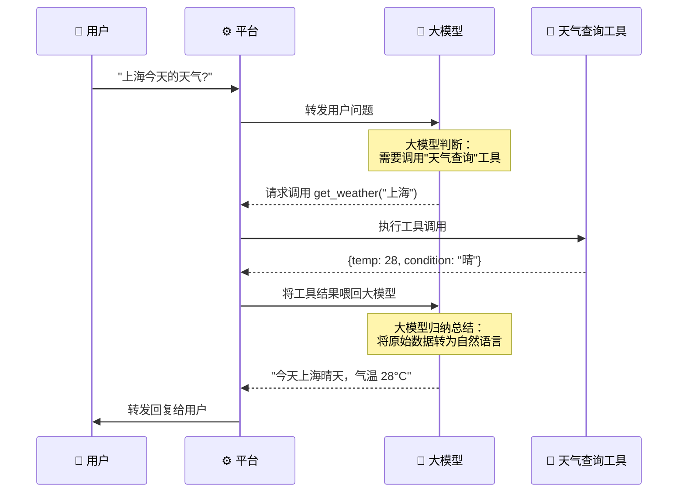
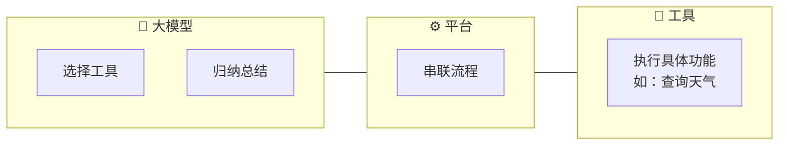
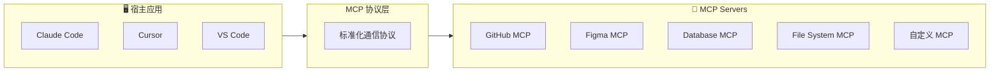
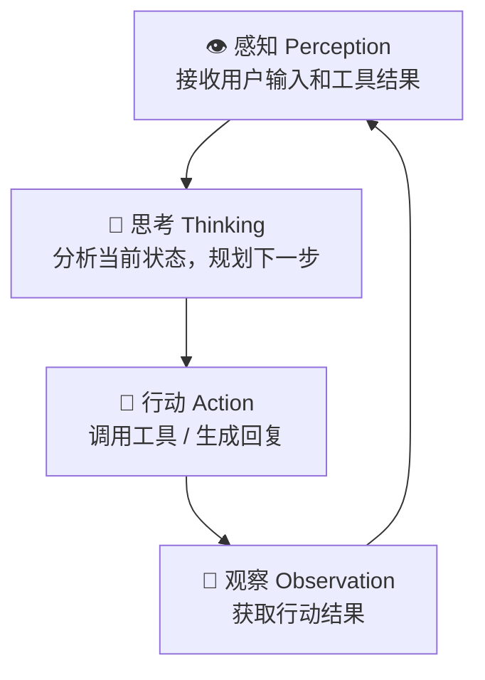
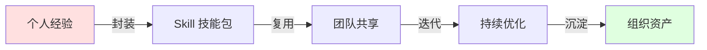
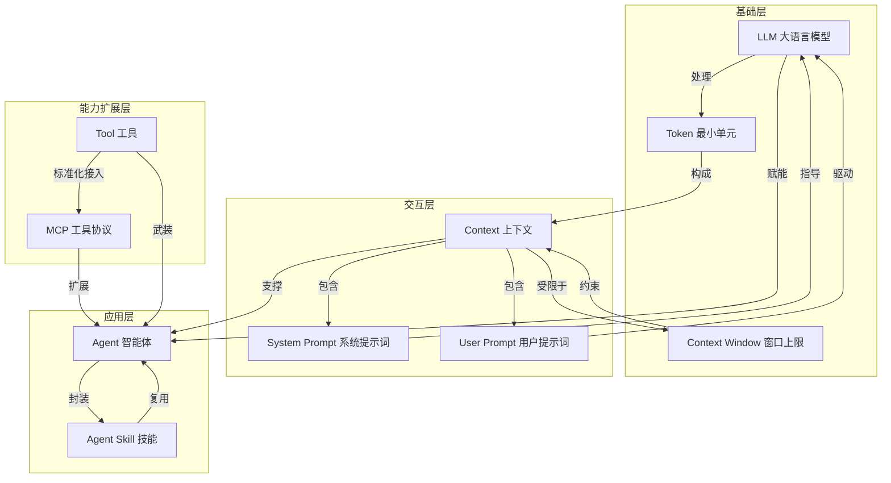

# 从 LLM 到 Agent Skill —— AI 核心概念大串联

> 视频来源：[Bilibili BV1E7wtzaEdq](https://www.bilibili.com/video/BV1E7wtzaEdq/)  
> UP 主：马克的技术工作坊 | 时长：32:31 | 发布时间：2026-03-14  
> 视频简介：AI 核心概念大串联：LLM, Token, Context, Context Window, Prompt, User Prompt, System Prompt, Tool, MCP, Agent, Agent Skill，一期视频带你打通 AI 底层逻辑！

---

## 一、思维导图



---

## 二、概念详解

### 2.1 LLM（Large Language Model，大语言模型）

**定义**：基于 Transformer 架构的大规模神经网络，通过学习海量文本数据中的统计规律，具备理解和生成自然语言的能力。

**核心原理**：
- 本质是一个"下一个 Token 预测器"（Next Token Predictor）
- 训练阶段：在海量文本上学习语言模式、知识、推理能力
- 推理阶段：给定上文，逐 Token 生成下文

**关键特性**：
- **涌现能力（Emergence）**：规模达到一定阈值后，突然具备推理、编码、翻译等能力
- **上下文学习（In-Context Learning）**：无需微调，仅通过 Prompt 即可引导行为
- **幻觉（Hallucination）**：可能生成看起来合理但不正确的内容

**主流模型**：
| 模型 | 厂商 | 特点 |
|------|------|------|
| GPT-4o / o3 | OpenAI | 多模态、强推理 |
| Claude 4.x | Anthropic | 安全对齐、长上下文 |
| DeepSeek V3/R1 | DeepSeek | 开源、高性价比 |
| Gemini 2.5 | Google | 原生多模态、超长上下文 |

---

### 2.2 Token

**定义**：LLM 处理文本的最小语义单元，是模型"阅读"和"生成"的基本单位。
**Playground**: https://platform.openai.com/tokenizer

**Token 化规则**：
A helpful rule of thumb is that one token generally corresponds to ~4 characters of text for common English text. This translates to roughly ¾ of a word (so 100 tokens ~= 75 words

- 英文： 1 个 token = 0.75 个单词（平均值）
- 中文：1 个 token ≈ 1.5 ~ 2 个汉字（平均值）
- 代码：符号、关键字各有独立 Token


**为什么 Token 重要？**

| 维度 | 影响 |
|------|------|
| **计费** | API 按 Token 计费（input + output） |
| **速率** | 模型有 Token/分钟 速率上限 |
| **上下文窗口** | Token 数不能超过 Context Window |
| **成本控制** | 优化 Prompt 长度 = 省钱 |

**实用技巧**：
- 用 `tiktoken` 或各厂商 Tokenizer 工具计算 Token 数
- System Prompt 每次请求都消耗 Token，应尽量精简
- 对话历史越长，Token 消耗越大，需定期裁剪或摘要

---

### 2.3 Context（上下文）

**定义**：模型在生成下一个 Token 时能"看到"的全部信息。是所有输入的总和，决定了模型的回答质量。

**Context 的构成**：

```
Context = System Prompt + 对话历史 + 当前 User Prompt + 工具调用结果 + 文件内容 + ...
```

**核心认知**：
- Context 是 AI 的"工作记忆"——它只能基于 Context 中的信息来回答
- Context 质量直接决定输出质量 → **Garbage In, Garbage Out**
- 模型没有"长期记忆"——每次对话都需要在 Context 中提供必要信息

**最佳实践**：
- 把关键信息放在 Context 的前部和后部（首位效应 & 近因效应）
- 结构化组织 Context（用标题、列表、代码块）
- 给模型提供"退出路径"（不知道就说不知道）

---

### 2.4 Context Window（上下文窗口）

**定义**：模型单次能处理的最大 Token 数量上限。超出窗口的内容会被截断或遗忘。

**主流模型的 Context Window**：

| 模型 | Context Window |
|------|---------------|
| GPT-4o | 128K |
| Claude 3.5 Sonnet | 200K |
| Claude 4 Opus | 200K |
| Gemini 2.5 Pro | 1M |
| DeepSeek V3 | 128K |

**Context Window 的工程挑战**：

```
问题：对话越来越长 → 超过窗口 → AI "失忆"

解决方案：
├─ 滑动窗口：只保留最近的 N 轮对话
├─ 摘要压缩：对历史对话做摘要后放入 Context
├─ RAG 检索：外部知识库按需检索，不用全放进来
├─ 分层记忆：重要信息存长期记忆，临时信息用短期记忆
└─ Context 编排：合理分配 Token 给不同内容
```

---

### 2.5 Prompt（提示词）

**定义**：用户向 LLM 输入的指令文本，是人与 AI 交互的核心界面, [课程](https://www.bilibili.com/video/BV1BxV16FEaB?spm_id_from=333.788.videopod.episodes&vd_source=d66a6fb5cb08fa8db4dd3bf2bd839f71&p=5)。


**Prompt 的两种类型**：

#### User Prompt（用户提示词）
- 用户直接输入的对话内容
- 表达当前需求、问题、任务
- 每次对话实时变化

#### System Prompt（系统提示词）
- 在对话开始前预设的全局指令
- 定义 AI 的角色、行为边界、规则约束
- 优先级高于 User Prompt
- 用户通常不可见

**System Prompt 典型结构**：

```markdown
## 角色定义
你是一个资深前端工程师，专精 React + TypeScript 技术栈。

## 行为规则
- 优先使用函数式组件 + Hooks，禁止 class 组件
- 所有代码必须有完整 TypeScript 类型
- 每个函数必须有 JSDoc 注释

## 安全边界
- 不执行任何删除文件的操作
- 不修改 .env 等敏感配置文件
- 不确定的事项必须向用户确认
```

**Prompt 工程核心原则**：
1. **清晰 > 简洁**：AI 不怕 Prompt 长，怕 Prompt 模糊
2. **结构化**：用标题、列表、代码块组织信息
3. **给示例**：Few-shot 示例显著提升输出质量
4. **设边界**：明确告诉 AI 什么能做、什么不能做
5. **链式思维**：复杂任务让 AI "一步步思考"（Chain of Thought）

---

### 2.6 Tool（工具）

**定义**：LLM 可以调用的外部能力接口，让模型突破纯文本生成的限制，与外部世界交互。

**核心认知**：Tool 调用不是 LLM 一个人的事，而是 **用户→平台→大模型→工具** 四方协作的结果。

---

#### 2.6.1 调用流程（以天气查询为例）



> ⚠️ 关键细节：用户不直接与大模型对话，也不直接与工具交互。**平台** 是串联一切的中枢——它接收用户输入、转发给大模型、执行大模型选择的工具、把结果喂回大模型、最后把大模型的总结返回给用户。

---

#### 2.6.2 各角色的职责



| 角色 | 职责 | 做什么 |
|------|------|--------|
| 🧠 **大模型** | **选择工具** | 根据用户意图，判断该调用哪个工具（天气查询？计算器？搜索？） |
| | **归纳总结** | 将工具返回的原始数据（JSON/结构化数据），转化为用户可读的自然语言 |
| 🔧 **工具** | **执行功能** | 只负责完成自己擅长的那一件事（查天气、算数值、搜网页...），不问为什么、不管上下文 |
| ⚙️ **平台** | **串联流程** | 整个交互的中枢：接收用户输入 → 调用大模型 → 执行工具 → 喂回结果 → 返回用户，所有环节由平台串联 |

---

**一句话总结**：大模型是"大脑"（决策+表达），工具是"手脚"（执行），平台是"神经系统"（串联一切）。

---

#### 2.6.3 常见 Tool 类型

| 类型 | 示例 | 扩展能力 |
|------|------|----------|
| 信息查询 | 天气、股票、新闻 API | 实时信息 |
| 搜索 | Web Search、知识库检索 | 外部知识 |
| 计算 | 代码执行器、数学引擎 | 精确计算 |
| 文件 | 读写文件、图片处理 | 本地操作 |
| 网络 | HTTP 请求、API 调用 | 外部服务交互 |
| 数据库 | SQL 查询 | 数据存取 |

---

### 2.7 MCP（Model Context Protocol，模型上下文协议）

**定义**：由 Anthropic 提出的开放标准协议，定义了 AI 模型与外部工具/数据源之间的标准化交互方式。

**类比理解**：
- MCP 之于 AI Tool：就像 **USB-C 之于外设**
- 没有 MCP：每个 AI 应用都要各自对接工具 → $M \times N$ 种集成
- 有了 MCP：一套协议，所有 AI × 所有工具 → $M + N$ 种集成

**MCP 架构**：



**MCP Server 提供的能力**：
- **Resources**：暴露数据（如文件内容、数据库记录）
- **Tools**：暴露可执行操作（如创建 Issue、查询天气）
- **Prompts**：预定义的 Prompt 模板

**为什么 MCP 重要？**
- 打破 AI 应用与工具之间的"烟囱式"集成
- 一次编写 MCP Server，所有 MCP 兼容的 AI 应用都能用
- 生态效应：社区贡献的 MCP Server 越来越丰富

---

### 2.8 Agent（智能体）

**定义**：具备自主决策、规划、执行能力的 AI 系统。Agent 能分解复杂任务，自主调用工具，根据反馈调整策略，最终完成目标。

**Agent vs 普通 LLM 对话**：

| 对比维度 | 普通 LLM | Agent |
|----------|----------|-------|
| 交互方式 | 单轮问答 | 多轮自主执行 |
| 任务复杂度 | 简单、明确 | 复杂、需要拆解 |
| 工具使用 | 无/手动 | 自动按需调用 |
| 反馈循环 | 无 | 观察→调整→再执行 |
| 典型代表 | ChatGPT 对话 | Claude Code、Cursor |

**Agent 核心循环（Perception-Action Loop）**：



**Agent 的架构层次**：

```
Agent 架构
├─ 规划层 (Planning)
│   ├─ 任务分解：将大目标拆分为子任务
│   ├─ 路径选择：选择最优执行路径
│   └─ 动态调整：根据反馈修正计划
├─ 记忆层 (Memory)
│   ├─ 短期记忆：当前 Context Window 内的信息
│   └─ 长期记忆：持久化存储（向量数据库、文件）
├─ 工具层 (Tool Use)
│   ├─ 工具选择：根据任务选择合适的 Tool
│   ├─ 参数构造：生成正确的调用参数
│   └─ 结果解析：理解工具返回的结果
└─ 执行层 (Execution)
    ├─ 代码执行：运行生成的代码
    ├─ 错误处理：捕获异常并修复
    └─ 结果验证：确认输出符合预期
```

---

### 2.9 Agent Skill（Agent 技能）

**定义**：将 AI Agent 的工作流程封装为标准化、可复用的能力模块。Skill 是团队沉淀 AI 能力、实现规模化提效的核心手段。

**Skill 的核心理念**：

```
从"每次从头告诉 AI 怎么做"
到"将最佳实践封装成 Skill，一键调用"
```

**Skill 的组成**：

```markdown
# Skill：需求拆解 (/spec)

## 描述
将用户需求转化为标准化的 Spec 文档

## 触发方式
/spec [需求描述]

## 执行流程
1. 分析需求，提取核心功能点
2. 确定技术约束和边界条件
3. 定义验收标准
4. 输出标准化 Spec 文件

## 输出
spec/{feature-name}.spec.md
```

**常见 Skill 类型**：

| Skill | 功能 | 提效场景 |
|-------|------|----------|
| `/spec` | 需求拆解 → Spec 文档 | 需求分析 |
| `/feat` | Spec → 完整功能代码 | 功能开发 |
| `/test` | 自动生成单元测试 | 质量保障 |
| `/review` | 代码审查 | 代码质量 |
| `/deploy` | 一键部署 | 发布上线 |
| `/doc` | 生成文档 | 知识沉淀 |

**Skill 的工程化价值**：



- **个人层面**：避免重复写同样的 Prompt，一次封装多次使用
- **团队层面**：统一工作流标准，新人快速上手
- **组织层面**：将隐性知识显性化，积累可传承的技术资产

---

## 三、概念关系全景图



**概念演进路径**：

```
LLM → Token → Context → Context Window
                           ↓
                     Prompt (User / System)
                           ↓
                     Tool ←→ MCP
                           ↓
                        Agent
                           ↓
                     Agent Skill
```

---

## 四、与前端/全栈开发的结合

基于同目录下 `01-intro.md` 的实践体系，这些概念在前端 AI 提效中的落地方式：

| 概念 | 前端落地形态 | 具体实践 |
|------|-------------|----------|
| LLM | Claude Code / Cursor / GitHub Copilot | 编码辅助、代码生成 |
| Token + Context Window | Context 编排策略 | CLAUDE.md 三级体系（全局/项目/模块） |
| System Prompt | 项目级规则文件 | `CLAUDE.md`、`DESIGN.md` |
| User Prompt | Spec 需求文档 | `spec/xxx.spec.md` |
| Tool | Hooks 自动化触发器 | PostToolUse（lint/format/typecheck） |
| MCP | 设计稿 → 代码 | Figma MCP、组件库 MCP |
| Agent | Claude Code 自主开发 | 读取 Spec → 编码 → 测试 → 修复 |
| Agent Skill | 可复用工作流 | `/spec`、`/feat`、`/test`、`/review` |

---

## 五、关键 Takeaways

1. **LLM 的本质是 Token 预测器**，理解 Token 才能理解成本、限制和能力边界。
2. **Context 是 AI 的唯一信息来源**，Context 质量 = 输出质量。
3. **Context Window 是硬上限**，工程上需要做 Context 编排、摘要压缩、RAG 检索。
4. **System Prompt 是你的"隐形员工手册"**，把规范写进去，AI 就会遵守。
5. **Tool + MCP 让 AI 从"聊天器"进化为"行动者"**，MCP 的标准化让生态互通成为可能。
6. **Agent = LLM + 规划 + 记忆 + 工具**，能自主完成复杂多步任务。
7. **Agent Skill = 可复用的 AI 能力资产**，是团队从"个人提效"走向"规模化提效"的关键。
8. **前端 AI 提效 ≠ 让 AI 写代码**，而是从需求 → 设计 → 编码 → 测试 → 发布的**全链路 AI 化**。
