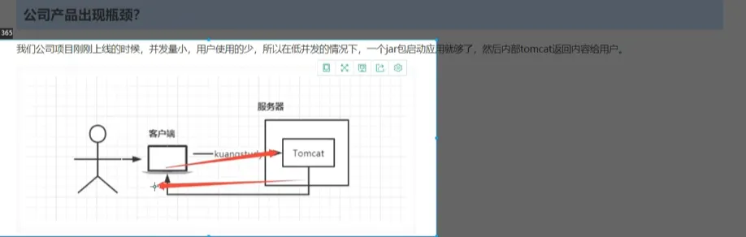
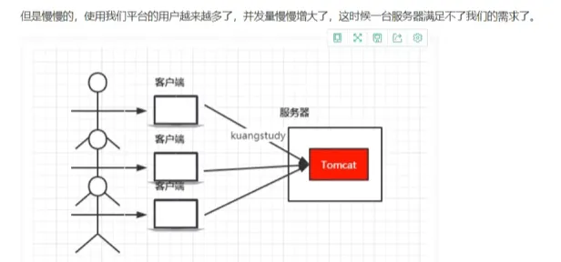
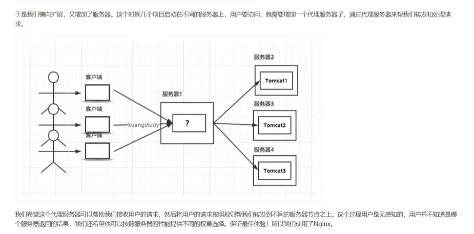
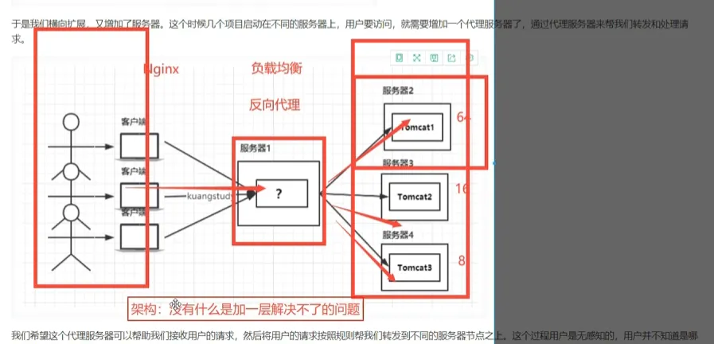
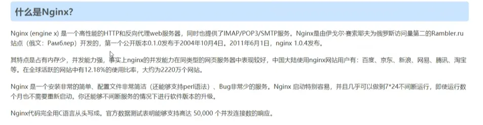
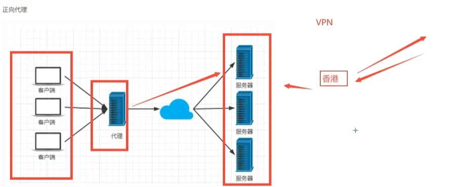
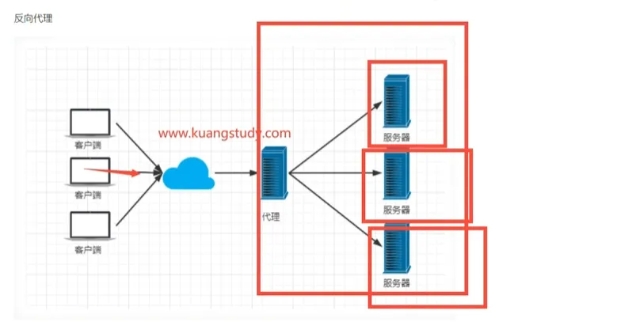

https://www.bilibili.com/video/BV1F5411J7vK/?spm_id_from=333.337.search-card.all.click&vd_source=d66a6fb5cb08fa8db4dd3bf2bd839f71

## 正向代理概念

### 定义
正向代理是位于客户端和目标服务器之间的中间服务器，代表客户端向目标服务器发送请求。

### 工作原理
1. 客户端向代理服务器发送请求
2. 代理服务器向目标服务器转发请求
3. 目标服务器将响应返回给代理服务器
4. 代理服务器将响应返回给客户端

### 核心特点
- 代理对象：客户端
- 隐藏客户端真实IP地址
- 目标服务器只知道代理服务器的IP，不知道真实客户端是谁

### VPN例子
当你使用VPN访问网站时：
- 你的电脑连接到VPN服务器（代理）
- 你访问网站的请求先发送到VPN服务器
- VPN服务器代替你向网站发送请求
- 网站返回的数据先到VPN服务器，再转发给你
- 网站只能看到VPN服务器的IP，看不到你的真实IP

### 应用场景
- 隐私保护：隐藏真实IP地址
- 访问限制：突破地理或网络限制
- 企业内网：统一访问外网出口

## 反向代理概念（百度例子）

### 定义
反向代理是位于客户端和后端服务器之间的中间服务器，代表服务器接收客户端请求。

### 百度例子
当你在浏览器输入"www.baidu.com"搜索时：

1. 你访问的是百度的反向代理服务器
2. 反向代理根据你的搜索内容，将请求分发给不同的后端服务器：
   - 搜索服务器处理关键词查询
   - 图片服务器提供搜索结果中的图片
   - 广告服务器返回相关广告
3. 各个后端服务器处理完成后，将结果返回给反向代理
4. 反向代理整合所有结果，返回给你看到的完整页面

### 核心特点
- 你不知道百度后端有多少台服务器
- 你不知道百度的服务器架构是什么样的
- 你只和反向代理打交道，反向代理保护了百度的真实服务器

### 作用
- 负载均衡：将海量用户请求分发到成千上万台服务器
- 安全保护：隐藏百度真实服务器，防止直接攻击
- 高可用：某台服务器故障时，自动切换到其他服务器
- 缓存加速：热门搜索结果可以缓存，提高响应速度