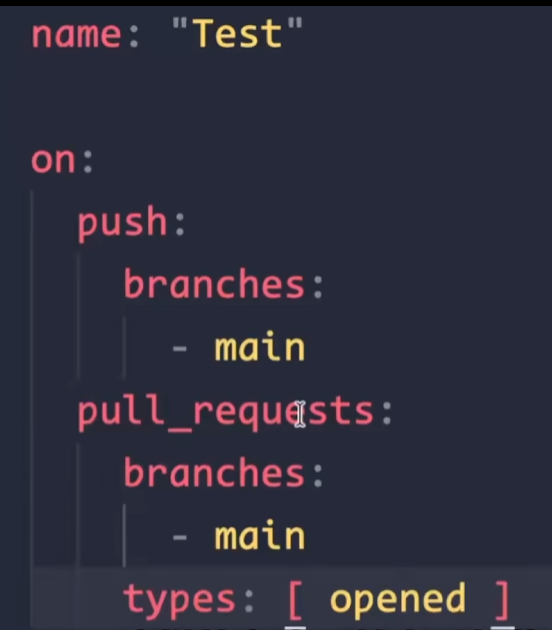
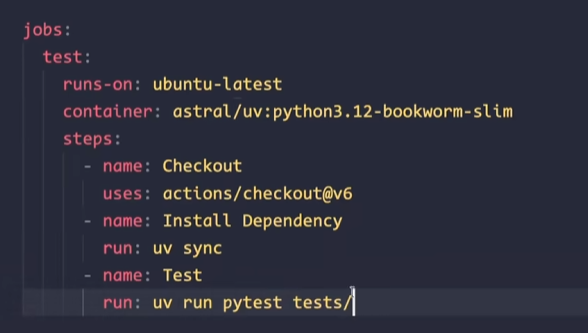

https://www.bilibili.com/video/BV1jNSEBiE6D/?spm_id_from=333.337.search-card.all.click&vd_source=d66a6fb5cb08fa8db4dd3bf2bd839f71

## workflow 文件






# 09 - CI/CD 速成班（Docker + GitHub Actions）

## 一、概念：CI 和 CD 是什么？

想象你在公司里写代码，提交到仓库后要做几件事：

```
你 git push 之后 → ┌─────────────────────────────────────────────────────────────┐
                    │  1. 安装依赖                                               │
                    │  2. 跑 ESLint 检查代码风格  ← 这些叫 CI                     │
                    │  3. 跑单元测试                                              │
                    │  4. npm run build 确认能编译    ← CI 的终点：产出 dist/ 目录 │
                    │                                                             │
                    │  5. 把 dist/ 打进 Docker 镜像    ← 这些叫 CD                 │
                    │  6. 把镜像推送到仓库注册表                                   │
                    │  7. 通知服务器拉取新镜像重启     ← CD 的终点：用户能访问新版本 │
                    └─────────────────────────────────────────────────────────────┘
```

| | CI（Continuous Integration） | CD（Continuous Delivery / Deployment） |
|--|-------------------------------|----------------------------------------|
| 中文 | 持续集成 | 持续交付/部署 |
| 做什么 | 自动化验证代码**能不能用** | 自动化把代码**送到线上** |
| 触发 | 每次 push / PR | CI 通过后自动触发（或手动） |
| 产出 | 编译产物（dist/） | 可运行的 Docker 镜像 |
| 谁关心 | 开发者（别提交坏的代码） | 运维 / 用户（线上别挂） |

> **简单记法：CI 是检查你写的代码是否合法，CD 是把合法的代码送上服务器。**

---

## 二、Docker 速成

### 三个核心概念

```
Dockerfile  →  写菜谱："怎么做这盘菜"
Image       →  半成品："按菜谱做好的菜，冷冻起来，随时可以用"
Container   →  成品："解冻后的菜，端上桌能吃了"
```

- **Dockerfile**：一个文本文件，描述怎么构建你的应用（装什么依赖、怎么编译、怎么启动）
- **Image（镜像）**：`docker build` 后产出的只读文件，包含你的应用 + 操作系统 + 运行时
- **Container（容器）**：`docker run image` 启动的运行实例，是镜像的"活"版本

### Dockerfile 逐行讲解

```dockerfile
# ──── 第一阶段：构建（builder） ────
FROM node:18-alpine AS builder
# ↑ FROM：以 node:18-alpine 为基础镜像
#    alpine 是精简版 Linux（~5MB），对比完整版（~100MB）大幅缩小镜像体积
#    AS builder：给这个阶段起个名字，后面 COPY 时引用

WORKDIR /app
# ↑ WORKDIR：相当于 cd /app。如果目录不存在会自动创建。
#    后续所有 RUN/CMD/COPY 命令都在这个目录下执行

COPY package*.json ./
# ↑ COPY：把本地的 package.json 和 package-lock.json 复制进镜像
#    package*.json 是通配符，匹配两个文件
#    为什么只复制这两个？利用 Docker 的层缓存——如果依赖没变，npm ci 可以跳过

RUN npm ci
# ↑ RUN：在镜像内执行命令
#    npm ci 和 npm install 的区别：
#    - npm install：会改 package-lock.json，慢
#    - npm ci：严格按 package-lock.json 装，快，适合 CI 环境

COPY . .
# ↑ COPY . .：把本地所有文件复制进镜像
#    为什么分两次 COPY？先复制 package.json → npm ci → 再复制源码
#    如果源码变了但 package.json 没变，npm ci 层会被缓存，大幅加速构建

RUN npm run build
# ↑ npm run build → webpack --mode production → 输出 dist/

# ──── 第二阶段：运行（最终镜像） ────
FROM nginx:alpine
# ↑ 第二个 FROM：重新开始一个全新阶段，旧阶段的 node_modules 全部丢弃
#    这就是"多阶段构建"——构建用 node 镜像，运行用 nginx 镜像
#    最终镜像里只有 nginx + 静态文件，没有 node_modules 的几百 MB 垃圾

COPY --from=builder /app/dist /usr/share/nginx/html
# ↑ --from=builder：从第一阶段复制文件
#    /usr/share/nginx/html：Nginx 默认的静态文件目录，放这里 Nginx 自动提供服务

COPY nginx.conf /etc/nginx/conf.d/default.conf
# ↑ 用我们自己的 Nginx 配置覆盖容器里默认的

EXPOSE 80
# ↑ EXPOSE：声明"这个容器会监听 80 端口"
#    注意：这只是文档声明，实际不打开端口。真正映射端口是 docker run -p 做的事

CMD ["nginx", "-g", "daemon off;"]
# ↑ CMD：容器启动时执行的命令
#    nginx -g "daemon off;"：前台运行 nginx（Docker 要求主进程不退出）
```

### 多阶段构建为什么重要？

```
          不用多阶段                              用多阶段
    ┌──────────────────┐                  ┌──────────────────┐
    │ node_modules     │ 300MB            │ static files     │ 500KB
    │ webpack config   │  2KB             │ nginx.conf       │ 200B
    │ source code      │  50KB            │ nginx:alpine     │   5MB
    │ 临时文件...      │ 200MB            │                  │
    │ node:18          │ 100MB            │                  │
    │ 总计             │ ~650MB           │ 总计             │  ~5.5MB
    └──────────────────┘                  └──────────────────┘
```

---

## 三、CI 工作流（持续集成）

`.github/workflows/ci.yml`——每次 push 都跑，验证代码能不能编译。

```yaml
# ============================================================
# CI 工作流：验证代码质量
# 触发时机：每次 push 到任何分支、每次创建 PR
# 做的事：装依赖 → 编译 → 确认构建成功
# 不做的事：不部署，不推送镜像
# ============================================================

name: CI

on:
  push:
    branches: [master]        # push 到 master 时触发
  pull_request:
    branches: [master]        # 创建指向 master 的 PR 时触发

jobs:
  # ──── 主应用构建验证 ────
  main-app:
    runs-on: ubuntu-latest    # GitHub 提供的 Ubuntu 虚拟机
    defaults:
      run:
        working-directory: main-app   # cd main-app，后面命令都在这个目录下执行
    steps:
      - uses: actions/checkout@v4
        # ↑ checkout：把仓库代码下载到虚拟机上

      - uses: actions/setup-node@v4
        with:
          node-version: 18     # 安装 Node.js 18
          cache: 'npm'
          cache-dependency-path: main-app/package-lock.json
          # ↑ cache：缓存 node_modules，第二次跑不用重新下载

      - run: npm ci
        # ↑ run：在虚拟机上执行命令（等价于终端输入 npm ci）

      - run: npm run build
        # ↑ 生产构建，确认 webpack 不报错

  # ──── React 子应用构建验证 ────
  sub-react:
    runs-on: ubuntu-latest
    defaults:
      run:
        working-directory: qiankun-app1
    steps:
      - uses: actions/checkout@v4
      - uses: actions/setup-node@v4
        with:
          node-version: 18
          cache: 'npm'
          cache-dependency-path: qiankun-app1/package-lock.json
      - run: npm ci
      - run: npm run build

  # ──── Vue 子应用构建验证 ────
  sub-vue:
    runs-on: ubuntu-latest
    defaults:
      run:
        working-directory: qiankun-app2
    steps:
      - uses: actions/checkout@v4
      - uses: actions/setup-node@v4
        with:
          node-version: 18
          cache: 'npm'
          cache-dependency-path: qiankun-app2/package-lock.json
      - run: npm ci
      - run: npm run build
```

> **为什么三个应用分成三个 job？** 它们各自独立，可以并行执行——三个 job 同时跑，总时长等于最慢的那个，而不是三个相加。GitHub Actions 默认并行执行 jobs。

> **为什么 CI 只做 `npm run build`？** 当前项目没有 ESLint、没有单测。企业项目应在这里加入 `npm run lint` 和 `npm test`。

---

## 四、CD 工作流（持续部署）

`.github/workflows/cd.yml`——CI 通过后（或手动触发），构建 Docker 镜像并推送。

```yaml
# ============================================================
# CD 工作流：构建镜像并推送
# 触发时机：CI 通过后手动触发，或 push 到 master 自动触发
# 做的事：构建 Docker 镜像 → 推送到镜像仓库
# 前提条件：CI 必须通过
# ============================================================

name: CD

on:
  push:
    branches: [master]
    paths:                               # 只有这些目录变更时才触发
      - 'main-app/**'
      - 'qiankun-app1/**'
      - 'qiankun-app2/**'
  workflow_dispatch:                     # 允许手动触发（GitHub 网页上点按钮）

jobs:
  # ──── 构建并推送主应用镜像 ────
  main-app:
    runs-on: ubuntu-latest
    steps:
      - uses: actions/checkout@v4

      - name: Log in to container registry
        uses: docker/login-action@v3
        with:
          registry: ghcr.io                  # GitHub 自带的镜像仓库（免费）
          username: ${{ github.actor }}       # 你的 GitHub 用户名
          password: ${{ secrets.GITHUB_TOKEN }} # GitHub 自动生成的 token

      - name: Build and push Docker image
        uses: docker/build-push-action@v6
        with:
          context: ./main-app                # Docker build 的上下文目录
          push: true                         # build 后直接 push，不需要手动 docker push
          tags: |
            ghcr.io/${{ github.repository }}/main-app:latest
            ghcr.io/${{ github.repository }}/main-app:${{ github.sha }}
            # ↑ 打两个 tag：
            #   latest  → 始终指向最新版本（服务器拉取用）
            #   ${{ github.sha }} → commit SHA（方便回滚到特定版本）

  # ──── 构建并推送 React 子应用镜像 ────
  sub-react:
    runs-on: ubuntu-latest
    steps:
      - uses: actions/checkout@v4

      - name: Log in to container registry
        uses: docker/login-action@v3
        with:
          registry: ghcr.io
          username: ${{ github.actor }}
          password: ${{ secrets.GITHUB_TOKEN }}

      - name: Build and push Docker image
        uses: docker/build-push-action@v6
        with:
          context: ./qiankun-app1
          push: true
          tags: |
            ghcr.io/${{ github.repository }}/sub-react:latest
            ghcr.io/${{ github.repository }}/sub-react:${{ github.sha }}

  # ──── 构建并推送 Vue 子应用镜像 ────
  sub-vue:
    runs-on: ubuntu-latest
    steps:
      - uses: actions/checkout@v4

      - name: Log in to container registry
        uses: docker/login-action@v3
        with:
          registry: ghcr.io
          username: ${{ github.actor }}
          password: ${{ secrets.GITHUB_TOKEN }}

      - name: Build and push Docker image
        uses: docker/build-push-action@v6
        with:
          context: ./qiankun-app2
          push: true
          tags: |
            ghcr.io/${{ github.repository }}/sub-vue:latest
            ghcr.io/${{ github.repository }}/sub-vue:${{ github.sha }}
```

> **`paths:` 过滤器的意义**：只有对应目录的文件变更才触发该 job。比如只改了 `qiankun-app1`，主应用的镜像不需要重新构建——对应的就是简历里"独立构建部署流水线，子应用可独立迭代发布"。

> **为什么用 `ghcr.io`？** GitHub Container Registry，每个 GitHub 仓库自带，免费，不需要额外注册 Docker Hub 账号。

> **两个 tag 的作用**：`latest` 服务器拉取最新版，`sha` 回滚用。出问题时 `docker pull ghcr.io/.../main-app:abc1234` 一步回退。

---

## 五、项目文件对照

完成以上配置后，你的项目结构应该包含：

```
qiankun-demo/
├── .github/workflows/
│   ├── ci.yml               # CI：每次 push 自动验证编译
│   └── cd.yml               # CD：构建镜像并推送
├── main-app/
│   ├── Dockerfile            # 主应用镜像
│   └── nginx.conf            # 主应用 Nginx 配置
├── qiankun-app1/
│   ├── Dockerfile            # React 子应用镜像
│   └── nginx.conf            # React 子应用 Nginx 配置
├── qiankun-app2/
│   ├── Dockerfile            # Vue 子应用镜像
│   └── nginx.conf            # Vue 子应用 Nginx 配置
└── docker-compose.yml        # 本地模拟部署（三个容器一起启动）
```

### 完整流程回顾

```
你 git push 到 master
        │
        ▼
┌─ CI 自动触发 ────────────────────────────┐
│ main-app:    npm ci → npm run build       │  ← 验证能不能编译
│ sub-react:   npm ci → npm run build       │     三个 job 并行
│ sub-vue:     npm ci → npm run build       │
└─────────────────┬─────────────────────────┘
                  │ CI 全部通过
                  ▼
┌─ CD 自动触发 ─────────────────────────────┐
│ main-app:    docker build → push ghcr.io  │  ← 构建镜像并推送
│ sub-react:   docker build → push ghcr.io  │     三个 job 并行
│ sub-vue:     docker build → push ghcr.io  │
└─────────────────┬─────────────────────────┘
                  │ 镜像推送到 ghcr.io
                  ▼
┌─ 服务器拉取新镜像 ────────────────────────┐
│ docker pull ghcr.io/.../main-app:latest   │  ← 手动或 webhook 触发
│ docker compose up -d                      │
└───────────────────────────────────────────┘
```

---

## 六、常见问题

**Q：开发环境也要用 Docker 吗？**
不用。开发时 `npm start`（webpack-dev-server）更方便，有热更新。Docker 只用于生产部署。

**Q：`ghcr.io` 需要额外注册吗？**
不需要，GitHub 自带。镜像存在 `https://github.com/你的用户名/仓库名/pkgs/container/`。

**Q：为什么不把 CI 和 CD 写在一个文件里？**
职责不同。CI 每次 push 都跑（包括 PR），只验证不部署。CD 只在 push 到 master 且只变更特定目录时触发。分开后即使 CD 失败，CI 还能正常验证代码。

**Q：`${{ github.sha }}` 是什么？**
GitHub Actions 的内置变量，代表当前 commit 的完整 SHA（如 `abc1234def...`）。用作镜像 tag 可以追溯到具体是哪次提交产出的镜像。

**Q：三个应用必须分别构建镜像吗？**
不一定，但强烈建议。合并成一个镜像就违背了微前端的目标——"独立构建、独立部署"。qiankun-app1 改了一行代码，不应该逼着 qiankun-app2 也重新构建。
